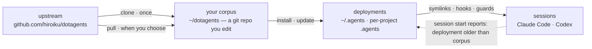
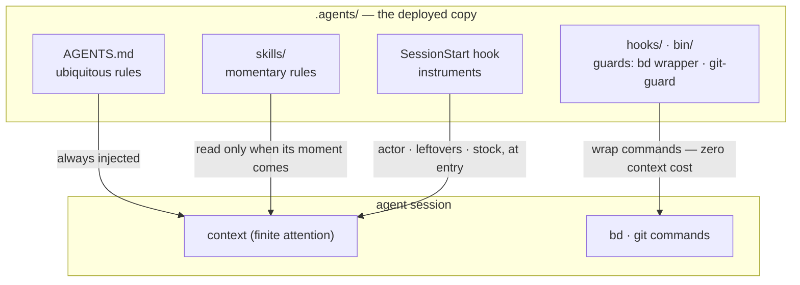

# dotagents

**An AI agent harness you own.** Rules, skills, and mechanical guards for
Claude Code and Codex — version-controlled as a single corpus, deployed to
every project from it.

English | [日本語](docs/README.ja.md) | [简体中文](docs/README.zh-CN.md) | [繁體中文](docs/README.zh-TW.md) | [한국어](docs/README.ko.md) | [Deutsch](docs/README.de.md) | [Español](docs/README.es.md) | [Français](docs/README.fr.md)

[](https://www.npmjs.com/package/@hiroiku/dotagents)
[](./LICENSE)

- **One corpus, many deployments.** Prompts, skills, agent roles, shell guards
  and session instruments live in one git repository. The installer copies them
  into `~/.agents` or `<project>/.agents` and wires the symlinks and hooks that
  Claude Code and Codex read.
- **A rulebook, not a library.** You edit the rules, commit them, and follow
  upstream only when you choose to — nothing changes behind your back.
- **Rules become mechanism.** Whatever a hook or wrapper can enforce is
  enforced; whatever has a clear moment becomes a skill; only the rest is
  allowed to occupy every session's attention. The reasoning lives in
  [Concept](#concept).

## How it works

One corpus feeds every environment. Deployments are plain copies — sessions
never depend on the corpus being reachable, and nothing deploys behind your
back:



Inside a session, the three layers of the corpus reach the agent by different
routes — and the lower the route, the stronger and the cheaper the rule:



## Quick start

**1 · Check the prerequisites**

| Tool | | Why |
|---|---|---|
| git, Node.js ≥ 18 | required | runs the CLI |
| [bd (beads)](https://github.com/gastownhall/beads) | required | the issue ledger everything runs on: filing, claiming, completion gates, merge exclusion |
| [codegraph](https://github.com/colbymchenry/codegraph) | recommended | structure queries — wire once with `codegraph install`, index per project with `codegraph init` |

The harness never installs these for you — the installer and every session
start detect what is missing and say so.

**2 · Get your corpus**

```sh
npx @hiroiku/dotagents clone ~/dotagents
```

A plain git clone, and it is yours: edit the rules, commit them, personalize.

**3 · Deploy it**

```sh
cd ~/dotagents
bin/agents-setup install project /path/to/project   # one project   → <dir>/.agents
bin/agents-setup install user                       # this machine  → ~/.agents
bin/agents-setup install shell                      # guards only   → hooks/bin + one ~/.zshenv line
```

Omit the target to pick it interactively. In a non-interactive shell an
omitted target stops without writing anything — no default ever decides where
rules land.

**4 · Operate**

```sh
bin/agents-setup pull                 # follow upstream: changelog → rebase → tests
bin/agents-setup update  project ...  # resync a deployment (sessions tell you when)
bin/agents-setup status  project ...  # verify files, links, fragments — exit 1 on drift
bin/agents-setup --help               # every command, target, option, example
```

## The three verbs

| Verb | Cadence | What it does |
|---|---|---|
| **clone** | once | materialize the corpus as a git repository you own |
| **pull** | when you choose | fetch upstream, show the incoming commit titles, rebase your commits on top, run the corpus tests |
| **install · update** | per machine, per project | copy the corpus into `.agents/` and wire links, hooks, guards |

Three rules connect them:

- **No deploying from a throwaway.** Outside a corpus (an npx cache, an
  unpacked tarball) the deploy commands delegate to the corpus your machine
  already knows — or stop and point to `clone`.
- **Resync is pulled, not pushed.** When the corpus moves ahead, the
  instrument at every session entrance reports *deployment older than the
  corpus*, and you run `update` in that project.
- **Following is deliberate.** What you pull are the texts that govern your
  agents, so `pull` shows the incoming commit titles first — written in domain
  language, they read as a changelog — then rebases and runs the tests.
  Nothing auto-updates.

## What lands where

| Piece | Destination | Delivery |
|---|---|---|
| Ubiquitous rules (`AGENTS.md`) | `.agents/AGENTS.md` | symlink `.claude/CLAUDE.md → .agents/AGENTS.md`; Codex gets the same shape under `.codex/` |
| Skills · agent roles | `.agents/skills/` · `.agents/agents/` | one link per entry, so they coexist with skills you wrote yourself |
| Guards (`bd` wrapper · `git-guard`) | `.agents/bin/` · `.agents/hooks/` | one managed line in `~/.zshenv` — user level, once per machine |
| Session injection | `settings.json` · `.codex/hooks.json` | fragments: `hooks.SessionStart`, `env.BASH_ENV`, `permissions.ask` |
| Machine-local products (manifest · metrics) | `.agents/` | kept out of version control by a `.gitignore` that ships with the payload |

Everything is idempotent and **hash-owned**: the installer touches only what
it placed and still recognizes. Your own skills are never touched, files you
edited in place are kept and reported (`--force` to overwrite), and
`uninstall` removes exactly what the manifest records — nothing else.

<details>
<summary><b>The shell layer — one per machine, tended from both sides</b></summary>

Guards reach sessions only through `hooks/shellenv.sh`, and zsh has no
per-project startup file — so this layer exists **once per machine** no matter
how many projects use the harness. The installer keeps its care out of your
operational knowledge: `install project` lays the minimal shell scope when it
is missing; `uninstall user` asks before removing what other projects share
(`--keep-shell` keeps it non-interactively); `uninstall project` never touches
it.

</details>

<details>
<summary><b>Late adoption and team rollout</b></summary>

- **Order-independent**: adding bd or codegraph later needs no reinstall —
  organs, ledgers and indexes are detected dynamically at every session start.
  An existing root AGENTS.md created by `bd init` is not taken over; only a
  managed reference block is added.
- **Two delivery layers**: the prompt layer (`.agents/` payload, links,
  reference block) rides version control and works from `git clone` alone; the
  injection and enforcement layer (manifest, settings fragments, zshenv line,
  shell guards) is machine-specific and is laid by the installer on each
  machine.
- **Second person onward**: clone the project, clone dotagents, run
  `bin/agents-setup install project <project>` — one command; the shell layer
  is completed on the way if missing. The installer is idempotent and
  hash-checked, so it never fights what version control delivered.

</details>

<details>
<summary><b>CLI design notes</b></summary>

The target is **one positional argument** (`user` / `project [dir]` /
`shell`), never defaulted. Because there is only one position, "user and
project at once" cannot even be typed — exclusivity is guaranteed by syntax,
not by runtime validation. The interactive prompt is an arrow-key selector
(`↑/↓` move, `enter` confirm, `ctrl-c` cancel) that collapses to a single line
recording what you chose. Output drops color automatically under `NO_COLOR` or
without a TTY.

</details>

## Concept

What this harness builds is not "one capable agent" but **an organization that
splits finite attention (context) across roles and connects them through
external records**. Every rule below derives from a single premise: context is
finite and dies with the session.

### Three layers of rules — ubiquitous, momentary, enforced

Before its content, a rule's nature is decided by **how it is delivered**.

- **Ubiquitous rules** (core = AGENTS.md) — always injected. They tax the
  attention of every session and hold only as **best effort**, so this layer
  may carry nothing but the few rules whose moment of observation cannot be
  named
- **Momentary rules** (skills) — injected just in time. They enter context only
  when their moment arrives, so detail here costs no other moment anything
- **Enforced rules** (hooks / bin / permissions) — never injected. A mechanism
  decides, so they consume no attention and cannot be broken (or leave a trace
  when they are)

**The law of descent**: push every rule as far down as it will go. Lower layers
are stronger *and* cheaper at once — a one-way slope where strength rises as
attention cost disappears. A prompt is merely the waiting room for rules that
have not yet been turned into mechanism.

### Separation — boundaries that admit no duplication

Subagents are cut not by capability but by **boundaries where duplication
cannot occur**: units whose inputs (context), search ranges, and write targets
(worktrees) do not intersect. Give the same information to two contexts and you
pay attention twice; let two write the same place and you have created a merge
point. The merge points that structure cannot remove (the integration branch
and the ledger) are the only ones protected by exclusion.

Separation is also concealment. Not knowing the implementation's
circumstances is what gives review its detection power — **"do not pass it" is
a design decision as strong as "pass it"**.

### Organs — declaration vs. derivation

Each tool serves as an organ answering one kind of question, and no organ's
native capability is reimplemented elsewhere. The axis is **declaration versus
derivation**:

- **Records of declaration** (what was decided cannot be derived, so record
  it): bd = the ledger of intent and state (what we decided to do, who holds
  what, why something is stopped); ADRs = the trail of decisions; the glossary
  = the ubiquitous language
- **Derivation** (what a machine can derive from the artifact is never written
  by hand): codegraph = the code's current structure (symbols, call paths,
  blast radius); git = the history of change

The moment you hand-write something derivable, drift begins. Memory sits on the
same axis: state is derived (bd prime's query injection); only invariants are
declared (bd remember). What carries context across sessions is not a
transcript but an external record with an address (**the context bridge**).

codegraph is the everyday exploration organ, and its ubiquitous rule ("derive
with explore first") is **delivered by the tool description (MCP server
instructions)** — never copied into prompts, where it would become a stale
replica. Tool choice cannot be machine-checked, so it cannot fall to
enforcement either: the zero-injection-cost tool layer is the lowest layer this
rule can live in. The harness prompts spell out only the moments where *not*
using it breaks a contract (ground-truthing before freezing, deriving the
horizontal sweep, the reviewer's scan). Wiring (`codegraph install`) and the
index (`codegraph init`) are codegraph's own responsibility — the harness
neither checks nor reimplements them; SessionStart merely detects `.codegraph/`
and injects one line of recall.

### Adversarial review — omissions do not exist until sought

The failure mode peculiar to AI agents is "done!" when it is not done, and its
substance is not lying but **omission** — someone whose context holds only what
they wrote cannot see what they did not write.

So review is not inspection (looking at what exists and judging it) but
**proof of existence**: starting from the requirements, the reviewer must find
the implementation and verification that satisfy each one in the artifact — a
scan in the reverse direction. The reviewer is not shown the diff first,
because attention captured by verifying what was written stops searching for
what was not.

### Sinking — loops end because knowledge descends

Review repeated alone diverges (findings well up without end). The loop
converges because each round makes knowledge **sink** a layer: individual
findings → articulated defect classes (broken contracts) → enforcement (a
structure, a type, a single guard). A hypothesis that has sunk is removed from
the charter, so the fuel of review shrinks round by round. When the same
defect class surfaces twice, the signal is not that the fix was wrong but that
**the sinking was**.

The issue ledger converges on the same principle: do not pile observations
into open; open only what was decided; fold same-shaped issues together; give
every filing its digestion path at birth.

### Tests — count is not the amount of protection

A test may pin only a **contract** (a promise the business relies on); a copy
of a symptom protects nothing from regression. The first line of defense is
structure that cannot break (designs and types in which the failure condition
cannot exist); tests are the last resort for contracts that structure cannot
seal.

### Watchers and enumerations — no meta quality checks

Watchers of watchers, tests of tests, guards of guards — meta checks that
guard no business contract multiply easily and eat maintenance while
protecting nothing. Three principles exclude them:

- **Do not add watchers; sink instead** — wanting to watch a guard is a
  symptom that it sits too high. The answer is the law of descent, not more
  surveillance: push it down and the thing to watch disappears
- **Detection goes one hop** — only contracts that structure cannot seal may
  have detectors, and detectors get no detectors. That a broken detector goes
  unnoticed is the accepted price, which is why detectors stay minimal and
  simple
- **Never guard by enumeration** — any scheme whose coverage is a hand-kept
  list turns forgotten additions into silent gaps. Prefer forms where the
  structure itself is the definition (the payload principle) or where the
  machine derives the list as a by-product (the manifest principle)

The rule texts themselves are not duplicated here (a copy of the payload would
silently rot). The canonical index: roles, quality invariants, git authority
and the beads ubiquitous rules are in [AGENTS.md](./payload/AGENTS.md);
pre-work and composition in
[agents-kickoff](./payload/skills/agents-kickoff/SKILL.md); operating the
quality loop in
[agents-quality-loop](./payload/skills/agents-quality-loop/SKILL.md); bd
operations and the memory boundary in
[agents-beads-ops](./payload/skills/agents-beads-ops/SKILL.md); test design in
[agents-test-design](./payload/skills/agents-test-design/SKILL.md); the three
layers and the ablation discipline in
[prompt-guidelines.md](./payload/docs/prompt-guidelines.md).

## Layout

```
bin/agents-setup      installer CLI (clone / pull / install / update / uninstall / status)
test/                 contract tests for the installer and the enforcement layer (npm test)
payload/              the single definition of what gets distributed; this tree becomes .agents/
├── AGENTS.md         ubiquitous rules (read by every session, always)
├── skills/           momentary rules (read only when their moment arrives)
├── agents/           role definitions (reviewer / verifier, tool-restricted)
├── hooks/            shellenv.sh (guard delivery) / beads-session.sh (SessionStart injection)
├── bin/              enforcement (bd, git-guard, agents-gate, agents-reap) and self-check (agents-doctor)
└── docs/             guidelines for updating prompts
```

[payload/](./payload/) is the canonical definition of the distribution; the
installer holds no list of its contents (replicated lists silently rot —
[package.json](./package.json) `files` names only `bin` and `payload`).

## Updating the prompts

Follow [payload/docs/prompt-guidelines.md](./payload/docs/prompt-guidelines.md).
Edit only in this repository and deliver with `agents-setup update` — editing an
installed tree directly makes `update` protect the file and warn, which is the
drift detection working.

## Open questions

- Bulk triage of pre-existing open issues when adopting the harness in a
  project with an established ledger (with blanket `AGENTS_BD_OPEN_OK=1`
  approval)
- Review of coined terms, and further slimming of the `<beads>` block in
  AGENTS.md — after the instruments have gathered observations
