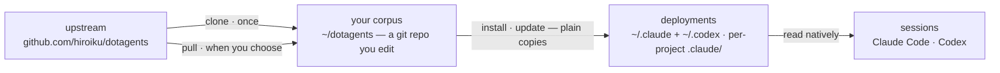

# dotagents

**A package manager for the rules your AI agents follow.** Modules of prompts, skills and review agents for Claude Code and Codex — version-controlled as a single corpus, installed into the projects you choose.

English | [日本語](docs/README.ja.md) | [简体中文](docs/README.zh-CN.md) | [繁體中文](docs/README.zh-TW.md) | [한국어](docs/README.ko.md) | [Deutsch](docs/README.de.md) | [Español](docs/README.es.md) | [Français](docs/README.fr.md)

[](https://www.npmjs.com/package/@hiroiku/dotagents)
[](./LICENSE)

- **One corpus, many deployments.** Every rule lives in one git repository, cut into modules you install per project or per machine. The installer writes straight into the directories Claude Code and Codex read — plain files, no symlinks, no intermediate tree.
- **A rulebook, not a library.** You edit the rules, commit them, and follow upstream only when you choose to — nothing changes behind your back.
- **Written for models that judge.** The corpus records only what a capable model cannot derive — your conventions, your requirement anchors, your role boundaries. Everything else is left to the model's judgment. The reasoning lives in [The bundled harness](./modules/harness/README.md).

## How it works

One corpus feeds every environment. Deployments are plain copies — sessions never depend on the corpus being reachable, and nothing deploys behind your back:



## Quick start

**1 · Get your corpus** (requires git and Node.js ≥ 18)

```sh
npx @hiroiku/dotagents clone ~/dotagents
```

A plain git clone, and it is yours: edit the rules, commit them, personalize.

**2 · Install what you want, where you want it**

```sh
cd ~/dotagents
bin/agents-setup list                     # what this corpus offers
bin/agents-setup install harness          # into the current project
bin/agents-setup install harness -g       # for every project on this machine
bin/agents-setup install harness -C ~/x   # into a specific project
```

The target defaults to this project — the smallest blast radius. The wider scope always takes a flag. What goes in never defaults: name a module, or pick interactively; a non-interactive shell stops rather than choosing for you.

**3 · Operate**

```sh
bin/agents-setup pull                 # follow upstream: changelog → rebase → tests
bin/agents-setup update               # resync this project (uses the modules it remembers)
bin/agents-setup status               # verify files and rules blocks — exit 1 on drift
bin/agents-setup uninstall <module>   # drop one module, keep the rest
bin/agents-setup --help               # every command, option, example
```

## Two objects, two vocabularies

Commands act on one of two things, and each borrows the vocabulary you already know:

| Object | Vocabulary | Commands |
|---|---|---|
| **The corpus** — the git repository of rules you own | git | `clone` · `pull` · `list` |
| **Deployments** — what a tool actually reads | package manager | `install` · `update` · `uninstall` · `status` |

Three rules connect them:

- **No deploying from a throwaway.** Outside a corpus (an npx cache, an unpacked tarball) the deploy commands delegate to the corpus your machine already knows — or stop and point to `clone`.
- **Following is deliberate.** What you pull are the texts that govern your agents, so `pull` shows the incoming commit titles first — written in domain language, they read as a changelog — then rebases and runs the tests. Nothing auto-updates.
- **Choices are remembered, not retyped.** The manifest records which modules a deployment holds, so `update` needs no arguments. `install` is additive, `uninstall` subtractive.

## What lands where

| Piece | Destination | Delivery |
|---|---|---|
| Skills · review agents · hooks | `.claude/skills/dotagents/` | **one plugin directory**. Claude Code loads a plugin found there with no marketplace and no install step, namespacing what it holds as `/dotagents:*` — which is how hooks arrive without ever touching `settings.json` |
| Skills (Codex) | `.codex/skills/dotagents-*` | plain copies. Codex has no plugins, so the namespace folds into the directory name |
| Ubiquitous rule (`AGENTS.md`) | `.claude/CLAUDE.md` · `~/.codex/AGENTS.md` · a project's root `AGENTS.md` | a managed block between markers — whatever you wrote around it is never touched, and `uninstall` restores the file |
| Machine-local record (manifest) | `~/.dotagents/` | never lands in a project — the hash ledger of what the installer placed, and which modules you chose, lives with the machine |

Everything is idempotent and **hash-owned**: the installer touches only what it placed and still recognizes. Your own skills are never touched, files you edited in place are kept and reported (`--force` to overwrite), and `uninstall` removes exactly what the manifest records — nothing else. Layouts left by older versions (a `.agents` tree, symlinks, a zshenv line, settings fragments, or plain copies outside the namespace) are detected and migrated on `install` / `update`.

Project-scope plugins load only when Claude Code starts at the repository root, and only after you accept the workspace trust dialog. Changes to agents and hooks take effect on the next session or after `/reload-plugins`; edits to a `SKILL.md` are picked up immediately.

## Layout

```
bin/agents-setup      installer CLI (clone / pull / list / install / update / uninstall / status)
test/                 contract tests for the installer (npm test)
modules/              the single definition of what can be distributed
└── harness/          the bundled module — no external dependencies
    ├── MODULE.md     name, description, what it expects on PATH
    ├── AGENTS.md     the one ubiquitous rule — delivered as a managed block
    ├── skills/       momentary rules (read only when their moment arrives)
    ├── agents/       review roles (adversarial · security · accessibility)
    ├── README.md     the bundled harness — what ships, and why it says so little
    └── docs/         translations of that guide (documentation; not deployed)
```

[modules/](./modules/) is the canonical definition of the distribution: a directory with a `MODULE.md` is a module, its top-level kinds decide where things land, and the installer holds no list of the files — replicated lists silently rot, so [package.json](./package.json) `files` names only `bin` and `modules`. Write your own module beside the bundled one and it installs the same way.

A module may declare what it expects on `PATH`. Requirements are **detected, never installed**: `list` and `install` report what is missing and block nothing, so adding the tool later needs no reinstall.

## Updating the prompts

The corpus carries its own editing discipline: the [prompting](./modules/harness/skills/prompting/SKILL.md) skill names the context-engineering guides to read before touching any prompt or agent definition. Edit only in this repository and deliver with `agents-setup update` — editing an installed tree directly makes `update` protect the file and warn, which is the drift detection working.
