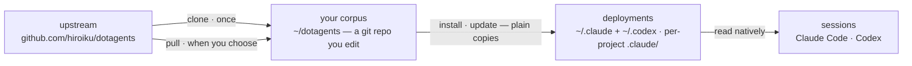

# dotagents

**An AI agent harness you own.** Rules, skills, and review agents for Claude Code and Codex — version-controlled as a single corpus, deployed to every project from it.

English | [日本語](docs/README.ja.md) | [简体中文](docs/README.zh-CN.md) | [繁體中文](docs/README.zh-TW.md) | [한국어](docs/README.ko.md) | [Deutsch](docs/README.de.md) | [Español](docs/README.es.md) | [Français](docs/README.fr.md)

[](https://www.npmjs.com/package/@hiroiku/dotagents)
[](./LICENSE)

- **One corpus, many deployments.** Prompts, skills and agent roles live in one git repository. The installer copies them straight into the directories Claude Code and Codex read (`.claude/`, `.codex/`) — plain files, no symlinks, no intermediate tree.
- **A rulebook, not a library.** You edit the rules, commit them, and follow upstream only when you choose to — nothing changes behind your back.
- **Written for models that judge.** The corpus records only what a capable model cannot derive — your conventions, your requirement anchors, your role boundaries. Everything else is left to the model's judgment. The reasoning lives in [The bundled harness](./payload/README.md).

## How it works

One corpus feeds every environment. Deployments are plain copies — sessions never depend on the corpus being reachable, and nothing deploys behind your back:



## Quick start

**1 · Get your corpus** (requires git and Node.js ≥ 18)

```sh
npx @hiroiku/dotagents clone ~/dotagents
```

A plain git clone, and it is yours: edit the rules, commit them, personalize.

**2 · Deploy it**

```sh
cd ~/dotagents
bin/agents-setup install project /path/to/project   # one project   → <dir>/.claude + <dir>/.codex
bin/agents-setup install user                       # this machine  → ~/.claude + ~/.codex
```

Omit the target to pick it interactively. In a non-interactive shell an omitted target stops without writing anything — no default ever decides where rules land.

**3 · Operate**

```sh
bin/agents-setup pull                 # follow upstream: changelog → rebase → tests
bin/agents-setup update  project ...  # resync a deployment
bin/agents-setup status  project ...  # verify files and rules blocks — exit 1 on drift
bin/agents-setup --help               # every command, target, option, example
```

## The three verbs

| Verb | Cadence | What it does |
|---|---|---|
| **clone** | once | materialize the corpus as a git repository you own |
| **pull** | when you choose | fetch upstream, show the incoming commit titles, rebase your commits on top, run the corpus tests |
| **install · update** | per machine, per project | copy the payload into the directories the tools read |

Three rules connect them:

- **No deploying from a throwaway.** Outside a corpus (an npx cache, an unpacked tarball) the deploy commands delegate to the corpus your machine already knows — or stop and point to `clone`.
- **Following is deliberate.** What you pull are the texts that govern your agents, so `pull` shows the incoming commit titles first — written in domain language, they read as a changelog — then rebases and runs the tests. Nothing auto-updates.
- **Drift is visible.** `status` compares every deployed file and link against the corpus and exits 1 on drift; `update` resyncs exactly what the installer owns.

## What lands where

| Piece | Destination | Delivery |
|---|---|---|
| Ubiquitous rule (`AGENTS.md`) | `.claude/CLAUDE.md` · `~/.codex/AGENTS.md` · a project's root `AGENTS.md` | a managed block between markers — whatever you wrote around it is never touched, and `uninstall` restores the file |
| Skills | `.claude/skills/` and `.codex/skills/` | plain copies, one directory per skill, coexisting with skills you wrote yourself |
| Review agents | `.claude/agents/` | plain copies, one file per agent |
| Machine-local record (manifest) | `~/.dotagents/` | never lands in a project — the hash ledger of what the installer placed lives with the machine |

Everything is idempotent and **hash-owned**: the installer touches only what it placed and still recognizes. Your own skills are never touched, files you edited in place are kept and reported (`--force` to overwrite), and `uninstall` removes exactly what the manifest records — nothing else. A legacy `.agents` layout (symlinks, zshenv line, settings fragments) left by older versions is detected and migrated automatically on `install` / `update`.

## Layout

```
bin/agents-setup      installer CLI (clone / pull / install / update / uninstall / status)
test/                 contract tests for the installer (npm test)
payload/              the single definition of what gets distributed
├── AGENTS.md         the one ubiquitous rule — delivered as a managed block
├── skills/           momentary rules (read only when their moment arrives)
├── agents/           review roles (adversarial · security · accessibility)
├── README.md         the bundled harness — what ships, and why it says so little
└── docs/             translations of that guide (documentation; not deployed)
```

[payload/](./payload/) is the canonical definition of the distribution: its top-level kinds decide where things land, and the installer holds no list of the files — replicated lists silently rot, so [package.json](./package.json) `files` names only `bin` and `payload`. What the payload ships is described in [The bundled harness](./payload/README.md).

## Updating the prompts

The corpus carries its own editing discipline: the [dotagents-prompting](./payload/skills/dotagents-prompting/SKILL.md) skill names the context-engineering guides to read before touching any prompt or agent definition. Edit only in this repository and deliver with `agents-setup update` — editing an installed tree directly makes `update` protect the file and warn, which is the drift detection working.
