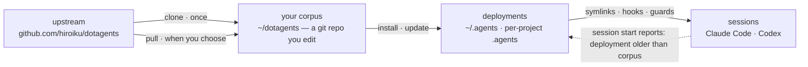

# dotagents

**An AI agent harness you own.** Rules, skills, and mechanical guards for Claude Code and Codex — version-controlled as a single corpus, deployed to every project from it.

English | [日本語](docs/README.ja.md) | [简体中文](docs/README.zh-CN.md) | [繁體中文](docs/README.zh-TW.md) | [한국어](docs/README.ko.md) | [Deutsch](docs/README.de.md) | [Español](docs/README.es.md) | [Français](docs/README.fr.md)

[](https://www.npmjs.com/package/@hiroiku/dotagents)
[](./LICENSE)

- **One corpus, many deployments.** Prompts, skills, agent roles, shell guards and session instruments live in one git repository. The installer copies them into `~/.agents` or `<project>/.agents` and wires the symlinks and hooks that Claude Code and Codex read.
- **A rulebook, not a library.** You edit the rules, commit them, and follow upstream only when you choose to — nothing changes behind your back.
- **Rules become mechanism.** Whatever a hook or wrapper can enforce is enforced; whatever has a clear moment becomes a skill; only the rest is allowed to occupy every session's attention. The reasoning lives in [The bundled harness](./docs/HARNESS.md).

## How it works

One corpus feeds every environment. Deployments are plain copies — sessions never depend on the corpus being reachable, and nothing deploys behind your back:



## Quick start

**1 · Check the prerequisites**

| Tool | | Why |
|---|---|---|
| git, Node.js ≥ 18 | required | runs the CLI |
| [bd (beads)](https://github.com/gastownhall/beads) | required | the issue ledger the bundled harness runs on: filing, claiming, completion gates, merge exclusion |
| [codegraph](https://github.com/colbymchenry/codegraph) | recommended | structure queries — wire once with `codegraph install`, index per project with `codegraph init` |

The harness never installs these for you — the installer and every session start detect what is missing and say so.

**2 · Get your corpus**

```sh
npx @hiroiku/dotagents clone ~/dotagents
```

A plain git clone, and it is yours: edit the rules, commit them, personalize.

**3 · Deploy it**

```sh
cd ~/dotagents
bin/agents-setup install project /path/to/project   # one project   → <dir>/.agents
bin/agents-setup install user                       # this machine  → ~/.agents
bin/agents-setup install shell                      # guards only   → hooks/bin + one ~/.zshenv line
```

Omit the target to pick it interactively. In a non-interactive shell an omitted target stops without writing anything — no default ever decides where rules land.

**4 · Operate**

```sh
bin/agents-setup pull                 # follow upstream: changelog → rebase → tests
bin/agents-setup update  project ...  # resync a deployment (sessions tell you when)
bin/agents-setup status  project ...  # verify files, links, fragments — exit 1 on drift
bin/agents-setup --help               # every command, target, option, example
```

## The three verbs

| Verb | Cadence | What it does |
|---|---|---|
| **clone** | once | materialize the corpus as a git repository you own |
| **pull** | when you choose | fetch upstream, show the incoming commit titles, rebase your commits on top, run the corpus tests |
| **install · update** | per machine, per project | copy the corpus into `.agents/` and wire links, hooks, guards |

Three rules connect them:

- **No deploying from a throwaway.** Outside a corpus (an npx cache, an unpacked tarball) the deploy commands delegate to the corpus your machine already knows — or stop and point to `clone`.
- **Resync is pulled, not pushed.** When the corpus moves ahead, the instrument at every session entrance reports *deployment older than the corpus*, and you run `update` in that project.
- **Following is deliberate.** What you pull are the texts that govern your agents, so `pull` shows the incoming commit titles first — written in domain language, they read as a changelog — then rebases and runs the tests. Nothing auto-updates.

## What lands where

| Piece | Destination | Delivery |
|---|---|---|
| Ubiquitous rules (`AGENTS.md`) | `.agents/AGENTS.md` | symlink `.claude/CLAUDE.md → .agents/AGENTS.md`; Codex gets the same shape under `.codex/` |
| Skills · agent roles | `.agents/skills/` · `.agents/agents/` | one link per entry, so they coexist with skills you wrote yourself |
| Guards (`bd` wrapper · `git-guard`) | `.agents/bin/` · `.agents/hooks/` | one managed line in `~/.zshenv` — user level, once per machine |
| Session injection | `settings.json` · `.codex/hooks.json` | fragments: `hooks.SessionStart`, `env.BASH_ENV`, `permissions.ask` |
| Machine-local products (manifest · metrics) | `.agents/` | kept out of version control by a `.gitignore` that ships with the payload |

Everything is idempotent and **hash-owned**: the installer touches only what it placed and still recognizes. Your own skills are never touched, files you edited in place are kept and reported (`--force` to overwrite), and `uninstall` removes exactly what the manifest records — nothing else.

<details>
<summary><b>The shell layer — one per machine, tended from both sides</b></summary>

Guards reach sessions only through `hooks/shellenv.sh`, and zsh has no per-project startup file — so this layer exists **once per machine** no matter how many projects use the harness. The installer keeps its care out of your operational knowledge: `install project` lays the minimal shell scope when it is missing; `uninstall user` asks before removing what other projects share (`--keep-shell` keeps it non-interactively); `uninstall project` never touches it.

</details>

<details>
<summary><b>Late adoption and team rollout</b></summary>

- **Order-independent**: adding bd or codegraph later needs no reinstall — organs, ledgers and indexes are detected dynamically at every session start. An existing root AGENTS.md created by `bd init` is not taken over; only a managed reference block is added.
- **Two delivery layers**: the prompt layer (`.agents/` payload, links, reference block) rides version control and works from `git clone` alone; the injection and enforcement layer (manifest, settings fragments, zshenv line, shell guards) is machine-specific and is laid by the installer on each machine.
- **Second person onward**: clone the project, clone dotagents, run `bin/agents-setup install project <project>` — one command; the shell layer is completed on the way if missing. The installer is idempotent and hash-checked, so it never fights what version control delivered.

</details>

<details>
<summary><b>CLI design notes</b></summary>

The target is **one positional argument** (`user` / `project [dir]` / `shell`), never defaulted. Because there is only one position, "user and project at once" cannot even be typed — exclusivity is guaranteed by syntax, not by runtime validation. The interactive prompt is an arrow-key selector (`↑/↓` move, `enter` confirm, `ctrl-c` cancel) that collapses to a single line recording what you chose. Output drops color automatically under `NO_COLOR` or without a TTY.

</details>

## Layout

```
bin/agents-setup      installer CLI (clone / pull / install / update / uninstall / status)
test/                 contract tests for the installer and the enforcement layer (npm test)
payload/              the single definition of what gets distributed; this tree becomes .agents/
├── AGENTS.md         ubiquitous rules (read by every session, always)
├── skills/           momentary rules (read only when their moment arrives)
├── agents/           role definitions (reviewer / verifier, tool-restricted)
├── hooks/            shellenv.sh (guard delivery) / beads-session.sh (SessionStart injection)
├── bin/              enforcement (bd, git-guard, agents-gate, agents-reap) and self-check (agents-doctor)
└── docs/             guidelines for updating prompts
```

[payload/](./payload/) is the canonical definition of the distribution; the installer holds no list of its contents (replicated lists silently rot — [package.json](./package.json) `files` names only `bin` and `payload`). What the payload ships — the bundled harness and the reasoning behind its rules — is described in [The bundled harness](./docs/HARNESS.md).

## Updating the prompts

Follow [payload/docs/prompt-guidelines.md](./payload/docs/prompt-guidelines.md). Edit only in this repository and deliver with `agents-setup update` — editing an installed tree directly makes `update` protect the file and warn, which is the drift detection working.
