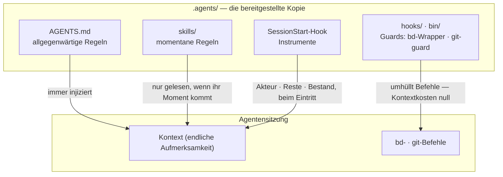

# Der mitgelieferte Harness

[English](HARNESS.md) | [日本語](HARNESS.ja.md) | [简体中文](HARNESS.zh-CN.md) | [繁體中文](HARNESS.zh-TW.md) | [한국어](HARNESS.ko.md) | Deutsch | [Español](HARNESS.es.md) | [Français](HARNESS.fr.md)

[README](README.de.md) beschreibt den Mechanismus — ein Korpus, von `agents-setup` nach `~/.agents` und in projektspezifische `.agents/` bereitgestellt. Dieses Dokument beschreibt, was dieser Korpus in [payload/](../payload/) ausliefert: einen vollständigen, funktionierenden Harness — mitgeliefert als das Beispiel, von dem du ausgehst und das du personalisierst.

Was dieser Harness baut, ist nicht "ein fähiger Agent", sondern **eine Organisation, die endliche Aufmerksamkeit (Kontext) über Rollen aufteilt und sie durch externe Aufzeichnungen verbindet**. Jede Regel unten leitet sich aus einer einzigen Prämisse ab: Kontext ist endlich und stirbt mit der Sitzung.

## Drei Schichten von Regeln — allgegenwärtig, momentan, durchgesetzt

Vor ihrem Inhalt wird die Natur einer Regel dadurch bestimmt, **wie sie zugestellt wird**. Innerhalb einer Sitzung erreichen die drei Schichten des Korpus den Agenten über unterschiedliche Wege — und je niedriger der Weg, desto stärker und billiger die Regel:

- **Allgegenwärtige Regeln** (Kern = AGENTS.md) — immer injiziert. Sie besteuern die Aufmerksamkeit jeder Sitzung und gelten nur als **Bestmögliches**, daher darf diese Schicht nur die wenigen Regeln tragen, deren Beobachtungsmoment nicht benannt werden kann
- **Momentane Regeln** (Skills) — just-in-time injiziert. Sie treten nur in den Kontext ein, wenn ihr Moment eintritt, sodass Detail hier keinen anderen Moment etwas kostet
- **Durchgesetzte Regeln** (hooks / bin / permissions) — nie injiziert. Ein Mechanismus entscheidet, sodass sie keine Aufmerksamkeit verbrauchen und nicht gebrochen werden können (oder eine Spur hinterlassen, wenn sie es doch werden)

**Das Gesetz des Abstiegs**: Schiebe jede Regel so weit nach unten, wie sie gehen wird. Untere Schichten sind zugleich stärker *und* billiger — ein Einbahn-Gefälle, auf dem die Stärke steigt, während die Aufmerksamkeitskosten verschwinden. Ein Prompt ist bloß das Wartezimmer für Regeln, die noch nicht in Mechanismus verwandelt wurden.

## Trennung — Grenzen, die keine Duplizierung zulassen

Subagenten werden nicht nach Fähigkeit geschnitten, sondern nach **Grenzen, an denen Duplizierung nicht auftreten kann**: Einheiten, deren Eingaben (Kontext), Suchbereiche und Schreibziele (Worktrees) sich nicht überschneiden. Gib zwei Kontexten dieselbe Information, und du zahlst die Aufmerksamkeit zweimal; lass zwei an derselben Stelle schreiben, und du hast einen Merge-Punkt geschaffen. Die Merge-Punkte, die Struktur nicht entfernen kann (der Integrations-Branch und das Journal), sind die einzigen, die durch Ausschluss geschützt werden.

Trennung ist auch Verbergen. Die Umstände der Implementierung nicht zu kennen, ist es, was dem Review seine Erkennungskraft gibt — **"nicht weitergeben" ist eine Design-Entscheidung, so stark wie "weitergeben"**.

## Organe — Deklaration versus Ableitung

Jedes Werkzeug dient als Organ, das eine Art von Frage beantwortet, und keine native Fähigkeit eines Organs wird anderswo neu implementiert. Die Achse ist **Deklaration versus Ableitung**:

- **Aufzeichnungen der Deklaration** (was entschieden wurde, kann nicht abgeleitet werden, also wird es aufgezeichnet): bd = das Journal von Absicht und Zustand (was wir zu tun beschlossen haben, wer was hält, warum etwas gestoppt ist); ADRs = die Spur der Entscheidungen; das Glossar = die allgegenwärtige Sprache
- **Ableitung** (was eine Maschine aus dem Artefakt ableiten kann, wird nie von Hand geschrieben): codegraph = die aktuelle Struktur des Codes (Symbole, Aufrufpfade, Wirkungsradius); git = die Geschichte der Änderung

In dem Moment, in dem du etwas Ableitbares von Hand schreibst, beginnt Drift. Das Gedächtnis sitzt auf derselben Achse: Zustand wird abgeleitet (die Query-Injektion von bd prime); nur Invarianten werden deklariert (bd remember). Was Kontext über Sitzungen hinweg trägt, ist kein Transkript, sondern eine externe Aufzeichnung mit einer Adresse (**die Kontextbrücke**).

codegraph ist das alltägliche Explorations-Organ, und seine allgegenwärtige Regel ("erst mit explore ableiten") wird **durch die Werkzeugbeschreibung (MCP-Server-Anweisungen) zugestellt** — nie in Prompts kopiert, wo sie zu einer veralteten Kopie würde. Werkzeugwahl kann nicht maschinell geprüft werden, daher kann sie auch nicht an die Durchsetzung fallen: die Werkzeugschicht mit Injektionskosten null ist die niedrigste Schicht, in der diese Regel leben kann. Die Harness-Prompts benennen nur die Momente, in denen das Werkzeug *nicht* zu benutzen einen Vertrag bricht (der Abgleich mit der Grundwahrheit vor dem Einfrieren, das Ableiten des horizontalen Durchlaufs, der Scan des Reviewers). Einbindung (`codegraph install`) und der Index (`codegraph init`) sind codegraphs eigene Verantwortung — der Harness prüft sie weder noch implementiert er sie neu; SessionStart erkennt lediglich `.codegraph/` und injiziert eine Zeile Erinnerung.

## Kontradiktorisches Review — Auslassungen existieren nicht, bis man sie sucht

Der Fehlermodus, der für KI-Agenten eigentümlich ist, ist "erledigt!", wenn es nicht erledigt ist, und seine Substanz ist nicht Lüge, sondern **Auslassung** — jemand, dessen Kontext nur enthält, was er geschrieben hat, kann nicht sehen, was er nicht geschrieben hat.

Review ist daher keine Inspektion (das Betrachten dessen, was existiert, und das Urteilen darüber), sondern **Existenzbeweis**: ausgehend von den Anforderungen muss der Reviewer die Implementierung und Verifikation finden, die jede einzelne im Artefakt erfüllt — ein Scan in umgekehrter Richtung. Dem Reviewer wird der Diff nicht zuerst gezeigt, weil Aufmerksamkeit, die durch das Verifizieren des Geschriebenen gebunden ist, aufhört, nach dem zu suchen, was nicht geschrieben wurde.

## Sinken — Schleifen enden, weil Wissen absteigt

Review, allein wiederholt, divergiert (Befunde quellen ohne Ende hervor). Die Schleife konvergiert, weil jede Runde Wissen eine Schicht **sinken** lässt: einzelne Befunde → artikulierte Fehlerklassen (gebrochene Verträge) → Durchsetzung (eine Struktur, ein Typ, ein einziger Guard). Eine Hypothese, die gesunken ist, wird aus der Charta entfernt, sodass der Treibstoff des Reviews Runde für Runde schrumpft. Wenn dieselbe Fehlerklasse zweimal auftaucht, ist das Signal nicht, dass die Behebung falsch war, sondern dass **das Sinken es war**.

Das Issue-Journal konvergiert auf demselben Prinzip: keine Beobachtungen in Open häufen; nur öffnen, was entschieden wurde; gleichförmige Issues zusammenfalten; jedem neuen Issue seinen Verdauungsweg bei der Geburt mitgeben.

## Tests — Anzahl ist nicht das Maß an Schutz

Ein Test darf nur einen **Vertrag** festnageln (ein Versprechen, auf das sich das Geschäft verlässt); eine Kopie eines Symptoms schützt vor nichts vor Regression. Die erste Verteidigungslinie ist Struktur, die nicht brechen kann (Designs und Typen, in denen die Fehlerbedingung nicht existieren kann); Tests sind das letzte Mittel für Verträge, die Struktur nicht abdichten kann.

## Beobachter und Aufzählungen — keine Meta-Qualitätsprüfungen

Beobachter von Beobachtern, Tests von Tests, Wächter von Wächtern — Meta-Prüfungen, die keinen Geschäftsvertrag bewachen, vermehren sich leicht und fressen Wartung, während sie nichts schützen. Drei Prinzipien schließen sie aus:

- **Keine Beobachter hinzufügen; stattdessen sinken lassen** — der Wunsch, einen Wächter zu beobachten, ist ein Symptom, dass er zu hoch sitzt. Die Antwort ist das Gesetz des Abstiegs, nicht mehr Überwachung: schiebe ihn nach unten, und das zu Beobachtende verschwindet
- **Erkennung geht nur einen Schritt weit** — nur Verträge, die Struktur nicht abdichten kann, dürfen Detektoren haben, und Detektoren bekommen keine Detektoren. Dass ein defekter Detektor unbemerkt bleibt, ist der akzeptierte Preis, weshalb Detektoren minimal und einfach bleiben
- **Niemals durch Aufzählung absichern** — jedes Schema, dessen Abdeckung eine von Hand gepflegte Liste ist, macht vergessene Ergänzungen zu stillen Lücken. Formen bevorzugen, bei denen die Struktur selbst die Definition ist (das payload-Prinzip) oder bei denen die Maschine die Liste als Nebenprodukt ableitet (das manifest-Prinzip)

## Der kanonische Index

Die Regeltexte selbst werden hier nicht dupliziert (eine Kopie der payload würde still verrotten). Der kanonische Index: Rollen, Qualitätsinvarianten, Git-Autorität und die allgegenwärtigen beads-Regeln stehen in [AGENTS.md](../payload/AGENTS.md); Vorarbeit und Komposition in [agents-kickoff](../payload/skills/agents-kickoff/SKILL.md); der Betrieb der Qualitätsschleife in [agents-quality-loop](../payload/skills/agents-quality-loop/SKILL.md); bd-Operationen und die Gedächtnisgrenze in [agents-beads-ops](../payload/skills/agents-beads-ops/SKILL.md); Testdesign in [agents-test-design](../payload/skills/agents-test-design/SKILL.md); die drei Schichten und die Ablations-Disziplin in [prompt-guidelines.md](../payload/docs/prompt-guidelines.md).

## Offene Fragen

- Massentriage vorbestehender offener Issues bei der Übernahme des Harness in einem Projekt mit einem etablierten Journal (mit pauschaler `AGENTS_BD_OPEN_OK=1`-Genehmigung)
- Überprüfung geprägter Begriffe, und weitere Verschlankung des `<beads>`-Blocks in AGENTS.md — nachdem die Instrumente Beobachtungen gesammelt haben
