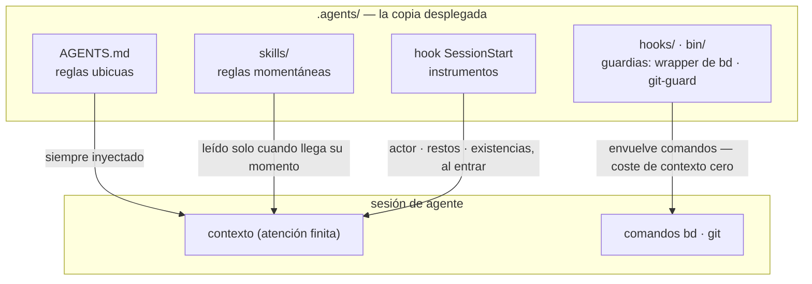

# El arnés incluido

[English](HARNESS.md) | [日本語](HARNESS.ja.md) | [简体中文](HARNESS.zh-CN.md) | [繁體中文](HARNESS.zh-TW.md) | [한국어](HARNESS.ko.md) | [Deutsch](HARNESS.de.md) | Español | [Français](HARNESS.fr.md)

El [README](README.es.md) describe el mecanismo — un único corpus, desplegado por `agents-setup` en `~/.agents` y en los `.agents/` de cada proyecto. Este documento describe lo que ese corpus entrega en [payload/](../payload/): un arnés completo y funcional, incluido como la muestra de la que partes y que personalizas.

Lo que construye este arnés no es "un agente capaz", sino **una organización que divide la atención finita (contexto) entre roles y los conecta mediante registros externos**. Cada regla siguiente se deriva de una única premisa: el contexto es finito y muere con la sesión.

## Tres capas de reglas — ubicuas, momentáneas, impuestas

Antes que su contenido, la naturaleza de una regla la decide **cómo se entrega**. Dentro de una sesión, las tres capas del corpus llegan al agente por rutas distintas — y cuanto más baja la ruta, más fuerte y más barata la regla:

- **Reglas ubicuas** (núcleo = AGENTS.md) — siempre inyectadas. Gravan la atención de cada sesión y solo se sostienen como **mejor esfuerzo**, así que esta capa solo puede llevar las pocas reglas cuyo momento de observación no se puede nombrar
- **Reglas momentáneas** (skills) — inyectadas justo a tiempo. Entran en el contexto solo cuando llega su momento, así que el detalle aquí no le cuesta nada a ningún otro momento
- **Reglas impuestas** (hooks / bin / permissions) — nunca inyectadas. Un mecanismo decide, así que no consumen atención y no pueden romperse (o dejan una huella cuando lo hacen)

**La ley del descenso**: empuja cada regla tan abajo como pueda llegar. Las capas inferiores son más fuertes *y* más baratas a la vez — una pendiente en un solo sentido donde la fuerza aumenta a medida que el coste de atención desaparece. Un prompt es solo la sala de espera para las reglas que todavía no se han convertido en mecanismo.

## Separación — fronteras que no admiten duplicación

Los subagentes se recortan no por capacidad, sino por **fronteras donde la duplicación no puede ocurrir**: unidades cuyas entradas (contexto), rangos de búsqueda y objetivos de escritura (worktrees) no se intersecan. Da la misma información a dos contextos y pagas la atención dos veces; deja que dos escriban en el mismo lugar y has creado un punto de fusión. Los puntos de fusión que la estructura no puede eliminar (la rama de integración y el registro) son los únicos protegidos por exclusión.

La separación también es ocultación. No conocer las circunstancias de la implementación es lo que le da a la revisión su poder de detección — **"no lo pases" es una decisión de diseño tan fuerte como "pásalo"**.

## Órganos — declaración frente a derivación

Cada herramienta sirve como un órgano que responde a un tipo de pregunta, y ninguna capacidad nativa de un órgano se reimplementa en otro sitio. El eje es **declaración frente a derivación**:

- **Registros de declaración** (lo que se decidió no se puede derivar, así que se registra): bd = el registro de intención y estado (lo que decidimos hacer, quién tiene qué, por qué algo está detenido); los ADR = el rastro de decisiones; el glosario = el lenguaje ubicuo
- **Derivación** (lo que una máquina puede derivar del artefacto nunca se escribe a mano): codegraph = la estructura actual del código (símbolos, rutas de llamada, radio de impacto); git = la historia del cambio

En el momento en que escribes a mano algo derivable, empieza la deriva. La memoria se sitúa en el mismo eje: el estado se deriva (la inyección de consultas de bd prime); solo los invariantes se declaran (bd remember). Lo que lleva el contexto de una sesión a otra no es una transcripción, sino un registro externo con una dirección (**el puente de contexto**).

codegraph es el órgano de exploración cotidiano, y su regla ubicua ("derivar con explore primero") se **entrega mediante la descripción de la herramienta (instrucciones del servidor MCP)** — nunca se copia en los prompts, donde se convertiría en una réplica obsoleta. La elección de herramienta no se puede verificar de forma automática, así que tampoco puede caer en la aplicación de reglas: la capa de herramientas de coste de inyección cero es la capa más baja en la que esta regla puede vivir. Los prompts del arnés detallan solo los momentos en los que *no* usarla rompe un contrato (la verificación con la realidad antes de congelar, derivar el barrido horizontal, el escaneo del revisor). La conexión (`codegraph install`) y el índice (`codegraph init`) son responsabilidad propia de codegraph — el arnés ni los verifica ni los reimplementa; SessionStart solo detecta `.codegraph/` e inyecta una línea de recordatorio.

## Revisión adversarial — las omisiones no existen hasta que se buscan

El modo de fallo peculiar de los agentes de IA es "¡hecho!" cuando no está hecho, y su esencia no es la mentira sino la **omisión** — alguien cuyo contexto solo contiene lo que escribió no puede ver lo que no escribió.

Así que la revisión no es inspección (mirar lo que existe y juzgarlo), sino **prueba de existencia**: partiendo de los requisitos, el revisor debe encontrar la implementación y la verificación que satisfacen cada uno en el artefacto — un escaneo en la dirección inversa. Al revisor no se le muestra primero el diff, porque la atención capturada por verificar lo que se escribió deja de buscar lo que no se escribió.

## Hundimiento — los bucles terminan porque el conocimiento desciende

La revisión repetida por sí sola diverge (los hallazgos brotan sin fin). El bucle converge porque cada ronda hace que el conocimiento **se hunda** una capa: hallazgos individuales → clases de defectos articuladas (contratos rotos) → aplicación de reglas (una estructura, un tipo, una única guardia). Una hipótesis que se ha hundido se elimina de la carta, así que el combustible de la revisión se reduce ronda a ronda. Cuando la misma clase de defecto aparece dos veces, la señal no es que la corrección estuviera mal, sino que **lo que estuvo mal fue el hundimiento**.

El registro de issues converge en el mismo principio: no amontonar observaciones en abierto; abrir solo lo que se decidió; plegar juntos los issues con la misma forma; dar a cada apertura su vía de digestión al nacer.

## Pruebas — la cantidad no es la cantidad de protección

Una prueba solo puede fijar un **contrato** (una promesa de la que depende el negocio); una copia de un síntoma no protege de nada frente a la regresión. La primera línea de defensa es una estructura que no puede romperse (diseños y tipos en los que la condición de fallo no puede existir); las pruebas son el último recurso para los contratos que la estructura no puede sellar.

## Vigilantes y enumeraciones — sin comprobaciones de calidad meta

Vigilantes de vigilantes, pruebas de pruebas, guardianes de guardianes — comprobaciones meta que no protegen ningún contrato de negocio se multiplican fácilmente y consumen mantenimiento sin proteger nada. Tres principios los excluyen:

- **No añadir vigilantes; hundirlo en su lugar** — querer vigilar a un guardián es un síntoma de que está demasiado arriba. La respuesta es la ley del descenso, no más vigilancia: empújalo hacia abajo y lo que había que vigilar desaparece
- **La detección avanza un solo salto** — solo los contratos que la estructura no puede sellar pueden tener detectores, y los detectores no tienen detectores. Que un detector roto pase desapercibido es el precio aceptado, por eso los detectores se mantienen mínimos y simples
- **Nunca proteger mediante enumeración** — cualquier esquema cuya cobertura sea una lista mantenida a mano convierte las adiciones olvidadas en huecos silenciosos. Preferir formas en las que la propia estructura sea la definición (el principio de payload) o en las que la máquina derive la lista como subproducto (el principio de manifest)

## El índice canónico

Los propios textos de las reglas no se duplican aquí (una copia del payload se pudriría en silencio). El índice canónico: los roles, los invariantes de calidad, la autoridad de git y las reglas ubicuas de beads están en [AGENTS.md](../payload/AGENTS.md); el trabajo previo y la composición en [agents-kickoff](../payload/skills/agents-kickoff/SKILL.md); el manejo del bucle de calidad en [agents-quality-loop](../payload/skills/agents-quality-loop/SKILL.md); las operaciones de bd y el límite de la memoria en [agents-beads-ops](../payload/skills/agents-beads-ops/SKILL.md); el diseño de pruebas en [agents-test-design](../payload/skills/agents-test-design/SKILL.md); las tres capas y la disciplina de ablación en [prompt-guidelines.md](../payload/docs/prompt-guidelines.md).

## Preguntas abiertas

- Triaje masivo de issues abiertos preexistentes al adoptar el arnés en un proyecto con un registro ya establecido (con aprobación general mediante `AGENTS_BD_OPEN_OK=1`)
- Revisión de los términos acuñados, y mayor adelgazamiento del bloque `<beads>` en AGENTS.md — después de que los instrumentos hayan reunido observaciones
