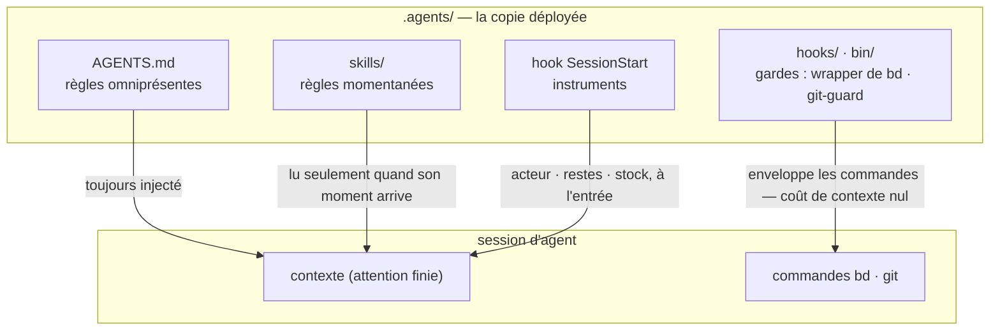

# Le harnais fourni

[English](HARNESS.md) | [日本語](HARNESS.ja.md) | [简体中文](HARNESS.zh-CN.md) | [繁體中文](HARNESS.zh-TW.md) | [한국어](HARNESS.ko.md) | [Deutsch](HARNESS.de.md) | [Español](HARNESS.es.md) | Français

[README](README.fr.md) décrit le mécanisme — un unique corpus, déployé par `agents-setup` dans `~/.agents` et dans les `.agents/` par projet. Ce document décrit ce que ce corpus livre dans [payload/](../payload/) : un harnais complet et fonctionnel, fourni comme l'exemple dont tu pars et que tu personnalises.

Ce que construit ce harnais n'est pas « un agent capable », mais **une organisation qui répartit une attention finie (le contexte) entre des rôles et les relie par des registres externes**. Chaque règle ci-dessous découle d'une prémisse unique : le contexte est fini et meurt avec la session.

## Trois couches de règles — omniprésentes, momentanées, imposées

Avant même son contenu, la nature d'une règle est décidée par **la façon dont elle est livrée**. À l'intérieur d'une session, les trois couches du corpus atteignent l'agent par des chemins différents — et plus le chemin est bas, plus la règle est forte et bon marché :

- **Règles omniprésentes** (le noyau = AGENTS.md) — toujours injectées. Elles taxent l'attention de chaque session et ne tiennent que comme un **effort maximal**, donc cette couche ne peut porter que les quelques règles dont le moment d'observation ne peut pas être nommé
- **Règles momentanées** (skills) — injectées juste à temps. Elles n'entrent dans le contexte que lorsque leur moment arrive, si bien que le détail n'y coûte rien à aucun autre moment
- **Règles imposées** (hooks / bin / permissions) — jamais injectées. Un mécanisme décide, si bien qu'elles ne consomment aucune attention et ne peuvent pas être enfreintes (ou laissent une trace quand elles le sont)

**La loi de la descente** : pousse chaque règle aussi bas qu'elle peut aller. Les couches inférieures sont à la fois plus fortes *et* moins coûteuses — une pente à sens unique où la force augmente à mesure que le coût d'attention disparaît. Un prompt n'est que la salle d'attente des règles qui n'ont pas encore été transformées en mécanisme.

## Séparation — des frontières qui n'admettent aucune duplication

Les subagents ne sont pas découpés selon leur capacité, mais selon des **frontières où la duplication ne peut pas se produire** : des unités dont les entrées (le contexte), les plages de recherche et les cibles d'écriture (worktrees) ne se recoupent pas. Donne la même information à deux contextes et tu paies l'attention deux fois ; laisse deux contextes écrire au même endroit et tu as créé un point de fusion. Les points de fusion que la structure ne peut pas supprimer (la branche d'intégration et le registre) sont les seuls protégés par exclusion.

La séparation est aussi une dissimulation. Ne pas connaître les circonstances de l'implémentation est ce qui donne à la revue son pouvoir de détection — **« ne pas le transmettre » est une décision de conception aussi forte que « le transmettre »**.

## Organes — déclaration contre dérivation

Chaque outil sert d'organe répondant à un type de question, et aucune capacité native d'un organe n'est réimplémentée ailleurs. L'axe est **déclaration contre dérivation** :

- **Registres de déclaration** (ce qui a été décidé ne peut pas être dérivé, donc on l'enregistre) : bd = le registre de l'intention et de l'état (ce que nous avons décidé de faire, qui détient quoi, pourquoi quelque chose est arrêté) ; les ADR = la trace des décisions ; le glossaire = le langage omniprésent
- **Dérivation** (ce qu'une machine peut dériver de l'artefact n'est jamais écrit à la main) : codegraph = la structure actuelle du code (symboles, chemins d'appel, rayon d'impact) ; git = l'historique des changements

Au moment où tu écris à la main quelque chose de dérivable, la dérive commence. La mémoire se situe sur le même axe : l'état est dérivé (l'injection de requêtes de bd prime) ; seuls les invariants sont déclarés (bd remember). Ce qui porte le contexte d'une session à l'autre n'est pas une transcription, mais un registre externe muni d'une adresse (**le pont de contexte**).

codegraph est l'organe d'exploration quotidien, et sa règle omniprésente (« dériver d'abord avec explore ») est **livrée par la description de l'outil (les instructions du serveur MCP)** — jamais copiée dans les prompts, où elle deviendrait une réplique obsolète. Le choix de l'outil ne peut pas être vérifié par une machine, donc il ne peut pas non plus relever de l'application des règles : la couche d'outils à coût d'injection nul est la couche la plus basse où cette règle peut vivre. Les prompts du harnais n'énoncent que les moments où *ne pas* l'utiliser rompt un contrat (la vérification avec la vérité de terrain avant le gel, la dérivation du balayage horizontal, le scan du relecteur). Le câblage (`codegraph install`) et l'index (`codegraph init`) relèvent de la responsabilité propre de codegraph — le harnais ne les vérifie ni ne les réimplémente ; SessionStart se contente de détecter `.codegraph/` et d'injecter une ligne de rappel.

## Revue contradictoire — les omissions n'existent pas tant qu'on ne les cherche pas

Le mode d'échec propre aux agents IA est le « c'est fait ! » alors que ce n'est pas fait, et son fond n'est pas le mensonge mais **l'omission** — quelqu'un dont le contexte ne contient que ce qu'il a écrit ne peut pas voir ce qu'il n'a pas écrit.

La revue n'est donc pas une inspection (regarder ce qui existe et le juger), mais une **preuve d'existence** : partant des exigences, le relecteur doit trouver l'implémentation et la vérification qui satisfont chacune d'elles dans l'artefact — un scan en sens inverse. Le diff n'est pas montré en premier au relecteur, parce que l'attention capturée par la vérification de ce qui a été écrit cesse de chercher ce qui n'a pas été écrit.

## Enfoncement — les boucles se terminent parce que le savoir descend

La revue répétée seule diverge (les constats surgissent sans fin). La boucle converge parce que chaque tour fait **s'enfoncer** le savoir d'une couche : des constats individuels → des classes de défauts articulées (des contrats rompus) → l'application des règles (une structure, un type, une seule garde). Une hypothèse qui s'est enfoncée est retirée de la charte, si bien que le carburant de la revue se réduit tour après tour. Quand la même classe de défaut resurgit deux fois, le signal n'est pas que le correctif était erroné, mais que **c'est l'enfoncement qui l'était**.

Le registre des tickets converge sur le même principe : ne pas empiler d'observations dans l'ouvert ; n'ouvrir que ce qui a été décidé ; replier ensemble les tickets de même forme ; donner à chaque dépôt sa voie de digestion dès sa naissance.

## Tests — le nombre n'est pas la mesure de la protection

Un test ne peut fixer qu'un **contrat** (une promesse dont dépend l'activité) ; une copie d'un symptôme ne protège de rien contre la régression. La première ligne de défense est une structure qui ne peut pas se rompre (des conceptions et des types dans lesquels la condition de défaillance ne peut pas exister) ; les tests sont le dernier recours pour les contrats que la structure ne peut pas sceller.

## Observateurs et énumérations — pas de contrôles qualité méta

Des observateurs d'observateurs, des tests de tests, des gardes de gardes — des contrôles méta qui ne protègent aucun contrat métier se multiplient facilement et consomment de la maintenance sans rien protéger. Trois principes les excluent :

- **Ne pas ajouter d'observateurs ; les enfoncer à la place** — vouloir observer une garde est le symptôme qu'elle est placée trop haut. La réponse est la loi de la descente, pas plus de surveillance : pousse-la vers le bas et ce qu'il fallait observer disparaît
- **La détection ne va qu'un cran plus loin** — seuls les contrats que la structure ne peut pas sceller peuvent avoir des détecteurs, et les détecteurs n'ont pas de détecteurs. Qu'un détecteur défaillant passe inaperçu est le prix accepté, c'est pourquoi les détecteurs restent minimaux et simples
- **Ne jamais garder par énumération** — tout schéma dont la couverture est une liste tenue à la main transforme les ajouts oubliés en lacunes silencieuses. Préférer les formes où la structure elle-même est la définition (le principe du payload) ou où la machine dérive la liste comme sous-produit (le principe du manifest)

## L'index canonique

Les textes de règles eux-mêmes ne sont pas dupliqués ici (une copie du payload pourrirait en silence). L'index canonique : les rôles, les invariants de qualité, l'autorité git et les règles omniprésentes de beads sont dans [AGENTS.md](../payload/AGENTS.md) ; le travail préparatoire et la composition dans [agents-kickoff](../payload/skills/agents-kickoff/SKILL.md) ; la conduite de la boucle de qualité dans [agents-quality-loop](../payload/skills/agents-quality-loop/SKILL.md) ; les opérations bd et la limite de la mémoire dans [agents-beads-ops](../payload/skills/agents-beads-ops/SKILL.md) ; la conception des tests dans [agents-test-design](../payload/skills/agents-test-design/SKILL.md) ; les trois couches et la discipline d'ablation dans [prompt-guidelines.md](../payload/docs/prompt-guidelines.md).

## Questions ouvertes

- Triage massif des tickets ouverts préexistants lors de l'adoption du harnais dans un projet doté d'un registre déjà établi (avec une approbation générale via `AGENTS_BD_OPEN_OK=1`)
- Révision des termes forgés, et allègement supplémentaire du bloc `<beads>` dans AGENTS.md — une fois que les instruments auront rassemblé des observations
