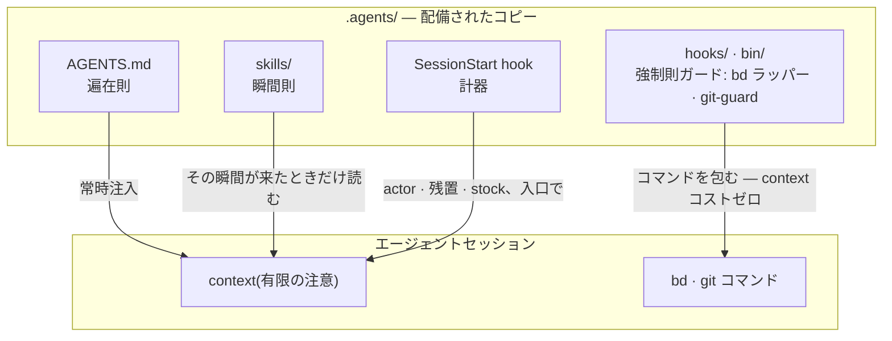

# 同梱ハーネス

[English](HARNESS.md) | 日本語 | [简体中文](HARNESS.zh-CN.md) | [繁體中文](HARNESS.zh-TW.md) | [한국어](HARNESS.ko.md) | [Deutsch](HARNESS.de.md) | [Español](HARNESS.es.md) | [Français](HARNESS.fr.md)

[README](README.ja.md) が説明するのは仕組み — 正本 1 つを `agents-setup` が `~/.agents` と各プロジェクトの `.agents/` へ配備する — である。この文書が説明するのは、その正本が [payload/](../payload/) に積んでいる物である: 完全に動くハーネス一式であり、そこから自分用に育てるためのサンプルとして同梱されている。

このハーネスが作るのは「1 つの有能なエージェント」ではなく、**限られた注意(コンテキスト)を役割で分割し、外部記録で接続した組織**である。以下の規則はすべて 1 つの前提から導かれる — context は有限で、セッションと共に消える。

## 規則の三層 — 遍在則・瞬間則・強制則

規則は内容より先に、**配達のされ方**で性質が決まる。セッションの内側では、正本の三層がそれぞれ違う経路でエージェントに届く — 経路が下にあるほど、規則は強く、そして安く届く:

- **遍在則**(コア = AGENTS.md)— 常時注入。全セッションの注意を常に消費し、守られるかは注意の配分に依存する**ベストエフォート**である。だからここに置けるのは、観測の瞬間を選べない少数の規則だけ
- **瞬間則**(スキル)— just-in-time 注入。その瞬間が来たときだけ context に入るので、詳細に書いても他の瞬間の注意を奪わない
- **強制則**(hooks / bin / permissions)— 注入されない。仕組みが判定するので注意を消費せず、破られない(または破れば痕跡が残る)

**落下則**: 規則は可能な限り下の層へ落とす。下へ行くほど保証が強くなり、同時に注意コストが消える — 強度と費用が同時に改善する一方通行の坂である。プロンプトとは「まだ仕組みに落とせていない規則の待機場所」に過ぎない。

## 分離 — 重複を作らない境界

サブエージェントは能力ではなく**重複が起きない境界**で切る: 判断材料(context)・探索範囲・書き込み先(worktree)が交差しない単位。同じ情報を 2 つの context に持たせれば注意を二重に払い、同じ場所を 2 つが書けば合流点が生まれる。構造で消せない合流点(統合ブランチと台帳)だけを、排他で守る。

分離は隠蔽でもある。実装の事情を知らないことがレビューの検出力であり、**「渡さない」は「渡す」と同じ強さの設計判断**である。

## 器官 — 宣言と導出を分ける

道具は「答えられる問い」を 1 種類ずつ持つ器官として使い分け、器官のネイティブ機能を他で再実装しない。分類の軸は**宣言か導出か**:

- **宣言の記録**(決めたことは導出できないから、記録する): bd = 意思と状態の台帳(何をやると決めたか・誰が何を・なぜ止まっているか)、ADR = 判断の経緯、用語の正本 = ユビキタス言語
- **導出**(実物から機械が導けるものは、手で記録しない): codegraph = コードの現在の構造(シンボル・呼び出し経路・影響範囲)、git = 変更の履歴

導出できるものを手で書いた瞬間から乖離が始まる。記憶も同じ軸の上にある: 状態は導出(bd prime のクエリ注入)、不変事項だけが宣言(bd remember)。セッション間で文脈を運ぶのは会話の転写ではなく、住所を持つ外部記録である(**コンテキストブリッジ**)。

codegraph は普段の探索で常用する器官であり、その遍在則(まず explore で導出する)は**ツール説明(MCP サーバー指示)が配達する** — プロンプトに書き写さない(codegraph 側の更新に置いていかれる写しになる)。ツール選択は機械判定できないので強制則にも落とせない — 注入コストゼロのツール層が、この規則の最下層である。ハーネスのプロンプトが明文化するのは、使わないことが契約違反になる義務の瞬間(凍結前の土地勘・横展開スイープの導出・reviewer の走査)だけ。配線(`codegraph install`)と index(`codegraph init`)は codegraph 自身の責務で、ハーネスは検査も再実装もしない — SessionStart が `.codegraph/` の存在を検出して想起の 1 行を注入するのみ。

## 敵対的レビュー — 欠落は探さないと存在しない

AI エージェント特有の失敗は「終わっていないのに完了しました」であり、その正体は嘘ではなく**欠落**である — 書いた物しか context に無い者には、書かなかった物が見えない。

だからレビューは検品(できた物を眺めて良し悪しを言う)ではなく **存在証明**にする: 要件を起点に「それを満たす実装と検証が実物に存在するか」を探させる、逆方向の走査。レビュアーに差分を先に見せないのは、注意が「書かれた物」の検証に占有されると「書かれなかった物」の探索が消えるからである。

## 沈降 — 知識を沈めるからループが終わる

レビューを繰り返すだけでは発散する(指摘は無限に湧く)。ループが収束するのは、ラウンドごとに知識が層を**沈降**するからである: 個別の指摘 → 欠陥クラス(壊れた契約)としての言語化 → 強制則(構造・型・ガード 1 本)へ。沈んだ仮説は憲章から取り除かれ、レビューの燃料は回を追って減る。同じ欠陥クラスが二度浮上したら、直し方ではなく**沈め方**が間違っている合図である。

issue の台帳も同じ原理で収束させる: 観測を open に積み上げるのではなく、決めた事だけを open にし、同型は畳み、起票時に消化の経路を与える。

## テスト — 件数は守りの量ではない

テストが固定してよいのは**契約**(業務にとっての約束)だけであり、症状の写しは退行から何も守らない。第一の防御は壊せない構造(発生条件を持てない設計・型)であり、テストは構造で封じられない契約のための最後の手段である。

## 見張りと列挙 — メタな品質チェックを作らない

監視の監視・テストのテスト・ガードのガードのような、業務の契約を守らないメタな検査は増殖しやすく、何も守らないまま維持費だけを食う。3 つの原則で排除する:

- **見張りは足さず、沈める** — ガードを見張りたくなるのは層が高すぎる徴候である。応答は監視の追加ではなく落下則の適用: 下げれば見張る対象そのものが消える
- **検出は一段まで** — 構造で閉じられない契約だけが検出型を持てる。検出の検出は作らない。検出器が壊れたら気づけないことはこの設計の対価であり、だから検出器は最小・単純に保つ
- **列挙で守らない** — 守備範囲・修正対象・監視対象が人の列挙で決まる仕組みは、足し忘れが静かな空白になる漏れの温床。構造そのものが定義になる形(payload 方式)か、列挙を機械が副産物として導出する形(manifest 方式)に寄せる

## 正本の索引

規則の本文はここに書かない(payload と二重管理になり、複製は黙って古くなる)。正本の索引: 役割・品質の不変条件・Git 権限・beads の遍在則は [AGENTS.md](../payload/AGENTS.md)、着手前と組成は [agents-kickoff](../payload/skills/agents-kickoff/SKILL.md)、品質ループの運転は [agents-quality-loop](../payload/skills/agents-quality-loop/SKILL.md)、bd 運用と記憶の線引きは [agents-beads-ops](../payload/skills/agents-beads-ops/SKILL.md)、テスト設計は [agents-test-design](../payload/skills/agents-test-design/SKILL.md)、三層配置とアブレーションの規律は [prompt-guidelines.md](../payload/docs/prompt-guidelines.md)。

## 検討中

- 既存の台帳を持つプロジェクトへハーネスを導入する際の、既存 open issue の一括トリアージ(`AGENTS_BD_OPEN_OK=1` の包括承認つき)
- 造語の見直しと、AGENTS.md の `<beads>` 断片のさらなるスリム化 — 計器が観測を蓄積してから
