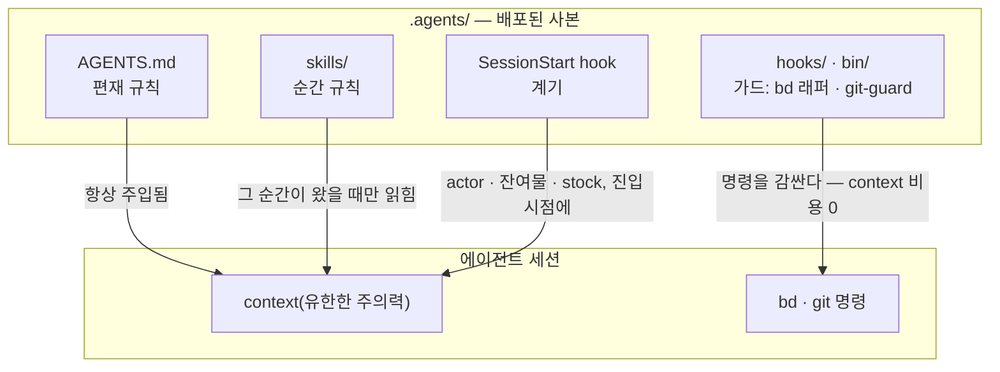

# 동봉된 하네스

[English](HARNESS.md) | [日本語](HARNESS.ja.md) | [简体中文](HARNESS.zh-CN.md) | [繁體中文](HARNESS.zh-TW.md) | 한국어 | [Deutsch](HARNESS.de.md) | [Español](HARNESS.es.md) | [Français](HARNESS.fr.md)

[README](README.ko.md)는 메커니즘을 설명한다 — 정본은 하나이고, 그것을 `agents-setup`이 `~/.agents`와 프로젝트별 `.agents/`로 배포한다. 이 문서는 그 정본이 [payload/](../payload/)에 싣고 오는 것을 설명한다: 그대로 작동하는 완결된 하네스이며, 여기서 출발해 개인화해 나가는 샘플로서 함께 실려 온다.

이 하네스가 만드는 것은 "유능한 에이전트 하나"가 아니라 **유한한 주의력 (컨텍스트)을 역할별로 나누고 외부 기록으로 연결한 조직**이다. 아래의 모든 규칙은 단 하나의 전제에서 나온다: 컨텍스트는 유한하고 세션과 함께 사라진다.

## 규칙의 세 층 — 편재 규칙, 순간 규칙, 강제 규칙

규칙의 내용보다 먼저, **어떻게 전달되는가**가 그 성격을 결정한다. 세션 내부에서는 정본의 세 층이 서로 다른 경로로 에이전트에 도달한다 — 경로가 낮을수록 규칙은 강해지고 동시에 비용은 낮아진다:

- **편재 규칙**(코어 = AGENTS.md) — 항상 주입된다. 모든 세션의 주의력을 세금처럼 소모하며, 지켜지는지는 어디까지나 **최선의 노력**에 달려 있다. 그래서 이 층에는 관측 시점을 특정할 수 없는 소수의 규칙만 올려야 한다
- **순간 규칙**(스킬) — 적시(just-in-time)에 주입된다. 그 순간이 왔을 때만 컨텍스트에 들어오므로, 여기에 자세히 써도 다른 순간의 주의력은 잃지 않는다
- **강제 규칙**(hooks / bin / permissions) — 절대 주입되지 않는다. 메커니즘이 판정하므로 주의력을 소모하지 않고, 어길 수도 없다(어기면 흔적이 남는다)

**하강 법칙**: 규칙은 갈 수 있는 한 아래 층까지 밀어 내린다. 아래로 내려갈수록 보장은 강해지고, 동시에 주의력 비용은 사라진다 — 강도와 비용이 동시에 좋아지는 일방통행 경사다. 프롬프트란 아직 메커니즘으로 바뀌지 못한 규칙의 대기실일 뿐이다.

## 분리 — 중복이 일어나지 않는 경계

서브에이전트는 능력이 아니라 **중복이 일어나지 않는 경계**로 잘라낸다: 입력(컨텍스트), 탐색 범위, 쓰기 대상(worktree)이 서로 겹치지 않는 단위다. 같은 정보를 두 컨텍스트에 주면 주의력을 두 번 지불하는 것이고, 두 주체가 같은 곳을 쓰게 하면 병합점이 생긴다. 구조로도 없앨 수 없는 병합점(통합 브랜치와 원장)만 배타 처리로 지킨다.

분리는 은폐이기도 하다. 구현의 사정을 모른다는 것 자체가 리뷰의 탐지력을 만든다 — **"넘기지 않는다"는 "넘긴다"와 똑같은 무게를 지닌 설계 결정이다**.

## 기관 — 선언과 도출을 가른다

각 도구는 한 가지 종류의 질문에 답하는 기관으로 구분해서 쓰고, 한 기관의 고유 기능을 다른 곳에서 재구현하지 않는다. 분류 축은 **선언 대 도출**이다:

- **선언의 기록**(결정된 것은 도출할 수 없으므로 기록한다): bd = 의도와 상태의 원장(무엇을 하기로 했는지, 누가 무엇을 맡고 있는지, 왜 멈췄는지), ADR = 결정의 경위, 용어집 = 유비쿼터스 언어
- **도출**(기계가 산출물에서 도출할 수 있는 것은 절대 손으로 쓰지 않는다): codegraph = 코드의 현재 구조(심볼, 호출 경로, 영향 범위), git = 변경 이력

도출 가능한 것을 손으로 쓰는 순간부터 표류가 시작된다. 기억도 같은 축 위에 있다: 상태는 도출되고(bd prime의 쿼리 주입), 불변 사항만 선언된다(bd remember). 세션을 넘어 컨텍스트를 나르는 것은 대화 기록이 아니라 주소를 가진 외부 기록이다(**컨텍스트 브리지**).

codegraph는 일상적인 탐색에 상시 쓰는 기관이며, 그 편재 규칙("먼저 explore로 도출하라")은 **도구 설명(MCP 서버 instructions)이 전달한다** — 프롬프트로 옮겨 적지 않는다(codegraph 쪽 갱신에서 뒤처진 낡은 사본이 되어버린다). 도구 선택은 기계로 검증할 수 없으므로 강제 규칙으로도 내려보낼 수 없다 — 주입 비용이 0인 도구 계층이 이 규칙이 머물 수 있는 가장 낮은 층이다. 하네스 프롬프트가 명문화하는 것은 codegraph를 쓰지 않으면 계약 위반이 되는 의무적인 순간(동결 전 현장 확인, 수평 전개 스윕의 도출, 리뷰어의 스캔)뿐이다. 연결 (`codegraph install`)과 인덱싱(`codegraph init`)은 codegraph 자신의 책임이며, 하네스는 검사도 재구현도 하지 않는다 — SessionStart는 `.codegraph/`의 존재만 감지해서 상기시키는 한 줄을 주입할 뿐이다.

## 적대적 리뷰 — 누락은 찾지 않으면 존재하지 않는다

AI 에이전트 특유의 실패 양식은 "다 안 됐는데 다 됐다고 하는 것"이며, 그 정체는 거짓말이 아니라 **누락**이다 — 자기가 쓴 것만 컨텍스트에 남는 사람에게는, 쓰지 않은 것이 보이지 않는다.

그래서 리뷰는 검품(만들어진 것을 살펴보고 좋고 나쁨을 판단하는 일)이 아니라 **존재 증명**이 되어야 한다: 요구 사항에서 출발해, 그것을 충족하는 구현과 검증이 실제 산출물에 존재하는지를 찾아내는, 역방향 스캔이다. 리뷰어에게 diff를 먼저 보여주지 않는 이유는, "쓰인 것"을 검증하는 데 주의력이 붙잡히면 "쓰이지 않은 것"을 찾는 일이 멈추기 때문이다.

## 침강 — 지식이 가라앉기 때문에 루프가 끝난다

리뷰만 반복하면 발산한다(지적 사항이 끝없이 솟아난다). 루프가 수렴하는 것은 라운드마다 지식이 한 층씩 **침강**하기 때문이다: 개별 지적 → 언어화된 결함 클래스(깨진 계약) → 강제 규칙(구조, 타입, 가드 하나)으로. 가라앉은 가설은 헌장에서 제거되므로, 리뷰의 연료는 라운드를 거듭할수록 줄어든다. 같은 결함 클래스가 두 번 떠오른다면, 잘못된 것은 고친 방식이 아니라 **가라앉힌 방식**이라는 신호다.

이슈 원장도 같은 원리로 수렴시킨다: 관측을 open에 쌓아두지 않고, 결정된 것만 open으로 두며, 같은 모양의 이슈는 접어 합치고, 등록되는 순간 소화 경로를 함께 부여한다.

## 테스트 — 개수는 보호의 양이 아니다

테스트가 고정해도 되는 것은 **계약**(업무가 의지하는 약속)뿐이며, 증상을 그대로 베낀 테스트는 회귀로부터 아무것도 지키지 못한다. 첫 번째 방어선은 깨질 수 없는 구조(실패 조건 자체가 존재할 수 없는 설계와 타입)이며, 테스트는 구조로 봉인할 수 없는 계약을 위한 최후의 수단이다.

## 감시자와 열거 — 메타 품질 검사는 만들지 않는다

감시자를 감시하고, 테스트를 테스트하고, 가드를 가드하는 식의, 어떤 업무 계약도 지키지 않는 메타 검사는 쉽게 증식하며 유지 비용만 먹고 아무것도 지키지 못한다. 세 가지 원칙으로 이를 배제한다:

- **감시자를 더하지 말고, 가라앉혀라** — 가드를 감시하고 싶어진다는 것 자체가 그 계층이 너무 높다는 증상이다. 해답은 감시 추가가 아니라 하강 법칙의 적용이다: 아래로 내리면 감시할 대상 자체가 사라진다
- **탐지는 한 홉까지만** — 구조로 봉인할 수 없는 계약만 탐지기를 가질 수 있고, 탐지기에는 탐지기를 두지 않는다. 탐지기가 고장 나도 눈치채지 못하는 것은 이 설계가 치르는 대가이며, 그래서 탐지기는 최소한으로 단순하게 유지한다
- **열거로 지키지 않는다** — 보호 범위, 수정 대상, 감시 대상이 사람이 손으로 작성한 목록으로 정해지는 방식은 추가를 깜빡하는 순간 조용한 구멍이 된다. 구조 자체가 정의가 되는 형태(payload 방식)나, 기계가 목록을 부산물로 도출하는 형태(manifest 방식)를 택한다

## 정본 색인

규칙 본문은 여기에 다시 적지 않는다(payload와 이중 관리가 되고, 사본은 조용히 낡아간다). 정본 색인: 역할, 품질 불변조건, Git 권한, beads의 편재 규칙은 [AGENTS.md](../payload/AGENTS.md)에, 착수 전 준비와 구성은 [agents-kickoff](../payload/skills/agents-kickoff/SKILL.md)에, 품질 루프 운용은 [agents-quality-loop](../payload/skills/agents-quality-loop/SKILL.md)에, bd 운용과 기억의 경계는 [agents-beads-ops](../payload/skills/agents-beads-ops/SKILL.md)에, 테스트 설계는 [agents-test-design](../payload/skills/agents-test-design/SKILL.md)에, 세 층 배치와 ablation 규율은 [prompt-guidelines.md](../payload/docs/prompt-guidelines.md)에 있다.

## 검토 중인 사항

- 이미 원장이 자리 잡은 프로젝트에 하네스를 도입할 때, 기존에 열려 있던 이슈를 일괄 트리아지하는 방법(포괄 승인 `AGENTS_BD_OPEN_OK=1`과 함께)
- 만든 용어들에 대한 재검토, 그리고 AGENTS.md의 `<beads>` 블록을 더 슬림하게 줄이는 작업 — 계기가 관측치를 충분히 모은 뒤에
