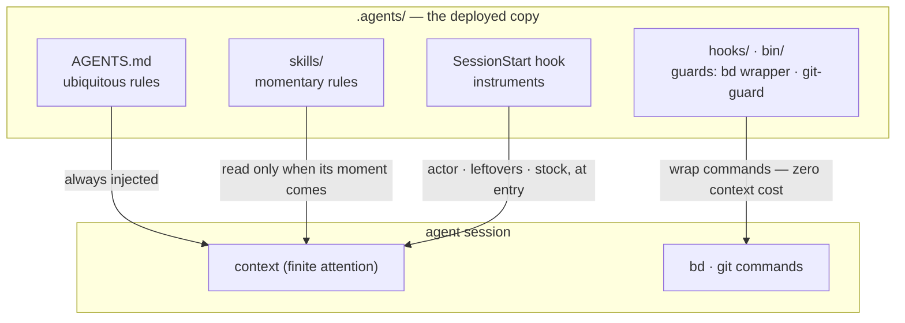

# The bundled harness

English | [日本語](HARNESS.ja.md) | [简体中文](HARNESS.zh-CN.md) | [繁體中文](HARNESS.zh-TW.md) | [한국어](HARNESS.ko.md) | [Deutsch](HARNESS.de.md) | [Español](HARNESS.es.md) | [Français](HARNESS.fr.md)

[README](../README.md) describes the mechanism — one corpus, deployed by `agents-setup` into `~/.agents` and per-project `.agents/`. This document describes what that corpus ships in [payload/](../payload/): a complete, working harness, included as the sample you start from and personalize.

What this harness builds is not "one capable agent" but **an organization that splits finite attention (context) across roles and connects them through external records**. Every rule below derives from a single premise: context is finite and dies with the session.

## Three layers of rules — ubiquitous, momentary, enforced

Before its content, a rule's nature is decided by **how it is delivered**. Inside a session, the three layers of the corpus reach the agent by different routes — and the lower the route, the stronger and the cheaper the rule:

- **Ubiquitous rules** (core = AGENTS.md) — always injected. They tax the attention of every session and hold only as **best effort**, so this layer may carry nothing but the few rules whose moment of observation cannot be named
- **Momentary rules** (skills) — injected just in time. They enter context only when their moment arrives, so detail here costs no other moment anything
- **Enforced rules** (hooks / bin / permissions) — never injected. A mechanism decides, so they consume no attention and cannot be broken (or leave a trace when they are)

**The law of descent**: push every rule as far down as it will go. Lower layers are stronger *and* cheaper at once — a one-way slope where strength rises as attention cost disappears. A prompt is merely the waiting room for rules that have not yet been turned into mechanism.

## Separation — boundaries that admit no duplication

Subagents are cut not by capability but by **boundaries where duplication cannot occur**: units whose inputs (context), search ranges, and write targets (worktrees) do not intersect. Give the same information to two contexts and you pay attention twice; let two write the same place and you have created a merge point. The merge points that structure cannot remove (the integration branch and the ledger) are the only ones protected by exclusion.

Separation is also concealment. Not knowing the implementation's circumstances is what gives review its detection power — **"do not pass it" is a design decision as strong as "pass it"**.

## Organs — declaration vs. derivation

Each tool serves as an organ answering one kind of question, and no organ's native capability is reimplemented elsewhere. The axis is **declaration versus derivation**:

- **Records of declaration** (what was decided cannot be derived, so record it): bd = the ledger of intent and state (what we decided to do, who holds what, why something is stopped); ADRs = the trail of decisions; the glossary = the ubiquitous language
- **Derivation** (what a machine can derive from the artifact is never written by hand): codegraph = the code's current structure (symbols, call paths, blast radius); git = the history of change

The moment you hand-write something derivable, drift begins. Memory sits on the same axis: state is derived (bd prime's query injection); only invariants are declared (bd remember). What carries context across sessions is not a transcript but an external record with an address (**the context bridge**).

codegraph is the everyday exploration organ, and its ubiquitous rule ("derive with explore first") is **delivered by the tool description (MCP server instructions)** — never copied into prompts, where it would become a stale replica. Tool choice cannot be machine-checked, so it cannot fall to enforcement either: the zero-injection-cost tool layer is the lowest layer this rule can live in. The harness prompts spell out only the moments where *not* using it breaks a contract (ground-truthing before freezing, deriving the horizontal sweep, the reviewer's scan). Wiring (`codegraph install`) and the index (`codegraph init`) are codegraph's own responsibility — the harness neither checks nor reimplements them; SessionStart merely detects `.codegraph/` and injects one line of recall.

## Adversarial review — omissions do not exist until sought

The failure mode peculiar to AI agents is "done!" when it is not done, and its substance is not lying but **omission** — someone whose context holds only what they wrote cannot see what they did not write.

So review is not inspection (looking at what exists and judging it) but **proof of existence**: starting from the requirements, the reviewer must find the implementation and verification that satisfy each one in the artifact — a scan in the reverse direction. The reviewer is not shown the diff first, because attention captured by verifying what was written stops searching for what was not.

## Sinking — loops end because knowledge descends

Review repeated alone diverges (findings well up without end). The loop converges because each round makes knowledge **sink** a layer: individual findings → articulated defect classes (broken contracts) → enforcement (a structure, a type, a single guard). A hypothesis that has sunk is removed from the charter, so the fuel of review shrinks round by round. When the same defect class surfaces twice, the signal is not that the fix was wrong but that **the sinking was**.

The issue ledger converges on the same principle: do not pile observations into open; open only what was decided; fold same-shaped issues together; give every filing its digestion path at birth.

## Tests — count is not the amount of protection

A test may pin only a **contract** (a promise the business relies on); a copy of a symptom protects nothing from regression. The first line of defense is structure that cannot break (designs and types in which the failure condition cannot exist); tests are the last resort for contracts that structure cannot seal.

## Watchers and enumerations — no meta quality checks

Watchers of watchers, tests of tests, guards of guards — meta checks that guard no business contract multiply easily and eat maintenance while protecting nothing. Three principles exclude them:

- **Do not add watchers; sink instead** — wanting to watch a guard is a symptom that it sits too high. The answer is the law of descent, not more surveillance: push it down and the thing to watch disappears
- **Detection goes one hop** — only contracts that structure cannot seal may have detectors, and detectors get no detectors. That a broken detector goes unnoticed is the accepted price, which is why detectors stay minimal and simple
- **Never guard by enumeration** — any scheme whose coverage is a hand-kept list turns forgotten additions into silent gaps. Prefer forms where the structure itself is the definition (the payload principle) or where the machine derives the list as a by-product (the manifest principle)

## The canonical index

The rule texts themselves are not duplicated here (a copy of the payload would silently rot). The canonical index: roles, quality invariants, git authority and the beads ubiquitous rules are in [AGENTS.md](../payload/AGENTS.md); pre-work and composition in [agents-kickoff](../payload/skills/agents-kickoff/SKILL.md); operating the quality loop in [agents-quality-loop](../payload/skills/agents-quality-loop/SKILL.md); bd operations and the memory boundary in [agents-beads-ops](../payload/skills/agents-beads-ops/SKILL.md); test design in [agents-test-design](../payload/skills/agents-test-design/SKILL.md); the three layers and the ablation discipline in [prompt-guidelines.md](../payload/docs/prompt-guidelines.md).

## Open questions

- Bulk triage of pre-existing open issues when adopting the harness in a project with an established ledger (with blanket `AGENTS_BD_OPEN_OK=1` approval)
- Review of coined terms, and further slimming of the `<beads>` block in AGENTS.md — after the instruments have gathered observations
