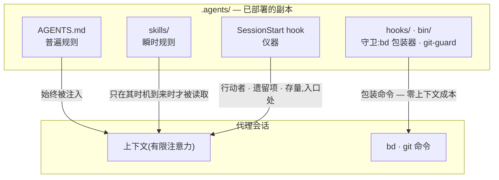

# 随附的框架

[English](HARNESS.md) | [日本語](HARNESS.ja.md) | 简体中文 | [繁體中文](HARNESS.zh-TW.md) | [한국어](HARNESS.ko.md) | [Deutsch](HARNESS.de.md) | [Español](HARNESS.es.md) | [Français](HARNESS.fr.md)

[README](README.zh-CN.md) 描述的是机制——一份文库,由 `agents-setup` 部署到 `~/.agents` 与各项目的 `.agents/`。本文档描述的是这份文库在 [payload/](../payload/) 中所分发的内容:一套完整、可运行的框架,作为你据以起步并加以个性化的样例一同随附。

本框架所构建的并非"一个能力全面的代理",而是**一个把有限注意力(上下文)拆分到各个角色、并通过外部记录将它们连接起来的组织**。以下每一条规则都源自同一个前提:上下文是有限的,并且会随会话一同消亡。

## 三层规则——普遍、瞬时、强制

在讨论内容之前,一条规则的性质首先由**它是如何被传递的**来决定。在一次会话内部,文库的三层规则通过不同的路径抵达代理——路径越低,规则就越强、也越廉价:

- **普遍规则**(核心即 AGENTS.md)——始终被注入。它们会消耗每一次会话的注意力,并且只能作为**尽力而为**来遵守,因此这一层只应容纳那些少数无法为其指明具体观察时机的规则
- **瞬时规则**(技能)——即时注入。它们只在自己的时机到来时才进入上下文,因此写在这里的细节不会耗费任何其他时刻的成本
- **强制规则**(hooks / bin / permissions)——从不被注入。由机制来做判断,因此它们不消耗任何注意力,也无法被违反(即便被违反也会留下痕迹)

**下降律**:把每一条规则尽可能推到它能到达的最低层。更低的层次同时兼具更强与更廉价两种性质——这是一道单向的斜坡,注意力成本消失的同时强度随之上升。提示词不过是那些尚未被转化为机制的规则的等候室。

## 分割——不容许重复的边界

子代理的切分依据不是能力,而是**不会产生重复的边界**:各单元的输入(上下文)、搜索范围与写入目标(worktree)彼此互不相交。把同一份信息交给两个上下文,你就要为注意力多付一次账;让两者写同一个地方,你就制造出了一个合并点。结构无法消除的那些合并点(集成分支与账本)才是唯一受互斥保护的对象。

分割同时也是遮蔽。不了解实现的具体情形,恰恰是审查具备检测力的原因——**"不传递它"与"传递它"是同样有力的设计决策**。

## 器官——声明与派生

每一个工具都作为一个器官,回答一类问题,而且任何器官的原生能力都不会在别处被重新实现。这条轴线是**声明与派生**:

- **声明的记录**(被决定的事情无法被派生出来,所以要记录下来):bd = 意图与状态的账本(我们决定做什么、谁在负责什么、为何某事被搁置);ADR = 决策的轨迹;词汇表 = 通用语言
- **派生**(凡是机器能从产物中派生出来的东西,就绝不手写):codegraph = 代码当前的结构(符号、调用路径、影响范围);git = 变更的历史

一旦你手写了某个本可被派生的东西,漂移便随之开始。记忆也处在同一条轴线上:状态是被派生出来的(bd prime 的查询注入);只有不变量才被声明(bd remember)。跨会话携带上下文的不是聊天记录,而是一份带有地址的外部记录(**上下文桥**)。

codegraph 是日常探索所用的器官,它的普遍规则("先用 explore 派生")**通过工具描述(MCP server instructions)来传递**——绝不会被复制进提示词,否则就会变成一份陈旧的复制品。工具的选择无法被机器校验,因此它也无法落入强制层:零注入成本的工具层,是这条规则能够安身的最低层。本框架的提示词只在*不*使用它就会破坏某个契约的那些时刻才把话说清楚(冻结前的事实核验、派生横向扫描、审查者的扫描)。接入(`codegraph install`)与建立索引(`codegraph init`)是 codegraph 自身的职责——本框架既不校验也不重新实现它们;SessionStart 只是检测 `.codegraph/` 是否存在,并注入一行提醒。

## 对抗式审查——遗漏在被寻找之前并不存在

AI 代理特有的失败模式,是明明没做完却说"做完了!",而其本质不是说谎,而是**遗漏**——一个上下文里只装着自己写下之物的人,是看不见自己没写下之物的。

因此审查不是检验(查看已存在之物并对其作出判断),而是**存在性证明**:审查者必须从需求出发,在产物中找到满足每一条需求的实现与验证——这是一次反方向的扫描。审查者不会先被给出 diff,因为被"核实已写之物"占据的注意力,会停止寻找那些未被写下之物。

## 下沉——循环之所以收敛,是因为知识在下沉

单纯重复审查会发散(发现会源源不断地冒出来,永无止境)。循环之所以收敛,是因为每一轮都让知识**下沉**一层:个别发现 → 被清楚表述的缺陷类别(被打破的契约) → 强制机制(一个结构、一个类型、一道守卫)。已经下沉的假设会从任务清单中移除,因此审查的燃料一轮比一轮减少。当同一类缺陷第二次出现时,这传递的信号不是修复本身错了,而是**下沉这件事错了**。

议题账本收敛于同一条原则:不要把观察堆进 open 状态;只有已经决定要做的事才能被开立;把形态相同的议题合并起来;每一笔登记在诞生之时就要指定它的消化路径。

## 测试——数量不等于保护的份量

一个测试只应钉住一个**契约**(业务所依赖的一项承诺);单纯复制一个症状,不能防止任何回归。第一道防线是不会破坏的结构(在其中失败条件根本无法存在的设计与类型);测试是留给那些结构无法封住的契约的最后手段。

## 监视者与枚举——不做元质量检查

监视者的监视者、测试的测试、守卫的守卫——这些不守护任何业务契约的元检查很容易不断增殖,吞噬维护成本却什么也保护不了。三条原则将它们排除在外:

- **不要增加监视者,而要下沉**——想要监视一道守卫,本身就是它所处位置太高的症状。答案是下降律,而不是更多的监控:把它往下推,需要被监视的对象就会随之消失
- **检测只走一跳**——只有结构无法封住的契约才可以拥有检测器,而检测器本身不再拥有检测器。检测器坏掉却无人察觉,是被接受的代价,这正是检测器必须保持极简的原因
- **绝不通过枚举来守护**——任何覆盖范围依赖手工维护清单的方案,都会把被遗忘的新增项变成无声的漏洞。应优先选择结构本身即定义的形式(payload 原则),或机器把清单作为副产品派生出来的形式(manifest 原则)

## 权威索引

规则文本本身不会在此重复(payload 的副本会无声腐坏)。权威索引如下:角色、质量不变量、git 权限与 beads 的普遍规则在 [AGENTS.md](../payload/AGENTS.md) 中;前置工作与组合方式在 [agents-kickoff](../payload/skills/agents-kickoff/SKILL.md) 中;质量循环的运作方式在 [agents-quality-loop](../payload/skills/agents-quality-loop/SKILL.md) 中;bd 操作与记忆边界在 [agents-beads-ops](../payload/skills/agents-beads-ops/SKILL.md) 中;测试设计在 [agents-test-design](../payload/skills/agents-test-design/SKILL.md) 中;三层结构与消融纪律在 [prompt-guidelines.md](../payload/docs/prompt-guidelines.md) 中。

## 未决问题

- 在已有账本的项目中引入本框架时,如何批量分诊既有的 open 议题(需配合整体性的 `AGENTS_BD_OPEN_OK=1` 授权)
- 待仪器积累足够观察结果后,复审自造术语,并进一步精简 AGENTS.md 中的 `<beads>` 区块
