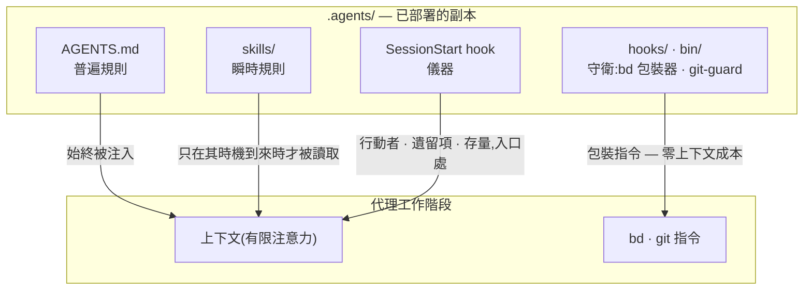

# 隨附的框架

[English](HARNESS.md) | [日本語](HARNESS.ja.md) | [简体中文](HARNESS.zh-CN.md) | 繁體中文 | [한국어](HARNESS.ko.md) | [Deutsch](HARNESS.de.md) | [Español](HARNESS.es.md) | [Français](HARNESS.fr.md)

[README](README.zh-TW.md) 描述的是機制——一份文庫,由 `agents-setup` 部署到 `~/.agents` 與各專案的 `.agents/`。本文件描述的則是那份文庫在 [payload/](../payload/) 中所分發的內容:一套完整且可運作的框架——它作為範例隨附,供你據以起步並個人化。

本框架所建構的並非「一個能力全面的代理」,而是**一個把有限注意力(上下文)拆分到各個角色、並透過外部記錄將它們連接起來的組織**。以下每一條規則都源自同一個前提:上下文是有限的,並且會隨工作階段一同消亡。

## 三層規則——普遍、瞬時、強制

在討論內容之前,一條規則的性質首先由**它是如何被傳遞的**來決定。在一次工作階段內部,文庫的三層規則透過不同的路徑抵達代理——路徑越低,規則就越強、也越廉價:

- **普遍規則**(核心即 AGENTS.md)——始終被注入。它們會消耗每一次工作階段的注意力,並且只能作為**盡力而為**來遵守,因此這一層只應容納那些少數無法為其指明具體觀察時機的規則
- **瞬時規則**(技能)——即時注入。它們只在自己的時機到來時才進入上下文,因此寫在這裡的細節不會耗費任何其他時刻的成本
- **強制規則**(hooks / bin / permissions)——從不被注入。由機制來做判斷,因此它們不消耗任何注意力,也無法被違反(即便被違反也會留下痕跡)

**下降律**:把每一條規則盡可能推到它能到達的最低層。更低的層次同時兼具更強與更廉價兩種性質——這是一道單向的斜坡,注意力成本消失的同時強度隨之上升。提示詞不過是那些尚未被轉化為機制的規則的等候室。

## 分割——不容許重複的邊界

子代理的切分依據不是能力,而是**不會產生重複的邊界**:各單元的輸入(上下文)、搜尋範圍與寫入目標(worktree)彼此互不相交。把同一份資訊交給兩個上下文,你就要為注意力多付一次帳;讓兩者寫同一個地方,你就製造出了一個合併點。結構無法消除的那些合併點(整合分支與帳本)才是唯一受互斥保護的對象。

分割同時也是遮蔽。不了解實作的具體情形,恰恰是審查具備偵測力的原因——**「不傳遞它」與「傳遞它」是同樣有力的設計決策**。

## 器官——宣告與衍生

每一個工具都作為一個器官,回答一類問題,而且任何器官的原生能力都不會在別處被重新實作。這條軸線是**宣告與衍生**:

- **宣告的記錄**(被決定的事情無法被衍生出來,所以要記錄下來):bd = 意圖與狀態的帳本(我們決定做什麼、誰在負責什麼、為何某事被擱置);ADR = 決策的軌跡;詞彙表 = 通用語言
- **衍生**(凡是機器能從產物中衍生出來的東西,就絕不手寫):codegraph = 程式碼目前的結構(符號、呼叫路徑、影響範圍);git = 變更的歷史

一旦你手寫了某個本可被衍生的東西,漂移便隨之開始。記憶也處在同一條軸線上:狀態是被衍生出來的(bd prime 的查詢注入);只有不變量才被宣告(bd remember)。跨工作階段攜帶上下文的不是對話紀錄,而是一份帶有位址的外部記錄(**上下文橋**)。

codegraph 是日常探索所用的器官,它的普遍規則(「先用 explore 衍生」)**透過工具描述(MCP server instructions)來傳遞**——絕不會被複製進提示詞,否則就會變成一份陳舊的複本。工具的選擇無法被機器驗證,因此它也無法落入強制層:零注入成本的工具層,是這條規則能夠安身的最低層。本框架的提示詞只在*不*使用它就會破壞某個契約的那些時刻才把話說清楚(凍結前的事實核驗、衍生橫向掃描、審查者的掃描)。接入(`codegraph install`)與建立索引(`codegraph init`)是 codegraph 自身的職責——本框架既不驗證也不重新實作它們;SessionStart 只是偵測 `.codegraph/` 是否存在,並注入一行提醒。

## 對抗式審查——遺漏在被尋找之前並不存在

AI 代理特有的失敗模式,是明明沒做完卻說「做完了!」,而其本質不是說謊,而是**遺漏**——一個上下文裡只裝著自己寫下之物的人,是看不見自己沒寫下之物的。

因此審查不是檢驗(查看已存在之物並對其作出判斷),而是**存在性證明**:審查者必須從需求出發,在產物中找到滿足每一條需求的實作與驗證——這是一次反方向的掃描。審查者不會先被給出 diff,因為被「核實已寫之物」佔據的注意力,會停止尋找那些未被寫下之物。

## 下沉——循環之所以收斂,是因為知識在下沉

單純重複審查會發散(發現會源源不絕地冒出來,永無止境)。循環之所以收斂,是因為每一輪都讓知識**下沉**一層:個別發現 → 被清楚表述的缺陷類別(被打破的契約) → 強制機制(一個結構、一個型別、一道守衛)。已經下沉的假設會從任務清單中移除,因此審查的燃料一輪比一輪減少。當同一類缺陷第二次出現時,這傳遞的訊號不是修復本身錯了,而是**下沉這件事錯了**。

議題帳本收斂於同一條原則:不要把觀察堆進 open 狀態;只有已經決定要做的事才能被開立;把形態相同的議題合併起來;每一筆登記在誕生之時就要指定它的消化路徑。

## 測試——數量不等於保護的份量

一個測試只應釘住一個**契約**(業務所依賴的一項承諾);單純複製一個症狀,無法防止任何回歸。第一道防線是不會壞掉的結構(在其中失敗條件根本無法存在的設計與型別);測試是留給那些結構無法封住的契約的最後手段。

## 監視者與列舉——不做後設品質檢查

監視者的監視者、測試的測試、守衛的守衛——這些不守護任何業務契約的後設檢查很容易不斷增殖,吞噬維護成本卻什麼也保護不了。三條原則將它們排除在外:

- **不要增加監視者,而要下沉**——想要監視一道守衛,本身就是它所處位置太高的症狀。答案是下降律,而不是更多的監控:把它往下推,需要被監視的對象就會隨之消失
- **偵測只走一跳**——只有結構無法封住的契約才可以擁有偵測器,而偵測器本身不再擁有偵測器。偵測器壞掉卻無人察覺,是被接受的代價,這正是偵測器必須保持極簡的原因
- **絕不透過列舉來守護**——任何涵蓋範圍依賴手動維護清單的方案,都會把被遺忘的新增項變成無聲的漏洞。應優先選擇結構本身即定義的形式(payload 原則),或機器把清單作為副產品衍生出來的形式(manifest 原則)

## 權威索引

規則文本本身不會在此重複(payload 的副本會無聲腐壞)。權威索引如下:角色、品質不變量、git 權限與 beads 的普遍規則在 [AGENTS.md](../payload/AGENTS.md) 中;前置工作與組成方式在 [agents-kickoff](../payload/skills/agents-kickoff/SKILL.md) 中;品質循環的運作方式在 [agents-quality-loop](../payload/skills/agents-quality-loop/SKILL.md) 中;bd 操作與記憶邊界在 [agents-beads-ops](../payload/skills/agents-beads-ops/SKILL.md) 中;測試設計在 [agents-test-design](../payload/skills/agents-test-design/SKILL.md) 中;三層結構與消融紀律在 [prompt-guidelines.md](../payload/docs/prompt-guidelines.md) 中。

## 未決問題

- 在已有帳本的專案中導入本框架時,如何批次分診既有的 open 議題(需配合整體性的 `AGENTS_BD_OPEN_OK=1` 授權)
- 待儀器蒐集足夠觀察結果後,複審自創術語,並進一步精簡 AGENTS.md 中的 `<beads>` 區塊
