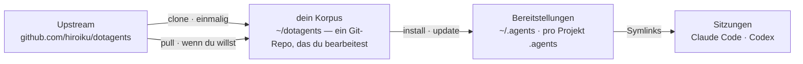

# dotagents

**Ein KI-Agenten-Harness, den du besitzt.** Regeln, Skills und Review-Agenten für Claude Code und Codex — als ein einziger Korpus versioniert und von dort in jedes Projekt bereitgestellt.

[English](../README.md) | [日本語](README.ja.md) | [简体中文](README.zh-CN.md) | [繁體中文](README.zh-TW.md) | [한국어](README.ko.md) | Deutsch | [Español](README.es.md) | [Français](README.fr.md)

[](https://www.npmjs.com/package/@hiroiku/dotagents)
[](../LICENSE)

- **Ein Korpus, viele Bereitstellungen.** Prompts, Skills und Agentenrollen leben in einem einzigen Git-Repository. Der Installer kopiert sie nach `~/.agents` oder `<project>/.agents` und verdrahtet die Symlinks, die Claude Code und Codex lesen.
- **Ein Regelwerk, keine Bibliothek.** Du bearbeitest die Regeln, committest sie und folgst dem Upstream nur, wenn du dich dafür entscheidest — nichts ändert sich hinter deinem Rücken.
- **Geschrieben für Modelle, die urteilen.** Der Korpus hält nur fest, was ein fähiges Modell nicht ableiten kann — deine Konventionen, deine Anforderungsanker, deine Rollengrenzen. Alles andere bleibt dem Urteil des Modells überlassen. Die Begründung steht unter [Der mitgelieferte Harness](../payload/docs/README.de.md).

## Wie es funktioniert

Ein Korpus versorgt jede Umgebung. Bereitstellungen sind reine Kopien — Sitzungen hängen nie davon ab, dass der Korpus erreichbar ist, und nichts wird hinter deinem Rücken bereitgestellt:



## Schnellstart

**1 · Deinen Korpus holen** (erfordert git und Node.js ≥ 18)

```sh
npx @hiroiku/dotagents clone ~/dotagents
```

Ein einfacher Git-Clone, und er gehört dir: Regeln bearbeiten, committen, personalisieren.

**2 · Bereitstellen**

```sh
cd ~/dotagents
bin/agents-setup install project /path/to/project   # ein Projekt    → <dir>/.agents
bin/agents-setup install user                       # diese Maschine → ~/.agents
```

Lässt du das Ziel weg, wird es interaktiv gewählt. In einer nicht-interaktiven Shell stoppt ein weggelassenes Ziel, ohne etwas zu schreiben — kein Standardwert entscheidet je, wo Regeln landen.

**3 · Betreiben**

```sh
bin/agents-setup pull                 # Upstream folgen: Changelog → Rebase → Tests
bin/agents-setup update  project ...  # eine Bereitstellung resynchronisieren
bin/agents-setup status  project ...  # Dateien und Links prüfen — exit 1 bei Drift
bin/agents-setup --help               # jeder Befehl, jedes Ziel, jede Option, jedes Beispiel
```

## Die drei Verben

| Verb | Kadenz | Was es tut |
|---|---|---|
| **clone** | einmalig | materialisiert den Korpus als Git-Repository, das dir gehört |
| **pull** | wenn du willst | holt Upstream, zeigt die eingehenden Commit-Titel, rebased deine Commits darauf, führt die Korpus-Tests aus |
| **install · update** | pro Maschine, pro Projekt | kopiert den Korpus nach `.agents/` und verdrahtet die Links |

Drei Regeln verbinden sie:

- **Kein Deployment aus einem Wegwerfobjekt.** Außerhalb eines Korpus (ein npx-Cache, ein entpackter Tarball) delegieren die Deploy-Befehle an den Korpus, den deine Maschine bereits kennt — oder stoppen mit einem Hinweis auf `clone`.
- **Folgen ist absichtlich.** Was du pullst, sind die Texte, die deine Agenten regieren, daher zeigt `pull` zuerst die eingehenden Commit-Titel — in Fachsprache geschrieben, lesen sie sich wie ein Changelog — und rebased und testet erst danach. Nichts aktualisiert sich automatisch.
- **Drift ist sichtbar.** `status` vergleicht jede bereitgestellte Datei und jeden Link mit dem Korpus und endet mit Exit 1 bei Drift; `update` resynchronisiert genau das, was dem Installer gehört.

## Was wo landet

| Teil | Ziel | Zustellung |
|---|---|---|
| Allgegenwärtige Regel (`AGENTS.md`) | `.agents/AGENTS.md` | Symlink `.claude/CLAUDE.md → .agents/AGENTS.md`; Codex erhält dieselbe Form unter `.codex/` |
| Skills | `.agents/skills/` | ein Link pro Skill in `.claude/skills/` und `.codex/skills/`, sodass sie mit selbst geschriebenen Skills koexistieren |
| Review-Agenten | `.agents/agents/` | ein Link pro Agent in `.claude/agents/` |
| Maschinenlokale Produkte (Manifest) | `.agents/` | durch eine `.gitignore`, die mit der Payload ausgeliefert wird, aus der Versionskontrolle herausgehalten |

Alles ist idempotent und **Hash-besessen**: Der Installer rührt nur an, was er selbst platziert hat und noch erkennt. Deine eigenen Skills werden nie berührt, Dateien, die du an Ort und Stelle bearbeitet hast, werden behalten und gemeldet (`--force` zum Überschreiben), und `uninstall` entfernt genau das, was das Manifest aufzeichnet — nichts sonst.

## Aufbau

```
bin/agents-setup      Installer-CLI (clone / pull / install / update / uninstall / status)
test/                 Vertragstests für den Installer (npm test)
payload/              die einzige Definition dessen, was verteilt wird; dieser Baum wird zu .agents/
├── README.md         der mitgelieferte Harness — was ausgeliefert wird, und warum er so wenig sagt
├── AGENTS.md         die eine allgegenwärtige Regel (von jeder Sitzung immer gelesen)
├── skills/           momentane Regeln (nur gelesen, wenn ihr Moment eintritt)
└── agents/           Review-Rollen (kontradiktorisch · Security · Accessibility)
```

[payload/](../payload/) ist die kanonische Definition der Distribution; der Installer hält keine Liste seines Inhalts — replizierte Listen verrotten still, daher nennt [package.json](../package.json) `files` nur `bin` und `payload`. Was die Payload ausliefert, wird in [Der mitgelieferte Harness](../payload/docs/README.de.md) beschrieben, und die Beschreibung reist mit jeder Bereitstellung.

## Aktualisieren der Prompts

Der Korpus trägt seine eigene Bearbeitungsdisziplin: Der [dotagents-prompting](../payload/skills/dotagents-prompting/SKILL.md)-Skill benennt die Context-Engineering-Leitfäden, die zu lesen sind, bevor irgendein Prompt oder eine Agentendefinition angerührt wird. Bearbeite nur in diesem Repository und liefere mit `agents-setup update` aus — einen installierten Baum direkt zu bearbeiten, lässt `update` die Datei schützen und warnen, was die Drift-Erkennung ist, die funktioniert.
