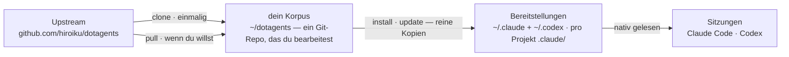

# dotagents

**Ein Paketmanager für die Regeln, denen deine KI-Agenten folgen.** Module aus Prompts, Skills und Review-Agenten für Claude Code und Codex — als ein einziger Korpus versioniert und in die Projekte installiert, die du wählst.

[English](../README.md) | [日本語](README.ja.md) | [简体中文](README.zh-CN.md) | [繁體中文](README.zh-TW.md) | [한국어](README.ko.md) | Deutsch | [Español](README.es.md) | [Français](README.fr.md)

[](https://www.npmjs.com/package/@hiroiku/dotagents)
[](../LICENSE)

- **Ein Korpus, viele Bereitstellungen.** Jede Regel lebt in einem einzigen Git-Repository, geschnitten in Module, die du pro Projekt oder pro Maschine installierst. Der Installer schreibt direkt in die Verzeichnisse, die Claude Code und Codex lesen — reine Dateien, keine Symlinks, kein Zwischenbaum.
- **Ein Regelwerk, keine Bibliothek.** Du bearbeitest die Regeln, committest sie und folgst dem Upstream nur, wenn du dich dafür entscheidest — nichts ändert sich hinter deinem Rücken.
- **Geschrieben für Modelle, die urteilen.** Der Korpus hält nur fest, was ein fähiges Modell nicht ableiten kann — deine Konventionen, deine Anforderungsanker, deine Rollengrenzen. Alles andere bleibt dem Urteil des Modells überlassen. Die Begründung steht unter [Der mitgelieferte Harness](../modules/harness/docs/README.de.md).

## Wie es funktioniert

Ein Korpus versorgt jede Umgebung. Bereitstellungen sind reine Kopien — Sitzungen hängen nie davon ab, dass der Korpus erreichbar ist, und nichts wird hinter deinem Rücken bereitgestellt:



## Schnellstart

**1 · Deinen Korpus holen** (erfordert git und Node.js ≥ 18)

```sh
npx @hiroiku/dotagents clone ~/dotagents
```

Ein einfacher Git-Clone, und er gehört dir: Regeln bearbeiten, committen, personalisieren.

**2 · Installieren, was du willst, wohin du willst**

```sh
cd ~/dotagents
bin/agents-setup list                     # was dieser Korpus anbietet
bin/agents-setup install harness          # in das aktuelle Projekt
bin/agents-setup install harness -g       # für jedes Projekt auf dieser Maschine
bin/agents-setup install harness -C ~/x   # in ein bestimmtes Projekt
```

Das Ziel ist standardmäßig dieses Projekt — der kleinste Wirkungsradius. Der weitere Geltungsbereich verlangt immer ein Flag. Was hineinkommt, hat nie einen Standardwert: Benenne ein Modul oder wähle interaktiv; eine nicht-interaktive Shell stoppt, statt für dich zu entscheiden.

**3 · Betreiben**

```sh
bin/agents-setup pull                 # Upstream folgen: Changelog → Rebase → Tests
bin/agents-setup update               # dieses Projekt resynchronisieren (nutzt die gemerkten Module)
bin/agents-setup status               # Dateien und Regelblöcke prüfen — exit 1 bei Drift
bin/agents-setup uninstall <module>   # ein Modul entfernen, den Rest behalten
bin/agents-setup --help               # jeder Befehl, jede Option, jedes Beispiel
```

## Zwei Objekte, zwei Vokabulare

Befehle wirken auf eines von zwei Dingen, und jedes leiht sich das Vokabular, das du bereits kennst:

| Objekt | Vokabular | Befehle |
|---|---|---|
| **Der Korpus** — das Git-Repository der Regeln, das dir gehört | git | `clone` · `pull` · `list` |
| **Bereitstellungen** — was ein Werkzeug tatsächlich liest | Paketmanager | `install` · `update` · `uninstall` · `status` |

Drei Regeln verbinden sie:

- **Keine Bereitstellung aus einem Wegwerfobjekt.** Außerhalb eines Korpus (ein npx-Cache, ein entpackter Tarball) delegieren die Bereitstellungsbefehle an den Korpus, den deine Maschine bereits kennt — oder stoppen mit einem Hinweis auf `clone`.
- **Folgen ist absichtlich.** Was du pullst, sind die Texte, die deine Agenten regieren, daher zeigt `pull` zuerst die eingehenden Commit-Titel — in Fachsprache geschrieben, lesen sie sich wie ein Changelog — und rebased und testet erst danach. Nichts aktualisiert sich automatisch.
- **Entscheidungen werden gemerkt, nicht neu getippt.** Das Manifest zeichnet auf, welche Module eine Bereitstellung enthält, daher braucht `update` keine Argumente. `install` ist additiv, `uninstall` subtraktiv.

## Was wo landet

| Teil | Ziel | Zustellung |
|---|---|---|
| Skills · Review-Agenten · Hooks | `.claude/skills/dotagents/` | **ein einziges plugin directory**. Claude Code lädt ein dort gefundenes Plugin ohne Marketplace und ohne Installationsschritt und stellt dessen Inhalt in den Namensraum `/dotagents:*` — so kommen Hooks an, ohne dass je `settings.json` angerührt wird |
| Skills (Codex) | `.codex/skills/dotagents-*` | reine Kopien. Codex kennt keine Plugins, daher faltet sich der Namensraum in den Verzeichnisnamen |
| Allgegenwärtige Regel (`AGENTS.md`) | `.claude/CLAUDE.md` · `~/.codex/AGENTS.md` · `AGENTS.md` in der Projektwurzel | ein verwalteter Block zwischen Markern — was du darum herum geschrieben hast, wird nie angerührt, und `uninstall` stellt die Datei wieder her |
| Maschinenlokale Aufzeichnung (Manifest) | `~/.dotagents/` | landet nie in einem Projekt — das Hash-Register dessen, was der Installer platziert hat, und welche Module du gewählt hast, bleibt bei der Maschine |

Alles ist idempotent und **Hash-besessen**: Der Installer rührt nur an, was er selbst platziert hat und noch erkennt. Deine eigenen Skills werden nie berührt, Dateien, die du an Ort und Stelle bearbeitet hast, werden behalten und gemeldet (`--force` zum Überschreiben), und `uninstall` entfernt genau das, was das Manifest aufzeichnet — nichts sonst. Layouts, die ältere Versionen hinterlassen haben (ein `.agents`-Baum, Symlinks, eine zshenv-Zeile, Settings-Fragmente oder reine Kopien außerhalb des Namensraums), werden bei `install` / `update` erkannt und migriert.

Plugins im Projekt-Geltungsbereich werden nur geladen, wenn Claude Code in der Repository-Wurzel startet, und erst, nachdem du den Workspace-Trust-Dialog bestätigt hast. Änderungen an Agents und Hooks wirken ab der nächsten Sitzung oder nach `/reload-plugins`; Bearbeitungen an einer `SKILL.md` werden sofort übernommen.

## Aufbau

```
bin/agents-setup      Installer-CLI (clone / pull / list / install / update / uninstall / status)
test/                 Vertragstests für den Installer (npm test)
modules/              die einzige Definition dessen, was verteilt werden kann
├── harness/          das mitgelieferte Modul — keine externen Abhängigkeiten
│   ├── MODULE.md     Name, Beschreibung, was es auf PATH erwartet
│   ├── AGENTS.md     die eine allgegenwärtige Regel — als verwalteter Block zugestellt
│   ├── skills/       momentane Regeln (nur gelesen, wenn ihr Moment eintritt)
│   ├── agents/       Review-Rollen (kontradiktorisch · Security · Accessibility)
│   ├── README.md     der mitgelieferte Harness — was ausgeliefert wird, und warum er so wenig sagt
│   └── docs/         Übersetzungen dieses Leitfadens (Dokumentation; nicht bereitgestellt)
└── beads/            ein optionales Modul — erwartet bd im PATH
```

[modules/](../modules/) ist die kanonische Definition der Distribution: Ein Verzeichnis mit einer `MODULE.md` ist ein Modul, seine Top-Level-Arten entscheiden, wo die Dinge landen, und der Installer hält keine Liste der Dateien — replizierte Listen verrotten still, daher nennt [package.json](../package.json) `files` nur `bin` und `modules`. Schreibe dein eigenes Modul neben das mitgelieferte, und es installiert sich genauso.

Ein Modul darf deklarieren, was es auf `PATH` erwartet. Voraussetzungen werden **erkannt, nie installiert**: `list` und `install` melden, was fehlt, und blockieren nichts — das Werkzeug später hinzuzufügen, erfordert also keine Neuinstallation.

## Aktualisieren der Prompts

Der Korpus trägt seine eigene Bearbeitungsdisziplin: Der [prompting](../modules/harness/skills/prompting/SKILL.md)-Skill benennt die Context-Engineering-Leitfäden, die zu lesen sind, bevor irgendein Prompt oder eine Agentendefinition angerührt wird. Bearbeite nur in diesem Repository und liefere mit `agents-setup update` aus — einen installierten Baum direkt zu bearbeiten, lässt `update` die Datei schützen und warnen, was die Drift-Erkennung ist, die funktioniert.
