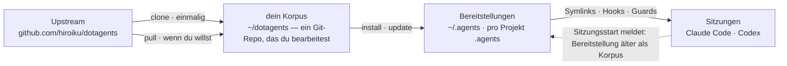

# dotagents

**Ein KI-Agenten-Harness, den du besitzt.** Regeln, Skills und mechanische Guards für Claude Code und Codex — als ein einziger Korpus versioniert und von dort in jedes Projekt bereitgestellt.

[English](../README.md) | [日本語](README.ja.md) | [简体中文](README.zh-CN.md) | [繁體中文](README.zh-TW.md) | [한국어](README.ko.md) | Deutsch | [Español](README.es.md) | [Français](README.fr.md)

[](https://www.npmjs.com/package/@hiroiku/dotagents)
[](../LICENSE)

- **Ein Korpus, viele Bereitstellungen.** Prompts, Skills, Agentenrollen, Shell-Guards und Sitzungsinstrumente leben in einem einzigen Git-Repository. Der Installer kopiert sie nach `~/.agents` oder `<project>/.agents` und verdrahtet die Symlinks und Hooks, die Claude Code und Codex lesen.
- **Ein Regelwerk, keine Bibliothek.** Du bearbeitest die Regeln, committest sie und folgst dem Upstream nur, wenn du dich dafür entscheidest — nichts ändert sich hinter deinem Rücken.
- **Regeln werden zu Mechanismus.** Was ein Hook oder Wrapper durchsetzen kann, wird durchgesetzt; was einen eindeutigen Moment hat, wird zu einem Skill; nur der Rest darf die Aufmerksamkeit jeder Sitzung besetzen. Die Begründung steht unter [Der mitgelieferte Harness](HARNESS.de.md).

## Wie es funktioniert

Ein Korpus versorgt jede Umgebung. Bereitstellungen sind reine Kopien — Sitzungen hängen nie davon ab, dass der Korpus erreichbar ist, und nichts wird hinter deinem Rücken bereitgestellt:



## Schnellstart

**1 · Voraussetzungen prüfen**

| Werkzeug | | Warum |
|---|---|---|
| git, Node.js ≥ 18 | erforderlich | betreibt die CLI |
| [bd (beads)](https://github.com/gastownhall/beads) | erforderlich | das Issue-Journal, auf dem der mitgelieferte Harness läuft: Anlegen, Beanspruchen, Abschlusssperren, Merge-Ausschluss |
| [codegraph](https://github.com/colbymchenry/codegraph) | empfohlen | Strukturabfragen — einmal einbinden mit `codegraph install`, pro Projekt indizieren mit `codegraph init` |

Der Harness installiert diese nie für dich — der Installer und jeder Sitzungsstart erkennen, was fehlt, und melden es.

**2 · Deinen Korpus holen**

```sh
npx @hiroiku/dotagents clone ~/dotagents
```

Ein einfacher Git-Clone, und er gehört dir: Regeln bearbeiten, committen, personalisieren.

**3 · Bereitstellen**

```sh
cd ~/dotagents
bin/agents-setup install project /path/to/project   # ein Projekt    → <dir>/.agents
bin/agents-setup install user                       # diese Maschine → ~/.agents
bin/agents-setup install shell                      # nur Guards     → hooks/bin + eine ~/.zshenv-Zeile
```

Lässt du das Ziel weg, wird es interaktiv gewählt. In einer nicht-interaktiven Shell stoppt ein weggelassenes Ziel, ohne etwas zu schreiben — kein Standardwert entscheidet je, wo Regeln landen.

**4 · Betreiben**

```sh
bin/agents-setup pull                 # Upstream folgen: Changelog → Rebase → Tests
bin/agents-setup update  project ...  # eine Bereitstellung resynchronisieren (Sitzungen sagen dir wann)
bin/agents-setup status  project ...  # Dateien, Links, Fragmente prüfen — exit 1 bei Drift
bin/agents-setup --help               # jeder Befehl, jedes Ziel, jede Option, jedes Beispiel
```

## Die drei Verben

| Verb | Kadenz | Was es tut |
|---|---|---|
| **clone** | einmalig | materialisiert den Korpus als Git-Repository, das dir gehört |
| **pull** | wenn du willst | holt Upstream, zeigt die eingehenden Commit-Titel, rebased deine Commits darauf, führt die Korpus-Tests aus |
| **install · update** | pro Maschine, pro Projekt | kopiert den Korpus nach `.agents/` und verdrahtet Links, Hooks, Guards |

Drei Regeln verbinden sie:

- **Kein Deployment aus einem Wegwerfobjekt.** Außerhalb eines Korpus (ein npx-Cache, ein entpackter Tarball) delegieren die Deploy-Befehle an den Korpus, den deine Maschine bereits kennt — oder stoppen mit einem Hinweis auf `clone`.
- **Resync wird gepullt, nicht gepusht.** Läuft der Korpus voraus, meldet das Instrument bei jedem Sitzungseintritt *Bereitstellung älter als der Korpus*, und du führst `update` in diesem Projekt aus.
- **Folgen ist absichtlich.** Was du pullst, sind die Texte, die deine Agenten regieren, daher zeigt `pull` zuerst die eingehenden Commit-Titel — in Fachsprache geschrieben, lesen sie sich wie ein Changelog — und rebased und testet erst danach. Nichts aktualisiert sich automatisch.

## Was wo landet

| Teil | Ziel | Zustellung |
|---|---|---|
| Allgegenwärtige Regeln (`AGENTS.md`) | `.agents/AGENTS.md` | Symlink `.claude/CLAUDE.md → .agents/AGENTS.md`; Codex erhält dieselbe Form unter `.codex/` |
| Skills · Agentenrollen | `.agents/skills/` · `.agents/agents/` | ein Link pro Eintrag, sodass sie mit selbst geschriebenen Skills koexistieren |
| Guards (`bd`-Wrapper · `git-guard`) | `.agents/bin/` · `.agents/hooks/` | eine verwaltete Zeile in `~/.zshenv` — Benutzerebene, einmal pro Maschine |
| Sitzungsinjektion | `settings.json` · `.codex/hooks.json` | Fragmente: `hooks.SessionStart`, `env.BASH_ENV`, `permissions.ask` |
| Maschinenlokale Produkte (Manifest · Metriken) | `.agents/` | durch eine `.gitignore`, die mit der Payload ausgeliefert wird, aus der Versionskontrolle herausgehalten |

Alles ist idempotent und **Hash-besessen**: Der Installer rührt nur an, was er selbst platziert hat und noch erkennt. Deine eigenen Skills werden nie berührt, Dateien, die du an Ort und Stelle bearbeitet hast, werden behalten und gemeldet (`--force` zum Überschreiben), und `uninstall` entfernt genau das, was das Manifest aufzeichnet — nichts sonst.

<details>
<summary><b>Die Shell-Schicht — eine pro Maschine, von beiden Seiten gepflegt</b></summary>

Guards erreichen Sitzungen nur über `hooks/shellenv.sh`, und zsh hat keine projektspezifische Startdatei — daher existiert diese Schicht **einmal pro Maschine**, unabhängig davon, wie viele Projekte den Harness nutzen. Der Installer hält seine Pflege aus deinem operativen Wissen heraus: `install project` legt den minimalen Shell-Scope an, wenn er fehlt; `uninstall user` fragt nach, bevor es wegnimmt, was andere Projekte teilen (`--keep-shell` behält ihn nicht-interaktiv); `uninstall project` rührt ihn nie an.

</details>

<details>
<summary><b>Späte Übernahme und Team-Rollout</b></summary>

- **Reihenfolge-unabhängig**: bd oder codegraph später hinzuzufügen erfordert keine Neuinstallation — Organe, Journale und Indizes werden dynamisch bei jedem Sitzungsstart erkannt. Eine bestehende Root-AGENTS.md, die von `bd init` erstellt wurde, wird nicht übernommen; nur ein verwalteter Referenzblock wird hinzugefügt.
- **Zwei Zustellungsschichten**: Die Prompt-Schicht (`.agents/`-Payload, Links, Referenzblock) reitet auf der Versionskontrolle und funktioniert allein aus dem `git clone`; die Injektions- und Durchsetzungsschicht (Manifest, Settings-Fragmente, zshenv-Zeile, Shell-Guards) ist maschinenspezifisch und wird vom Installer auf jeder Maschine gelegt.
- **Ab der zweiten Person**: das Projekt klonen, dotagents klonen, `bin/agents-setup install project <project>` ausführen — ein Befehl; die Shell-Schicht wird dabei mit vervollständigt, falls sie fehlt. Der Installer ist idempotent und Hash-geprüft, sodass er nie gegen das ankämpft, was die Versionskontrolle geliefert hat.

</details>

<details>
<summary><b>Hinweise zum CLI-Design</b></summary>

Das Ziel ist **ein einziges Positionsargument** (`user` / `project [dir]` / `shell`), nie mit einem Standardwert belegt. Weil es nur eine Position gibt, kann "Benutzer und Projekt gleichzeitig" gar nicht erst getippt werden — Exklusivität wird durch Syntax garantiert, nicht durch Laufzeitvalidierung. Die interaktive Eingabeaufforderung ist eine Pfeiltasten-Auswahl (`↑/↓` bewegen, `enter` bestätigen, `ctrl-c` abbrechen), die sich zu einer einzigen Zeile zusammenfaltet, die zeigt, was du gewählt hast. Die Ausgabe verliert die Farbe automatisch unter `NO_COLOR` oder ohne TTY.

</details>

## Aufbau

```
bin/agents-setup      Installer-CLI (clone / pull / install / update / uninstall / status)
test/                 Vertragstests für den Installer und die Durchsetzungsschicht (npm test)
payload/              die einzige Definition dessen, was verteilt wird; dieser Baum wird zu .agents/
├── AGENTS.md         allgegenwärtige Regeln (von jeder Sitzung immer gelesen)
├── skills/           momentane Regeln (nur gelesen, wenn ihr Moment eintritt)
├── agents/           Rollendefinitionen (reviewer / verifier, werkzeugbeschränkt)
├── hooks/            shellenv.sh (Guard-Zustellung) / beads-session.sh (SessionStart-Injektion)
├── bin/              Durchsetzung (bd, git-guard, agents-gate, agents-reap) und Selbstprüfung (agents-doctor)
└── docs/             Richtlinien zur Aktualisierung der Prompts
```

[payload/](../payload/) ist die kanonische Definition der Distribution; der Installer hält keine Liste seines Inhalts (replizierte Listen verrotten still — [package.json](../package.json) `files` nennt nur `bin` und `payload`). Was die Payload ausliefert — der mitgelieferte Harness und die Begründung hinter seinen Regeln — wird in [Der mitgelieferte Harness](HARNESS.de.md) beschrieben.

## Aktualisieren der Prompts

Folge [payload/docs/prompt-guidelines.md](../payload/docs/prompt-guidelines.md). Bearbeite nur in diesem Repository und liefere mit `agents-setup update` aus — einen installierten Baum direkt zu bearbeiten, lässt `update` die Datei schützen und warnen, was die Drift-Erkennung ist, die funktioniert.

