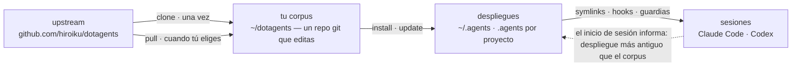

# dotagents

**Un arnés de agentes de IA que posees.** Reglas, skills y guardias mecánicas para Claude Code y Codex — versionado como un único corpus, desplegado a cada proyecto desde él.

[English](../README.md) | [日本語](README.ja.md) | [简体中文](README.zh-CN.md) | [繁體中文](README.zh-TW.md) | [한국어](README.ko.md) | [Deutsch](README.de.md) | Español | [Français](README.fr.md)

[](https://www.npmjs.com/package/@hiroiku/dotagents)
[](../LICENSE)

- **Un corpus, muchos despliegues.** Los prompts, skills, roles de agente, guardias de shell e instrumentos de sesión viven en un único repositorio git. El instalador los copia en `~/.agents` o `<project>/.agents` y conecta los enlaces simbólicos y los hooks que leen Claude Code y Codex.
- **Un libro de reglas, no una biblioteca.** Editas las reglas, las confirmas (commit) y sigues el upstream solo cuando tú lo decides — nada cambia a tus espaldas.
- **Las reglas se convierten en mecanismo.** Todo lo que un hook o wrapper puede aplicar se aplica; todo lo que tiene un momento claro se convierte en un skill; solo el resto tiene permiso para ocupar la atención de cada sesión. El razonamiento vive en [El arnés incluido](HARNESS.es.md).

## Cómo funciona

Un corpus alimenta cada entorno. Los despliegues son copias simples — las sesiones nunca dependen de que el corpus sea accesible, y nada se despliega a tus espaldas:



## Inicio rápido

**1 · Comprueba los requisitos previos**

| Herramienta | | Por qué |
|---|---|---|
| git, Node.js ≥ 18 | obligatorio | ejecuta la CLI |
| [bd (beads)](https://github.com/gastownhall/beads) | obligatorio | el registro de issues sobre el que corre el arnés incluido: apertura, reclamación, puertas de finalización, exclusión de fusión |
| [codegraph](https://github.com/colbymchenry/codegraph) | recomendado | consultas de estructura — conecta una vez con `codegraph install`, indexa por proyecto con `codegraph init` |

El arnés nunca los instala por ti — el instalador y cada inicio de sesión detectan lo que falta y lo informan.

**2 · Consigue tu corpus**

```sh
npx @hiroiku/dotagents clone ~/dotagents
```

Un simple `git clone`, y es tuyo: edita las reglas, confírmalas, personalízalo.

**3 · Despliégalo**

```sh
cd ~/dotagents
bin/agents-setup install project /path/to/project   # un proyecto    → <dir>/.agents
bin/agents-setup install user                       # esta máquina   → ~/.agents
bin/agents-setup install shell                      # solo guardias  → hooks/bin + una línea en ~/.zshenv
```

Omite el destino para elegirlo de forma interactiva. En un shell no interactivo, un destino omitido detiene el proceso sin escribir nada — ningún valor por defecto decide nunca dónde aterrizan las reglas.

**4 · Opera**

```sh
bin/agents-setup pull                 # seguir el upstream: registro de cambios → rebase → pruebas
bin/agents-setup update  project ...  # resincronizar un despliegue (las sesiones te avisan cuándo)
bin/agents-setup status  project ...  # verificar archivos, enlaces, fragmentos — exit 1 si hay deriva
bin/agents-setup --help               # todos los comandos, destinos, opciones, ejemplos
```

## Los tres verbos

| Verbo | Cadencia | Qué hace |
|---|---|---|
| **clone** | una vez | materializa el corpus como un repositorio git que posees |
| **pull** | cuando tú eliges | obtiene el upstream, muestra los títulos de los commits entrantes, hace rebase de tus commits encima, ejecuta las pruebas del corpus |
| **install · update** | por máquina, por proyecto | copia el corpus en `.agents/` y conecta enlaces, hooks, guardias |

Tres reglas los conectan:

- **No se despliega desde algo desechable.** Fuera de un corpus (una caché de npx, un tarball descomprimido) los comandos de despliegue delegan en el corpus que tu máquina ya conoce — o se detienen y señalan `clone`.
- **La resincronización se hace pull, no push.** Cuando el corpus avanza, el instrumento en cada entrada de sesión informa *despliegue más antiguo que el corpus*, y ejecutas `update` en ese proyecto.
- **Seguir es deliberado.** Lo que haces pull son los textos que gobiernan tus agentes, así que `pull` muestra primero los títulos de los commits entrantes — escritos en lenguaje de dominio, se leen como un registro de cambios — y luego hace rebase y ejecuta las pruebas. Nada se actualiza automáticamente.

## Dónde aterriza cada cosa

| Pieza | Destino | Entrega |
|---|---|---|
| Reglas ubicuas (`AGENTS.md`) | `.agents/AGENTS.md` | symlink `.claude/CLAUDE.md → .agents/AGENTS.md`; Codex recibe la misma forma bajo `.codex/` |
| Skills · roles de agente | `.agents/skills/` · `.agents/agents/` | un enlace por entrada, para que coexistan con los skills que escribiste tú mismo |
| Guardias (wrapper de `bd` · `git-guard`) | `.agents/bin/` · `.agents/hooks/` | una línea gestionada en `~/.zshenv` — nivel de usuario, una vez por máquina |
| Inyección de sesión | `settings.json` · `.codex/hooks.json` | fragmentos: `hooks.SessionStart`, `env.BASH_ENV`, `permissions.ask` |
| Productos específicos de la máquina (manifest · métricas) | `.agents/` | mantenidos fuera del control de versiones por un `.gitignore` que se entrega con el payload |

Todo es idempotente y **posesión por hash**: el instalador solo toca lo que él colocó y aún reconoce. Tus propios skills nunca se tocan, los archivos que editaste en su lugar se conservan y se informan (`--force` para sobrescribir), y `uninstall` elimina exactamente lo que el manifest registra — nada más.

<details>
<summary><b>La capa de shell — una por máquina, atendida desde ambos lados</b></summary>

Las guardias solo llegan a las sesiones a través de `hooks/shellenv.sh`, y zsh no tiene un archivo de inicio por proyecto — así que esta capa existe **una vez por máquina**, sin importar cuántos proyectos usen el arnés. El instalador mantiene su cuidado fuera de tu conocimiento operativo: `install project` añade el alcance mínimo de shell cuando falta; `uninstall user` pregunta antes de quitar lo que otros proyectos comparten (`--keep-shell` lo conserva sin interacción); `uninstall project` nunca lo toca.

</details>

<details>
<summary><b>Adopción tardía y despliegue en equipo</b></summary>

- **Independiente del orden**: añadir bd o codegraph más tarde no requiere reinstalar — los órganos, registros e índices se detectan dinámicamente en cada inicio de sesión. Un AGENTS.md raíz existente creado por `bd init` no se sustituye; solo se añade un bloque de referencia gestionado.
- **Dos capas de entrega**: la capa de prompts (el payload de `.agents/`, los enlaces, el bloque de referencia) viaja con el control de versiones y funciona con solo `git clone`; la capa de inyección y aplicación de reglas (manifest, fragmentos de settings, la línea de zshenv, las guardias de shell) es específica de la máquina y la coloca el instalador en cada máquina.
- **Desde la segunda persona**: clona el proyecto, clona dotagents, ejecuta `bin/agents-setup install project <project>` — un solo comando; la capa de shell se completa de paso si falta. El instalador es idempotente y se verifica por hash, así que nunca pelea contra lo que entregó el control de versiones.

</details>

<details>
<summary><b>Notas de diseño de la CLI</b></summary>

El destino es **un único argumento posicional** (`user` / `project [dir]` / `shell`), nunca con un valor por defecto. Como solo hay una posición, "usuario y proyecto a la vez" ni siquiera se puede escribir — la exclusividad está garantizada por la sintaxis, no por la validación en tiempo de ejecución. El aviso interactivo es un selector con flechas (`↑/↓` mover, `enter` confirmar, `ctrl-c` cancelar) que se colapsa en una sola línea que muestra lo que elegiste. La salida pierde el color automáticamente bajo `NO_COLOR` o sin una TTY.

</details>

## Estructura

```
bin/agents-setup      CLI del instalador (clone / pull / install / update / uninstall / status)
test/                 pruebas de contrato para el instalador y la capa de aplicación (npm test)
payload/              la única definición de lo que se distribuye; este árbol se convierte en .agents/
├── AGENTS.md         reglas ubicuas (leídas por cada sesión, siempre)
├── skills/           reglas momentáneas (leídas solo cuando llega su momento)
├── agents/           definiciones de roles (reviewer / verifier, con herramientas restringidas)
├── hooks/            shellenv.sh (entrega de guardias) / beads-session.sh (inyección de SessionStart)
├── bin/              aplicación de reglas (bd, git-guard, agents-gate, agents-reap) y autocomprobación (agents-doctor)
└── docs/             directrices para actualizar los prompts
```

[payload/](../payload/) es la definición canónica de la distribución; el instalador no mantiene ninguna lista de su contenido (las listas replicadas se pudren en silencio — [package.json](../package.json) `files` solo nombra `bin` y `payload`). Lo que entrega el payload — el arnés incluido y el razonamiento detrás de sus reglas — se describe en [El arnés incluido](HARNESS.es.md).

## Actualizar los prompts

Sigue [payload/docs/prompt-guidelines.md](../payload/docs/prompt-guidelines.md). Edita solo en este repositorio y entrega con `agents-setup update` — editar un árbol instalado directamente hace que `update` proteja el archivo y avise, lo cual es la detección de deriva funcionando.

