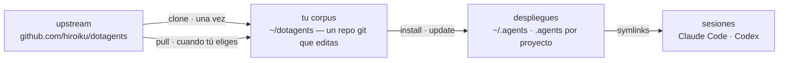

# dotagents

**Un arnés de agentes de IA que posees.** Reglas, skills y agentes de revisión para Claude Code y Codex — versionados como un único corpus, desplegados a cada proyecto desde él.

[English](../README.md) | [日本語](README.ja.md) | [简体中文](README.zh-CN.md) | [繁體中文](README.zh-TW.md) | [한국어](README.ko.md) | [Deutsch](README.de.md) | Español | [Français](README.fr.md)

[](https://www.npmjs.com/package/@hiroiku/dotagents)
[](../LICENSE)

- **Un corpus, muchos despliegues.** Los prompts, skills y roles de agente viven en un único repositorio git. El instalador los copia en `~/.agents` o `<project>/.agents` y conecta los enlaces simbólicos que leen Claude Code y Codex.
- **Un libro de reglas, no una biblioteca.** Editas las reglas, las confirmas (commit) y sigues el upstream solo cuando tú lo decides — nada cambia a tus espaldas.
- **Escrito para modelos que juzgan.** El corpus registra solo lo que un modelo capaz no puede derivar — tus convenciones, tus anclas de requisitos, tus fronteras de roles. Todo lo demás se deja al juicio del modelo. El razonamiento vive en [El arnés incluido](../payload/docs/README.es.md).

## Cómo funciona

Un corpus alimenta cada entorno. Los despliegues son copias simples — las sesiones nunca dependen de que el corpus sea accesible, y nada se despliega a tus espaldas:



## Inicio rápido

**1 · Consigue tu corpus** (requiere git y Node.js ≥ 18)

```sh
npx @hiroiku/dotagents clone ~/dotagents
```

Un simple `git clone`, y es tuyo: edita las reglas, confírmalas, personalízalo.

**2 · Despliégalo**

```sh
cd ~/dotagents
bin/agents-setup install project /path/to/project   # un proyecto    → <dir>/.agents
bin/agents-setup install user                       # esta máquina   → ~/.agents
```

Omite el destino para elegirlo de forma interactiva. En un shell no interactivo, un destino omitido detiene el proceso sin escribir nada — ningún valor por defecto decide nunca dónde aterrizan las reglas.

**3 · Opera**

```sh
bin/agents-setup pull                 # seguir el upstream: registro de cambios → rebase → pruebas
bin/agents-setup update  project ...  # resincronizar un despliegue
bin/agents-setup status  project ...  # verificar archivos y enlaces — exit 1 si hay deriva
bin/agents-setup --help               # todos los comandos, destinos, opciones, ejemplos
```

## Los tres verbos

| Verbo | Cadencia | Qué hace |
|---|---|---|
| **clone** | una vez | materializa el corpus como un repositorio git que posees |
| **pull** | cuando tú eliges | obtiene el upstream, muestra los títulos de los commits entrantes, hace rebase de tus commits encima, ejecuta las pruebas del corpus |
| **install · update** | por máquina, por proyecto | copia el corpus en `.agents/` y conecta los enlaces |

Tres reglas los conectan:

- **No se despliega desde algo desechable.** Fuera de un corpus (una caché de npx, un tarball descomprimido) los comandos de despliegue delegan en el corpus que tu máquina ya conoce — o se detienen y señalan `clone`.
- **Seguir es deliberado.** Lo que haces pull son los textos que gobiernan tus agentes, así que `pull` muestra primero los títulos de los commits entrantes — escritos en lenguaje de dominio, se leen como un registro de cambios — y luego hace rebase y ejecuta las pruebas. Nada se actualiza automáticamente.
- **La deriva es visible.** `status` compara cada archivo y cada enlace desplegados con el corpus y termina con exit 1 si hay deriva; `update` resincroniza exactamente lo que el instalador posee.

## Dónde aterriza cada cosa

| Pieza | Destino | Entrega |
|---|---|---|
| Regla ubicua (`AGENTS.md`) | `.agents/AGENTS.md` | symlink `.claude/CLAUDE.md → .agents/AGENTS.md`; Codex recibe la misma forma bajo `.codex/` |
| Skills | `.agents/skills/` | un enlace por skill en `.claude/skills/` y `.codex/skills/`, para que coexistan con los skills que escribiste tú mismo |
| Agentes de revisión | `.agents/agents/` | un enlace por agente en `.claude/agents/` |
| Productos específicos de la máquina (manifest) | `.agents/` | mantenidos fuera del control de versiones por un `.gitignore` que se entrega con el payload |

Todo es idempotente y de **posesión por hash**: el instalador solo toca lo que él colocó y aún reconoce. Tus propios skills nunca se tocan, los archivos que editaste en su lugar se conservan y se informan (`--force` para sobrescribir), y `uninstall` elimina exactamente lo que el manifest registra — nada más.

## Estructura

```
bin/agents-setup      CLI del instalador (clone / pull / install / update / uninstall / status)
test/                 pruebas de contrato para el instalador (npm test)
payload/              la única definición de lo que se distribuye; este árbol se convierte en .agents/
├── README.md         el arnés incluido — qué se entrega, y por qué dice tan poco
├── AGENTS.md         la única regla ubicua (leída por cada sesión, siempre)
├── skills/           reglas momentáneas (leídas solo cuando llega su momento)
└── agents/           roles de revisión (adversarial · seguridad · accesibilidad)
```

[payload/](../payload/) es la definición canónica de la distribución; el instalador no mantiene ninguna lista de su contenido — las listas replicadas se pudren en silencio, así que [package.json](../package.json) `files` solo nombra `bin` y `payload`. Lo que entrega el payload se describe en [El arnés incluido](../payload/docs/README.es.md), y la descripción viaja con cada despliegue.

## Actualizar los prompts

El corpus lleva consigo su propia disciplina de edición: el skill [dotagents-prompting](../payload/skills/dotagents-prompting/SKILL.md) nombra las guías de ingeniería de contexto que hay que leer antes de tocar cualquier prompt o definición de agente. Edita solo en este repositorio y entrega con `agents-setup update` — editar un árbol instalado directamente hace que `update` proteja el archivo y avise, lo cual es la detección de deriva funcionando.
