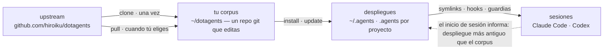
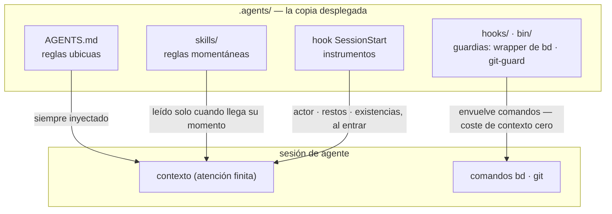

# dotagents

**Un arnés de agentes de IA que posees.** Reglas, skills y guardias
mecánicas para Claude Code y Codex — versionado como un único corpus,
desplegado a cada proyecto desde él.

[English](../README.md) | [日本語](README.ja.md) | [简体中文](README.zh-CN.md) | [繁體中文](README.zh-TW.md) | [한국어](README.ko.md) | [Deutsch](README.de.md) | Español | [Français](README.fr.md)

[](https://www.npmjs.com/package/@hiroiku/dotagents)
[](../LICENSE)

- **Un corpus, muchos despliegues.** Los prompts, skills, roles de agente,
  guardias de shell e instrumentos de sesión viven en un único repositorio
  git. El instalador los copia en `~/.agents` o `<project>/.agents` y
  conecta los enlaces simbólicos y los hooks que leen Claude Code y Codex.
- **Un libro de reglas, no una biblioteca.** Editas las reglas, las
  confirmas (commit) y sigues el upstream solo cuando tú lo decides — nada
  cambia a tus espaldas.
- **Las reglas se convierten en mecanismo.** Todo lo que un hook o wrapper
  puede aplicar se aplica; todo lo que tiene un momento claro se convierte
  en un skill; solo el resto tiene permiso para ocupar la atención de cada
  sesión. El razonamiento vive en [Concepto](#concepto).

## Cómo funciona

Un corpus alimenta cada entorno. Los despliegues son copias simples — las
sesiones nunca dependen de que el corpus sea accesible, y nada se despliega
a tus espaldas:



Dentro de una sesión, las tres capas del corpus llegan al agente por rutas
distintas — y cuanto más baja la ruta, más fuerte y más barata la regla:



## Inicio rápido

**1 · Comprueba los requisitos previos**

| Herramienta | | Por qué |
|---|---|---|
| git, Node.js ≥ 18 | obligatorio | ejecuta la CLI |
| [bd (beads)](https://github.com/gastownhall/beads) | obligatorio | el registro de issues sobre el que corre todo: apertura, reclamación, puertas de finalización, exclusión de fusión |
| [codegraph](https://github.com/colbymchenry/codegraph) | recomendado | consultas de estructura — conecta una vez con `codegraph install`, indexa por proyecto con `codegraph init` |

El arnés nunca los instala por ti — el instalador y cada inicio de sesión
detectan lo que falta y lo informan.

**2 · Consigue tu corpus**

```sh
npx @hiroiku/dotagents clone ~/dotagents
```

Un simple `git clone`, y es tuyo: edita las reglas, confírmalas,
personalízalo.

**3 · Despliégalo**

```sh
cd ~/dotagents
bin/agents-setup install project /path/to/project   # un proyecto    → <dir>/.agents
bin/agents-setup install user                       # esta máquina   → ~/.agents
bin/agents-setup install shell                      # solo guardias  → hooks/bin + una línea en ~/.zshenv
```

Omite el destino para elegirlo de forma interactiva. En un shell no
interactivo, un destino omitido detiene el proceso sin escribir nada —
ningún valor por defecto decide nunca dónde aterrizan las reglas.

**4 · Opera**

```sh
bin/agents-setup pull                 # seguir el upstream: registro de cambios → rebase → pruebas
bin/agents-setup update  project ...  # resincronizar un despliegue (las sesiones te avisan cuándo)
bin/agents-setup status  project ...  # verificar archivos, enlaces, fragmentos — exit 1 si hay deriva
bin/agents-setup --help               # todos los comandos, destinos, opciones, ejemplos
```

## Los tres verbos

| Verbo | Cadencia | Qué hace |
|---|---|---|
| **clone** | una vez | materializa el corpus como un repositorio git que posees |
| **pull** | cuando tú eliges | obtiene el upstream, muestra los títulos de los commits entrantes, hace rebase de tus commits encima, ejecuta las pruebas del corpus |
| **install · update** | por máquina, por proyecto | copia el corpus en `.agents/` y conecta enlaces, hooks, guardias |

Tres reglas los conectan:

- **No se despliega desde algo desechable.** Fuera de un corpus (una caché
  de npx, un tarball descomprimido) los comandos de despliegue delegan en
  el corpus que tu máquina ya conoce — o se detienen y señalan `clone`.
- **La resincronización se hace pull, no push.** Cuando el corpus avanza, el
  instrumento en cada entrada de sesión informa *despliegue más antiguo que
  el corpus*, y ejecutas `update` en ese proyecto.
- **Seguir es deliberado.** Lo que haces pull son los textos que gobiernan
  tus agentes, así que `pull` muestra primero los títulos de los commits
  entrantes — escritos en lenguaje de dominio, se leen como un registro de
  cambios — y luego hace rebase y ejecuta las pruebas. Nada se actualiza
  automáticamente.

## Dónde aterriza cada cosa

| Pieza | Destino | Entrega |
|---|---|---|
| Reglas ubicuas (`AGENTS.md`) | `.agents/AGENTS.md` | symlink `.claude/CLAUDE.md → .agents/AGENTS.md`; Codex recibe la misma forma bajo `.codex/` |
| Skills · roles de agente | `.agents/skills/` · `.agents/agents/` | un enlace por entrada, para que coexistan con los skills que escribiste tú mismo |
| Guardias (wrapper de `bd` · `git-guard`) | `.agents/bin/` · `.agents/hooks/` | una línea gestionada en `~/.zshenv` — nivel de usuario, una vez por máquina |
| Inyección de sesión | `settings.json` · `.codex/hooks.json` | fragmentos: `hooks.SessionStart`, `env.BASH_ENV`, `permissions.ask` |
| Productos específicos de la máquina (manifest · métricas) | `.agents/` | mantenidos fuera del control de versiones por un `.gitignore` que se entrega con el payload |

Todo es idempotente y **posesión por hash**: el instalador solo toca lo que
él colocó y aún reconoce. Tus propios skills nunca se tocan, los archivos
que editaste en su lugar se conservan y se informan (`--force` para
sobrescribir), y `uninstall` elimina exactamente lo que el manifest
registra — nada más.

<details>
<summary><b>La capa de shell — una por máquina, atendida desde ambos lados</b></summary>

Las guardias solo llegan a las sesiones a través de `hooks/shellenv.sh`, y
zsh no tiene un archivo de inicio por proyecto — así que esta capa existe
**una vez por máquina**, sin importar cuántos proyectos usen el arnés. El
instalador mantiene su cuidado fuera de tu conocimiento operativo: `install
project` añade el alcance mínimo de shell cuando falta; `uninstall user`
pregunta antes de quitar lo que otros proyectos comparten (`--keep-shell` lo
conserva sin interacción); `uninstall project` nunca lo toca.

</details>

<details>
<summary><b>Adopción tardía y despliegue en equipo</b></summary>

- **Independiente del orden**: añadir bd o codegraph más tarde no requiere
  reinstalar — los órganos, registros e índices se detectan dinámicamente en
  cada inicio de sesión. Un AGENTS.md raíz existente creado por `bd init` no
  se sustituye; solo se añade un bloque de referencia gestionado.
- **Dos capas de entrega**: la capa de prompts (el payload de `.agents/`,
  los enlaces, el bloque de referencia) viaja con el control de versiones y
  funciona con solo `git clone`; la capa de inyección y aplicación de reglas
  (manifest, fragmentos de settings, la línea de zshenv, las guardias de
  shell) es específica de la máquina y la coloca el instalador en cada
  máquina.
- **Desde la segunda persona**: clona el proyecto, clona dotagents, ejecuta
  `bin/agents-setup install project <project>` — un solo comando; la capa
  de shell se completa de paso si falta. El instalador es idempotente y se
  verifica por hash, así que nunca pelea contra lo que entregó el control
  de versiones.

</details>

<details>
<summary><b>Notas de diseño de la CLI</b></summary>

El destino es **un único argumento posicional** (`user` / `project [dir]` /
`shell`), nunca con un valor por defecto. Como solo hay una posición,
"usuario y proyecto a la vez" ni siquiera se puede escribir — la
exclusividad está garantizada por la sintaxis, no por la validación en
tiempo de ejecución. El aviso interactivo es un selector con flechas
(`↑/↓` mover, `enter` confirmar, `ctrl-c` cancelar) que se colapsa en una
sola línea que muestra lo que elegiste. La salida pierde el color
automáticamente bajo `NO_COLOR` o sin una TTY.

</details>

## Concepto

Lo que construye este arnés no es "un agente capaz", sino **una organización
que divide la atención finita (contexto) entre roles y los conecta mediante
registros externos**. Cada regla siguiente se deriva de una única premisa: el
contexto es finito y muere con la sesión.

### Tres capas de reglas — ubicuas, momentáneas, impuestas

Antes que su contenido, la naturaleza de una regla la decide **cómo se
entrega**.

- **Reglas ubicuas** (núcleo = AGENTS.md) — siempre inyectadas. Gravan la
  atención de cada sesión y solo se sostienen como **mejor esfuerzo**, así
  que esta capa solo puede llevar las pocas reglas cuyo momento de
  observación no se puede nombrar
- **Reglas momentáneas** (skills) — inyectadas justo a tiempo. Entran en el
  contexto solo cuando llega su momento, así que el detalle aquí no le
  cuesta nada a ningún otro momento
- **Reglas impuestas** (hooks / bin / permissions) — nunca inyectadas. Un
  mecanismo decide, así que no consumen atención y no pueden romperse (o
  dejan una huella cuando lo hacen)

**La ley del descenso**: empuja cada regla tan abajo como pueda llegar. Las
capas inferiores son más fuertes *y* más baratas a la vez — una pendiente en
un solo sentido donde la fuerza aumenta a medida que el coste de atención
desaparece. Un prompt es solo la sala de espera para las reglas que todavía
no se han convertido en mecanismo.

### Separación — fronteras que no admiten duplicación

Los subagentes se recortan no por capacidad, sino por **fronteras donde la
duplicación no puede ocurrir**: unidades cuyas entradas (contexto), rangos de
búsqueda y objetivos de escritura (worktrees) no se intersecan. Da la misma
información a dos contextos y pagas la atención dos veces; deja que dos
escriban en el mismo lugar y has creado un punto de fusión. Los puntos de
fusión que la estructura no puede eliminar (la rama de integración y el
registro) son los únicos protegidos por exclusión.

La separación también es ocultación. No conocer las circunstancias de la
implementación es lo que le da a la revisión su poder de detección — **"no lo
pases" es una decisión de diseño tan fuerte como "pásalo"**.

### Órganos — declaración frente a derivación

Cada herramienta sirve como un órgano que responde a un tipo de pregunta, y
ninguna capacidad nativa de un órgano se reimplementa en otro sitio. El eje
es **declaración frente a derivación**:

- **Registros de declaración** (lo que se decidió no se puede derivar, así
  que se registra): bd = el registro de intención y estado (lo que decidimos
  hacer, quién tiene qué, por qué algo está detenido); los ADR = el rastro
  de decisiones; el glosario = el lenguaje ubicuo
- **Derivación** (lo que una máquina puede derivar del artefacto nunca se
  escribe a mano): codegraph = la estructura actual del código (símbolos,
  rutas de llamada, radio de impacto); git = la historia del cambio

En el momento en que escribes a mano algo derivable, empieza la deriva. La
memoria se sitúa en el mismo eje: el estado se deriva (la inyección de
consultas de bd prime); solo los invariantes se declaran (bd remember). Lo
que lleva el contexto de una sesión a otra no es una transcripción, sino un
registro externo con una dirección (**el puente de contexto**).

codegraph es el órgano de exploración cotidiano, y su regla ubicua ("derivar
con explore primero") se **entrega mediante la descripción de la herramienta
(instrucciones del servidor MCP)** — nunca se copia en los prompts, donde se
convertiría en una réplica obsoleta. La elección de herramienta no se puede
verificar de forma automática, así que tampoco puede caer en la aplicación de
reglas: la capa de herramientas de coste de inyección cero es la capa más
baja en la que esta regla puede vivir. Los prompts del arnés detallan solo
los momentos en los que *no* usarla rompe un contrato (la verificación con la
realidad antes de congelar, derivar el barrido horizontal, el escaneo del
revisor). La conexión (`codegraph install`) y el índice (`codegraph init`)
son responsabilidad propia de codegraph — el arnés ni los verifica ni los
reimplementa; SessionStart solo detecta `.codegraph/` e inyecta una línea de
recordatorio.

### Revisión adversarial — las omisiones no existen hasta que se buscan

El modo de fallo peculiar de los agentes de IA es "¡hecho!" cuando no está
hecho, y su esencia no es la mentira sino la **omisión** — alguien cuyo
contexto solo contiene lo que escribió no puede ver lo que no escribió.

Así que la revisión no es inspección (mirar lo que existe y juzgarlo), sino
**prueba de existencia**: partiendo de los requisitos, el revisor debe
encontrar la implementación y la verificación que satisfacen cada uno en el
artefacto — un escaneo en la dirección inversa. Al revisor no se le muestra
primero el diff, porque la atención capturada por verificar lo que se
escribió deja de buscar lo que no se escribió.

### Hundimiento — los bucles terminan porque el conocimiento desciende

La revisión repetida por sí sola diverge (los hallazgos brotan sin fin). El
bucle converge porque cada ronda hace que el conocimiento **se hunda** una
capa: hallazgos individuales → clases de defectos articuladas (contratos
rotos) → aplicación de reglas (una estructura, un tipo, una única guardia).
Una hipótesis que se ha hundido se elimina de la carta, así que el
combustible de la revisión se reduce ronda a ronda. Cuando la misma clase de
defecto aparece dos veces, la señal no es que la corrección estuviera mal,
sino que **lo que estuvo mal fue el hundimiento**.

El registro de issues converge en el mismo principio: no amontonar
observaciones en abierto; abrir solo lo que se decidió; plegar juntos los
issues con la misma forma; dar a cada apertura su vía de digestión al nacer.

### Pruebas — la cantidad no es la cantidad de protección

Una prueba solo puede fijar un **contrato** (una promesa de la que depende el
negocio); una copia de un síntoma no protege de nada frente a la regresión.
La primera línea de defensa es una estructura que no puede romperse (diseños
y tipos en los que la condición de fallo no puede existir); las pruebas son
el último recurso para los contratos que la estructura no puede sellar.

### Vigilantes y enumeraciones — sin comprobaciones de calidad meta

Vigilantes de vigilantes, pruebas de pruebas, guardianes de guardianes —
comprobaciones meta que no protegen ningún contrato de negocio se
multiplican fácilmente y consumen mantenimiento sin proteger nada. Tres
principios los excluyen:

- **No añadir vigilantes; hundirlo en su lugar** — querer vigilar a un
  guardián es un síntoma de que está demasiado arriba. La respuesta es la
  ley del descenso, no más vigilancia: empújalo hacia abajo y lo que había
  que vigilar desaparece
- **La detección avanza un solo salto** — solo los contratos que la
  estructura no puede sellar pueden tener detectores, y los detectores no
  tienen detectores. Que un detector roto pase desapercibido es el precio
  aceptado, por eso los detectores se mantienen mínimos y simples
- **Nunca proteger mediante enumeración** — cualquier esquema cuya cobertura
  sea una lista mantenida a mano convierte las adiciones olvidadas en huecos
  silenciosos. Preferir formas en las que la propia estructura sea la
  definición (el principio de payload) o en las que la máquina derive la
  lista como subproducto (el principio de manifest)

Los propios textos de las reglas no se duplican aquí (una copia del payload
se pudriría en silencio). El índice canónico: los roles, los invariantes de
calidad, la autoridad de git y las reglas ubicuas de beads están en
[AGENTS.md](../payload/AGENTS.md); el trabajo previo y la composición en
[agents-kickoff](../payload/skills/agents-kickoff/SKILL.md); el manejo del
bucle de calidad en
[agents-quality-loop](../payload/skills/agents-quality-loop/SKILL.md); las
operaciones de bd y el límite de la memoria en
[agents-beads-ops](../payload/skills/agents-beads-ops/SKILL.md); el diseño de
pruebas en [agents-test-design](../payload/skills/agents-test-design/SKILL.md);
las tres capas y la disciplina de ablación en
[prompt-guidelines.md](../payload/docs/prompt-guidelines.md).

## Estructura

```
bin/agents-setup      CLI del instalador (clone / pull / install / update / uninstall / status)
test/                 pruebas de contrato para el instalador y la capa de aplicación (npm test)
payload/              la única definición de lo que se distribuye; este árbol se convierte en .agents/
├── AGENTS.md         reglas ubicuas (leídas por cada sesión, siempre)
├── skills/           reglas momentáneas (leídas solo cuando llega su momento)
├── agents/           definiciones de roles (reviewer / verifier, con herramientas restringidas)
├── hooks/            shellenv.sh (entrega de guardias) / beads-session.sh (inyección de SessionStart)
├── bin/              aplicación de reglas (bd, git-guard, agents-gate, agents-reap) y autocomprobación (agents-doctor)
└── docs/             directrices para actualizar los prompts
```

[payload/](../payload/) es la definición canónica de la distribución; el
instalador no mantiene ninguna lista de su contenido (las listas replicadas
se pudren en silencio — [package.json](../package.json) `files` solo nombra
`bin` y `payload`).

## Actualizar los prompts

Sigue [payload/docs/prompt-guidelines.md](../payload/docs/prompt-guidelines.md).
Edita solo en este repositorio y entrega con `agents-setup update` — editar
un árbol instalado directamente hace que `update` proteja el archivo y avise,
lo cual es la detección de deriva funcionando.

## Preguntas abiertas

- Triaje masivo de issues abiertos preexistentes al adoptar el arnés en un
  proyecto con un registro ya establecido (con aprobación general mediante
  `AGENTS_BD_OPEN_OK=1`)
- Revisión de los términos acuñados, y mayor adelgazamiento del bloque
  `<beads>` en AGENTS.md — después de que los instrumentos hayan reunido
  observaciones
