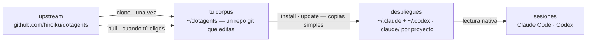

# dotagents

**Un gestor de paquetes para las reglas que siguen tus agentes de IA.** Módulos de prompts, skills y agentes de revisión para Claude Code y Codex — versionados como un único corpus, instalados en los proyectos que tú elijas.

[English](../README.md) | [日本語](README.ja.md) | [简体中文](README.zh-CN.md) | [繁體中文](README.zh-TW.md) | [한국어](README.ko.md) | [Deutsch](README.de.md) | Español | [Français](README.fr.md)

[](https://www.npmjs.com/package/@hiroiku/dotagents)
[](../LICENSE)

- **Un corpus, muchos despliegues.** Cada regla vive en un único repositorio git, dividido en módulos que instalas por proyecto o por máquina. El instalador escribe directamente en los directorios que leen Claude Code y Codex — archivos simples, sin symlinks, sin árbol intermedio.
- **Un libro de reglas, no una biblioteca.** Editas las reglas, las confirmas (commit) y sigues el upstream solo cuando tú lo decides — nada cambia a tus espaldas.
- **Escrito para modelos que juzgan.** El corpus registra solo lo que un modelo capaz no puede derivar — tus convenciones, tus anclas de requisitos, tus fronteras de roles. Todo lo demás se deja al juicio del modelo. El razonamiento vive en [El arnés incluido](../modules/harness/docs/README.es.md).

## Cómo funciona

Un corpus alimenta cada entorno. Los despliegues son copias simples — las sesiones nunca dependen de que el corpus sea accesible, y nada se despliega a tus espaldas:



## Inicio rápido

**1 · Consigue tu corpus** (requiere git y Node.js ≥ 18)

```sh
npx @hiroiku/dotagents clone ~/dotagents
```

Un simple `git clone`, y es tuyo: edita las reglas, confírmalas, personalízalo.

**2 · Instala lo que quieras, donde lo quieras**

```sh
cd ~/dotagents
bin/agents-setup list                     # lo que ofrece este corpus
bin/agents-setup install harness          # en el proyecto actual
bin/agents-setup install harness -g       # para todos los proyectos de esta máquina
bin/agents-setup install harness -C ~/x   # en un proyecto concreto
```

El destino por defecto es este proyecto — el menor radio de impacto. El alcance más amplio siempre requiere un flag. Lo que entra nunca tiene valor por defecto: nombra un módulo o elígelo de forma interactiva; un shell no interactivo se detiene en lugar de elegir por ti.

**3 · Opera**

```sh
bin/agents-setup pull                 # seguir el upstream: registro de cambios → rebase → pruebas
bin/agents-setup update               # resincronizar este proyecto (usa los módulos que recuerda)
bin/agents-setup status               # verificar archivos y bloques de reglas — exit 1 si hay deriva
bin/agents-setup uninstall <module>   # quitar un módulo, conservar el resto
bin/agents-setup --help               # todos los comandos, opciones, ejemplos
```

## Dos objetos, dos vocabularios

Los comandos actúan sobre una de dos cosas, y cada uno toma prestado el vocabulario que ya conoces:

| Objeto | Vocabulario | Comandos |
|---|---|---|
| **El corpus** — el repositorio git de reglas que posees | git | `clone` · `pull` · `list` |
| **Los despliegues** — lo que una herramienta lee de verdad | gestor de paquetes | `install` · `update` · `uninstall` · `status` |

Tres reglas los conectan:

- **No se despliega desde algo desechable.** Fuera de un corpus (una caché de npx, un tarball descomprimido) los comandos de despliegue delegan en el corpus que tu máquina ya conoce — o se detienen y señalan `clone`.
- **Seguir es deliberado.** Lo que haces pull son los textos que gobiernan tus agentes, así que `pull` muestra primero los títulos de los commits entrantes — escritos en lenguaje de dominio, se leen como un registro de cambios — y luego hace rebase y ejecuta las pruebas. Nada se actualiza automáticamente.
- **Las elecciones se recuerdan, no se vuelven a teclear.** El manifest registra qué módulos contiene un despliegue, así que `update` no necesita argumentos. `install` es aditivo; `uninstall`, sustractivo.

## Dónde aterriza cada cosa

| Pieza | Destino | Entrega |
|---|---|---|
| Skills · agentes de revisión · hooks | `.claude/skills/dotagents/` | **un único directorio de plugin**. Claude Code carga un plugin que encuentre ahí sin marketplace y sin paso de instalación, poniendo lo que contiene en el espacio de nombres `/dotagents:*` — que es como llegan los hooks sin tocar nunca `settings.json` |
| Skills (Codex) | `.codex/skills/dotagents-*` | copias simples. Codex no tiene plugins, así que el espacio de nombres se pliega dentro del nombre del directorio |
| Regla ubicua (`AGENTS.md`) | `.claude/CLAUDE.md` · `~/.codex/AGENTS.md` · el `AGENTS.md` en la raíz de un proyecto | un bloque gestionado entre marcadores — lo que tú escribiste alrededor nunca se toca, y `uninstall` restaura el archivo |
| Registro local de la máquina (manifest) | `~/.dotagents/` | nunca aterriza en un proyecto — el libro mayor de hashes de lo que el instalador colocó, y de qué módulos elegiste, vive con la máquina |

Todo es idempotente y de **posesión por hash**: el instalador solo toca lo que él colocó y aún reconoce. Tus propios skills nunca se tocan, los archivos que editaste en su lugar se conservan y se informan (`--force` para sobrescribir), y `uninstall` elimina exactamente lo que el manifest registra — nada más. Las estructuras dejadas por versiones anteriores (un árbol `.agents`, symlinks, una línea en zshenv, fragmentos de settings o copias simples fuera del espacio de nombres) se detectan y se migran en `install` / `update`.

Los plugins de alcance de proyecto solo se cargan cuando Claude Code arranca en la raíz del repositorio, y solo después de que aceptes el diálogo de confianza del workspace. Los cambios en agentes y hooks surten efecto en la sesión siguiente o tras `/reload-plugins`; las ediciones de un `SKILL.md` se recogen de inmediato.

## Estructura

```
bin/agents-setup      CLI del instalador (clone / pull / list / install / update / uninstall / status)
test/                 pruebas de contrato para el instalador (npm test)
modules/              la única definición de lo que se puede distribuir
├── harness/          el módulo incluido — sin dependencias externas
│   ├── MODULE.md     nombre, descripción, qué espera en PATH
│   ├── AGENTS.md     la única regla ubicua — entregada como un bloque gestionado
│   ├── skills/       reglas momentáneas (leídas solo cuando llega su momento)
│   ├── agents/       roles de revisión (adversarial · seguridad · accesibilidad)
│   ├── README.md     el arnés incluido — qué se entrega, y por qué dice tan poco
│   └── docs/         traducciones de esa guía (documentación; no se despliega)
└── beads/            un módulo opcional — requiere bd en el PATH
```

[modules/](../modules/) es la definición canónica de la distribución: un directorio con un `MODULE.md` es un módulo, sus tipos de primer nivel deciden dónde aterrizan las cosas, y el instalador no mantiene ninguna lista de los archivos — las listas replicadas se pudren en silencio, así que [package.json](../package.json) `files` solo nombra `bin` y `modules`. Escribe tu propio módulo junto al incluido y se instala igual.

Un módulo puede declarar qué espera en el `PATH`. Los requisitos se **detectan, nunca se instalan**: `list` e `install` informan de lo que falta y no bloquean nada, así que añadir la herramienta más tarde no requiere reinstalar.

## Actualizar los prompts

El corpus lleva consigo su propia disciplina de edición: el skill [prompting](../modules/harness/skills/prompting/SKILL.md) nombra las guías de ingeniería de contexto que hay que leer antes de tocar cualquier prompt o definición de agente. Edita solo en este repositorio y entrega con `agents-setup update` — editar un árbol instalado directamente hace que `update` proteja el archivo y avise, lo cual es la detección de deriva funcionando.
