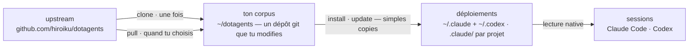

# dotagents

**Un gestionnaire de paquets pour les règles que suivent tes agents IA.** Des modules de prompts, de skills et d'agents de revue pour Claude Code et Codex — versionnés comme un unique corpus, installés dans les projets que tu choisis.

[English](../README.md) | [日本語](README.ja.md) | [简体中文](README.zh-CN.md) | [繁體中文](README.zh-TW.md) | [한국어](README.ko.md) | [Deutsch](README.de.md) | [Español](README.es.md) | Français

[](https://www.npmjs.com/package/@hiroiku/dotagents)
[](../LICENSE)

- **Un corpus, de nombreux déploiements.** Chaque règle vit dans un unique dépôt git, découpé en modules que tu installes par projet ou par machine. L'installeur écrit directement dans les répertoires que lisent Claude Code et Codex — des fichiers ordinaires, sans symlinks, sans arbre intermédiaire.
- **Un livre de règles, pas une bibliothèque.** Tu modifies les règles, tu les commit, et tu suis l'upstream seulement quand tu le choisis — rien ne change dans ton dos.
- **Écrit pour des modèles qui jugent.** Le corpus n'enregistre que ce qu'un modèle capable ne peut pas dériver — tes conventions, tes ancres d'exigences, tes frontières de rôles. Tout le reste est laissé au jugement du modèle. Le raisonnement se trouve dans [Le harnais fourni](../modules/harness/docs/README.fr.md).

## Comment ça marche

Un corpus alimente chaque environnement. Les déploiements sont de simples copies — les sessions ne dépendent jamais de l'accessibilité du corpus, et rien ne se déploie dans ton dos :



## Démarrage rapide

**1 · Obtiens ton corpus** (requiert git et Node.js ≥ 18)

```sh
npx @hiroiku/dotagents clone ~/dotagents
```

Un simple `git clone`, et il est à toi : modifie les règles, commit-les, personnalise-le.

**2 · Installe ce que tu veux, là où tu le veux**

```sh
cd ~/dotagents
bin/agents-setup list                     # ce que ce corpus propose
bin/agents-setup install harness          # dans le projet courant
bin/agents-setup install harness -g       # pour tous les projets de cette machine
bin/agents-setup install harness -C ~/x   # dans un projet précis
```

La cible par défaut est ce projet — le plus petit rayon d'impact. La portée plus large demande toujours un flag. Ce qui est installé n'a jamais de défaut : nomme un module, ou choisis de façon interactive ; un shell non interactif s'arrête plutôt que de choisir à ta place.

**3 · Opère**

```sh
bin/agents-setup pull                 # suivre l'upstream : journal des modifications → rebase → tests
bin/agents-setup update               # resynchroniser ce projet (avec les modules dont il se souvient)
bin/agents-setup status               # vérifier fichiers et blocs de règles — exit 1 en cas de dérive
bin/agents-setup uninstall <module>   # retirer un module, garder le reste
bin/agents-setup --help               # toutes les commandes, options, exemples
```

## Deux objets, deux vocabulaires

Les commandes agissent sur l'une de deux choses, et chacune emprunte le vocabulaire que tu connais déjà :

| Objet | Vocabulaire | Commandes |
|---|---|---|
| **Le corpus** — le dépôt git de règles que tu possèdes | git | `clone` · `pull` · `list` |
| **Les déploiements** — ce qu'un outil lit réellement | gestionnaire de paquets | `install` · `update` · `uninstall` · `status` |

Trois règles les relient :

- **Pas de déploiement depuis un jetable.** En dehors d'un corpus (un cache npx, une archive tarball décompressée), les commandes de déploiement délèguent au corpus que ta machine connaît déjà — ou s'arrêtent en pointant vers `clone`.
- **Le suivi est délibéré.** Ce que tu récupères par pull, ce sont les textes qui gouvernent tes agents, donc `pull` montre d'abord les titres des commits entrants — écrits en langage du domaine, ils se lisent comme un journal des modifications — puis rebase et exécute les tests. Rien ne se met à jour automatiquement.
- **Les choix sont mémorisés, pas retapés.** Le manifest enregistre quels modules un déploiement détient, si bien qu'`update` n'a besoin d'aucun argument. `install` est additif, `uninstall` soustractif.

## Ce qui atterrit où

| Élément | Destination | Livraison |
|---|---|---|
| Skills · agents de revue · hooks | `.claude/skills/dotagents/` | **un unique répertoire de plugin**. Claude Code charge un plugin qu'il y trouve sans marketplace ni étape d'installation, en plaçant ce qu'il contient dans l'espace de noms `/dotagents:*` — c'est ainsi que les hooks arrivent sans jamais toucher à `settings.json` |
| Skills (Codex) | `.codex/skills/dotagents-*` | de simples copies. Codex n'a pas de plugins, l'espace de noms se replie donc dans le nom du répertoire |
| Règle omniprésente (`AGENTS.md`) | `.claude/CLAUDE.md` · `~/.codex/AGENTS.md` · `AGENTS.md` à la racine d'un projet | un bloc géré entre des marqueurs — ce que tu as écrit autour n'est jamais touché, et `uninstall` restaure le fichier |
| Relevé local à la machine (manifest) | `~/.dotagents/` | n'atterrit jamais dans un projet — le registre d'empreintes de ce que l'installeur a placé, et des modules que tu as choisis, vit avec la machine |

Tout est idempotent et **possédé par empreinte** : l'installeur ne touche que ce qu'il a lui-même placé et reconnaît encore. Tes propres skills ne sont jamais touchés, les fichiers que tu as modifiés sur place sont conservés et signalés (`--force` pour écraser), et `uninstall` retire exactement ce que le manifest enregistre — rien d'autre. Les dispositions laissées par d'anciennes versions (un arbre `.agents`, des symlinks, une ligne zshenv, des fragments de settings, ou de simples copies hors de l'espace de noms) sont détectées et migrées lors d'un `install` / `update`.

Les plugins de portée projet ne se chargent que si Claude Code démarre à la racine du dépôt, et seulement après que tu as accepté la boîte de dialogue de confiance de l'espace de travail. Les changements apportés aux agents et aux hooks prennent effet à la session suivante ou après `/reload-plugins` ; les modifications d'un `SKILL.md` sont prises en compte immédiatement.

## Structure

```
bin/agents-setup      CLI de l'installeur (clone / pull / list / install / update / uninstall / status)
test/                 tests de contrat pour l'installeur (npm test)
modules/              la définition unique de ce qui peut être distribué
├── harness/          le module fourni — sans dépendance externe
│   ├── MODULE.md     nom, description, ce qu'il attend dans le PATH
│   ├── AGENTS.md     la règle omniprésente unique — livrée comme un bloc géré
│   ├── skills/       règles momentanées (lues seulement quand leur moment arrive)
│   ├── agents/       rôles de revue (contradictoire · sécurité · accessibilité)
│   ├── README.md     le harnais fourni — ce qui est livré, et pourquoi il en dit si peu
│   └── docs/         traductions de ce guide (documentation ; non déployée)
└── beads/            un module optionnel — requiert bd dans le PATH
```

[modules/](../modules/) est la définition canonique de la distribution : un répertoire doté d'un `MODULE.md` est un module, ses catégories de premier niveau décident où atterrissent les choses, et l'installeur ne tient aucune liste des fichiers — les listes répliquées pourrissent en silence, donc `files` dans [package.json](../package.json) ne nomme que `bin` et `modules`. Écris ton propre module à côté de celui qui est fourni, et il s'installe de la même façon.

Un module peut déclarer ce qu'il attend dans le `PATH`. Les prérequis sont **détectés, jamais installés** : `list` et `install` signalent ce qui manque et ne bloquent rien, si bien qu'ajouter l'outil plus tard ne demande aucune réinstallation.

## Mettre à jour les prompts

Le corpus porte sa propre discipline d'édition : le skill [prompting](../modules/harness/skills/prompting/SKILL.md) nomme les guides d'ingénierie de contexte à lire avant de toucher au moindre prompt ou à la moindre définition d'agent. Modifie uniquement dans ce dépôt et livre avec `agents-setup update` — modifier directement un arbre installé fait que `update` protège le fichier et avertit, ce qui est la détection de dérive à l'œuvre.
