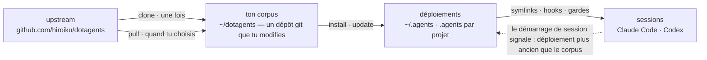
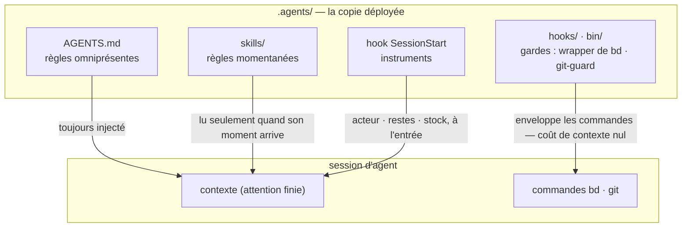

# dotagents

**Un harnais d'agents IA que tu possèdes.** Règles, skills et gardes
mécaniques pour Claude Code et Codex — versionnés comme un unique corpus,
déployé vers chaque projet depuis celui-ci.

[English](../README.md) | [日本語](README.ja.md) | [简体中文](README.zh-CN.md) | [繁體中文](README.zh-TW.md) | [한국어](README.ko.md) | [Deutsch](README.de.md) | [Español](README.es.md) | Français

[](https://www.npmjs.com/package/@hiroiku/dotagents)
[](../LICENSE)

- **Un corpus, de nombreux déploiements.** Prompts, skills, rôles d'agents,
  gardes shell et instruments de session vivent dans un unique dépôt git.
  L'installeur les copie dans `~/.agents` ou `<project>/.agents` et câble
  les liens symboliques et les hooks que lisent Claude Code et Codex.
- **Un livre de règles, pas une bibliothèque.** Tu modifies les règles, les
  commit, et tu suis l'upstream seulement quand tu le choisis — rien ne
  change dans ton dos.
- **Les règles deviennent mécanisme.** Tout ce qu'un hook ou un wrapper peut
  imposer est imposé ; tout ce qui a un moment clair devient un skill ;
  seul le reste a le droit d'occuper l'attention de chaque session. Le
  raisonnement se trouve dans [Concept](#concept).

## Comment ça marche

Un corpus alimente chaque environnement. Les déploiements sont de simples
copies — les sessions ne dépendent jamais de l'accessibilité du corpus, et
rien ne se déploie dans ton dos :



À l'intérieur d'une session, les trois couches du corpus atteignent l'agent
par des chemins différents — et plus le chemin est bas, plus la règle est
forte et bon marché :



## Démarrage rapide

**1 · Vérifie les prérequis**

| Outil | | Pourquoi |
|---|---|---|
| git, Node.js ≥ 18 | requis | fait tourner la CLI |
| [bd (beads)](https://github.com/gastownhall/beads) | requis | le registre de tickets sur lequel tout repose : dépôt, réclamation, portes d'achèvement, exclusion de fusion |
| [codegraph](https://github.com/colbymchenry/codegraph) | recommandé | requêtes de structure — à câbler une fois avec `codegraph install`, à indexer par projet avec `codegraph init` |

Le harnais ne les installe jamais à ta place — l'installeur et chaque
démarrage de session détectent ce qui manque et le signalent.

**2 · Obtiens ton corpus**

```sh
npx @hiroiku/dotagents clone ~/dotagents
```

Un simple `git clone`, et il est à toi : modifie les règles, commit-les,
personnalise-le.

**3 · Déploie-le**

```sh
cd ~/dotagents
bin/agents-setup install project /path/to/project   # un projet     → <dir>/.agents
bin/agents-setup install user                       # cette machine → ~/.agents
bin/agents-setup install shell                      # gardes seules → hooks/bin + une ligne dans ~/.zshenv
```

Omets la cible pour la choisir de façon interactive. Dans un shell non
interactif, une cible omise arrête le processus sans rien écrire — aucun
défaut ne décide jamais où atterrissent les règles.

**4 · Opère**

```sh
bin/agents-setup pull                 # suivre l'upstream : journal des modifications → rebase → tests
bin/agents-setup update  project ...  # resynchroniser un déploiement (les sessions te le disent)
bin/agents-setup status  project ...  # vérifier fichiers, liens, fragments — exit 1 en cas de dérive
bin/agents-setup --help               # toutes les commandes, cibles, options, exemples
```

## Les trois verbes

| Verbe | Cadence | Ce qu'il fait |
|---|---|---|
| **clone** | une fois | matérialise le corpus comme un dépôt git que tu possèdes |
| **pull** | quand tu choisis | récupère l'upstream, affiche les titres des commits entrants, rebase tes commits par-dessus, exécute les tests du corpus |
| **install · update** | par machine, par projet | copie le corpus dans `.agents/` et câble liens, hooks, gardes |

Trois règles les relient :

- **Pas de déploiement depuis un jetable.** En dehors d'un corpus (un cache
  npx, une archive tarball décompressée), les commandes de déploiement
  délèguent au corpus que ta machine connaît déjà — ou s'arrêtent en
  pointant vers `clone`.
- **La resynchronisation se pull, elle ne se push pas.** Quand le corpus
  avance, l'instrument à chaque entrée de session signale *déploiement plus
  ancien que le corpus*, et tu exécutes `update` dans ce projet.
- **Le suivi est délibéré.** Ce que tu récupères par pull, ce sont les
  textes qui gouvernent tes agents, donc `pull` montre d'abord les titres
  des commits entrants — écrits en langage du domaine, ils se lisent comme
  un journal des modifications — puis rebase et exécute les tests. Rien ne
  se met à jour automatiquement.

## Ce qui atterrit où

| Élément | Destination | Livraison |
|---|---|---|
| Règles omniprésentes (`AGENTS.md`) | `.agents/AGENTS.md` | symlink `.claude/CLAUDE.md → .agents/AGENTS.md` ; Codex reçoit la même forme sous `.codex/` |
| Skills · rôles d'agents | `.agents/skills/` · `.agents/agents/` | un lien par entrée, pour qu'ils coexistent avec les skills que tu as écrits toi-même |
| Gardes (wrapper `bd` · `git-guard`) | `.agents/bin/` · `.agents/hooks/` | une ligne gérée dans `~/.zshenv` — niveau utilisateur, une fois par machine |
| Injection de session | `settings.json` · `.codex/hooks.json` | fragments : `hooks.SessionStart`, `env.BASH_ENV`, `permissions.ask` |
| Produits spécifiques à la machine (manifest · métriques) | `.agents/` | tenus hors du contrôle de version par un `.gitignore` livré avec le payload |

Tout est idempotent et **possédé par empreinte** : l'installeur ne touche
que ce qu'il a lui-même placé et reconnaît encore. Tes propres skills ne
sont jamais touchés, les fichiers que tu as modifiés sur place sont
conservés et signalés (`--force` pour écraser), et `uninstall` retire
exactement ce que le manifest enregistre — rien d'autre.

<details>
<summary><b>La couche shell — une par machine, entretenue des deux côtés</b></summary>

Les gardes n'atteignent les sessions que par `hooks/shellenv.sh`, et zsh n'a
pas de fichier de démarrage par projet — donc cette couche existe **une
fois par machine**, quel que soit le nombre de projets qui utilisent le
harnais. L'installeur garde son entretien hors de ta connaissance
opérationnelle : `install project` ajoute la portée shell minimale quand
elle manque ; `uninstall user` demande confirmation avant de retirer ce que
d'autres projets partagent (`--keep-shell` la conserve sans interaction) ;
`uninstall project` n'y touche jamais.

</details>

<details>
<summary><b>Adoption tardive et déploiement en équipe</b></summary>

- **Indépendant de l'ordre** : ajouter bd ou codegraph plus tard ne
  nécessite aucune réinstallation — les organes, les registres et les index
  sont détectés dynamiquement à chaque démarrage de session. Un AGENTS.md
  racine existant créé par `bd init` n'est pas repris ; seul un bloc de
  référence géré est ajouté.
- **Deux couches de livraison** : la couche de prompts (le payload de
  `.agents/`, les liens, le bloc de référence) voyage avec le contrôle de
  version et fonctionne dès le simple `git clone` ; la couche d'injection et
  d'application des règles (manifest, fragments de settings, la ligne
  zshenv, les gardes shell) est spécifique à la machine et est posée par
  l'installeur sur chaque machine.
- **À partir de la deuxième personne** : cloner le projet, cloner
  dotagents, exécuter `bin/agents-setup install project <project>` — une
  seule commande ; la couche shell est complétée au passage si elle manque.
  L'installeur est idempotent et vérifié par empreinte, si bien qu'il ne
  combat jamais ce que le contrôle de version a livré.

</details>

<details>
<summary><b>Notes de conception de la CLI</b></summary>

La cible est **un unique argument positionnel** (`user` / `project [dir]` /
`shell`), jamais par défaut. Comme il n'y a qu'une seule position,
« utilisateur et projet à la fois » ne peut même pas être saisi —
l'exclusivité est garantie par la syntaxe, pas par une validation à
l'exécution. L'invite interactive est un sélecteur à flèches (`↑/↓`
déplacer, `enter` confirmer, `ctrl-c` annuler) qui se réduit à une seule
ligne montrant ce que tu as choisi. La sortie perd automatiquement la
couleur sous `NO_COLOR` ou sans TTY.

</details>

## Concept

Ce que construit ce harnais n'est pas « un agent capable », mais **une
organisation qui répartit une attention finie (le contexte) entre des rôles
et les relie par des registres externes**. Chaque règle ci-dessous découle
d'une prémisse unique : le contexte est fini et meurt avec la session.

### Trois couches de règles — omniprésentes, momentanées, imposées

Avant même son contenu, la nature d'une règle est décidée par **la façon
dont elle est livrée**.

- **Règles omniprésentes** (le noyau = AGENTS.md) — toujours injectées.
  Elles taxent l'attention de chaque session et ne tiennent que comme un
  **effort maximal**, donc cette couche ne peut porter que les quelques
  règles dont le moment d'observation ne peut pas être nommé
- **Règles momentanées** (skills) — injectées juste à temps. Elles n'entrent
  dans le contexte que lorsque leur moment arrive, si bien que le détail n'y
  coûte rien à aucun autre moment
- **Règles imposées** (hooks / bin / permissions) — jamais injectées. Un
  mécanisme décide, si bien qu'elles ne consomment aucune attention et ne
  peuvent pas être enfreintes (ou laissent une trace quand elles le sont)

**La loi de la descente** : pousse chaque règle aussi bas qu'elle peut aller.
Les couches inférieures sont à la fois plus fortes *et* moins coûteuses —
une pente à sens unique où la force augmente à mesure que le coût
d'attention disparaît. Un prompt n'est que la salle d'attente des règles qui
n'ont pas encore été transformées en mécanisme.

### Séparation — des frontières qui n'admettent aucune duplication

Les subagents ne sont pas découpés selon leur capacité, mais selon des
**frontières où la duplication ne peut pas se produire** : des unités dont
les entrées (le contexte), les plages de recherche et les cibles d'écriture
(worktrees) ne se recoupent pas. Donne la même information à deux contextes
et tu paies l'attention deux fois ; laisse deux contextes écrire au même
endroit et tu as créé un point de fusion. Les points de fusion que la
structure ne peut pas supprimer (la branche d'intégration et le registre)
sont les seuls protégés par exclusion.

La séparation est aussi une dissimulation. Ne pas connaître les
circonstances de l'implémentation est ce qui donne à la revue son pouvoir de
détection — **« ne pas le transmettre » est une décision de conception aussi
forte que « le transmettre »**.

### Organes — déclaration contre dérivation

Chaque outil sert d'organe répondant à un type de question, et aucune
capacité native d'un organe n'est réimplémentée ailleurs. L'axe est
**déclaration contre dérivation** :

- **Registres de déclaration** (ce qui a été décidé ne peut pas être dérivé,
  donc on l'enregistre) : bd = le registre de l'intention et de l'état (ce
  que nous avons décidé de faire, qui détient quoi, pourquoi quelque chose
  est arrêté) ; les ADR = la trace des décisions ; le glossaire = le
  langage omniprésent
- **Dérivation** (ce qu'une machine peut dériver de l'artefact n'est jamais
  écrit à la main) : codegraph = la structure actuelle du code (symboles,
  chemins d'appel, rayon d'impact) ; git = l'historique des changements

Au moment où tu écris à la main quelque chose de dérivable, la dérive
commence. La mémoire se situe sur le même axe : l'état est dérivé
(l'injection de requêtes de bd prime) ; seuls les invariants sont déclarés
(bd remember). Ce qui porte le contexte d'une session à l'autre n'est pas
une transcription, mais un registre externe muni d'une adresse (**le pont de
contexte**).

codegraph est l'organe d'exploration quotidien, et sa règle omniprésente
(« dériver d'abord avec explore ») est **livrée par la description de
l'outil (les instructions du serveur MCP)** — jamais copiée dans les
prompts, où elle deviendrait une réplique obsolète. Le choix de l'outil ne
peut pas être vérifié par une machine, donc il ne peut pas non plus relever
de l'application des règles : la couche d'outils à coût d'injection nul est
la couche la plus basse où cette règle peut vivre. Les prompts du harnais
n'énoncent que les moments où *ne pas* l'utiliser rompt un contrat (la
vérification avec la vérité de terrain avant le gel, la dérivation du
balayage horizontal, le scan du relecteur). Le câblage (`codegraph install`)
et l'index (`codegraph init`) relèvent de la responsabilité propre de
codegraph — le harnais ne les vérifie ni ne les réimplémente ; SessionStart
se contente de détecter `.codegraph/` et d'injecter une ligne de rappel.

### Revue contradictoire — les omissions n'existent pas tant qu'on ne les cherche pas

Le mode d'échec propre aux agents IA est le « c'est fait ! » alors que ce
n'est pas fait, et son fond n'est pas le mensonge mais **l'omission** —
quelqu'un dont le contexte ne contient que ce qu'il a écrit ne peut pas voir
ce qu'il n'a pas écrit.

La revue n'est donc pas une inspection (regarder ce qui existe et le juger),
mais une **preuve d'existence** : partant des exigences, le relecteur doit
trouver l'implémentation et la vérification qui satisfont chacune d'elles
dans l'artefact — un scan en sens inverse. Le diff n'est pas montré en
premier au relecteur, parce que l'attention capturée par la vérification de
ce qui a été écrit cesse de chercher ce qui n'a pas été écrit.

### Enfoncement — les boucles se terminent parce que le savoir descend

La revue répétée seule diverge (les constats surgissent sans fin). La
boucle converge parce que chaque tour fait **s'enfoncer** le savoir d'une
couche : des constats individuels → des classes de défauts articulées (des
contrats rompus) → l'application des règles (une structure, un type, une
seule garde). Une hypothèse qui s'est enfoncée est retirée de la charte, si
bien que le carburant de la revue se réduit tour après tour. Quand la même
classe de défaut resurgit deux fois, le signal n'est pas que le correctif
était erroné, mais que **c'est l'enfoncement qui l'était**.

Le registre des tickets converge sur le même principe : ne pas empiler
d'observations dans l'ouvert ; n'ouvrir que ce qui a été décidé ; replier
ensemble les tickets de même forme ; donner à chaque dépôt sa voie de
digestion dès sa naissance.

### Tests — le nombre n'est pas la mesure de la protection

Un test ne peut fixer qu'un **contrat** (une promesse dont dépend
l'activité) ; une copie d'un symptôme ne protège de rien contre la
régression. La première ligne de défense est une structure qui ne peut pas
se rompre (des conceptions et des types dans lesquels la condition de
défaillance ne peut pas exister) ; les tests sont le dernier recours pour
les contrats que la structure ne peut pas sceller.

### Observateurs et énumérations — pas de contrôles qualité méta

Des observateurs d'observateurs, des tests de tests, des gardes de gardes —
des contrôles méta qui ne protègent aucun contrat métier se multiplient
facilement et consomment de la maintenance sans rien protéger. Trois
principes les excluent :

- **Ne pas ajouter d'observateurs ; les enfoncer à la place** — vouloir
  observer une garde est le symptôme qu'elle est placée trop haut. La
  réponse est la loi de la descente, pas plus de surveillance : pousse-la
  vers le bas et ce qu'il fallait observer disparaît
- **La détection ne va qu'un cran plus loin** — seuls les contrats que la
  structure ne peut pas sceller peuvent avoir des détecteurs, et les
  détecteurs n'ont pas de détecteurs. Qu'un détecteur défaillant passe
  inaperçu est le prix accepté, c'est pourquoi les détecteurs restent
  minimaux et simples
- **Ne jamais garder par énumération** — tout schéma dont la couverture est
  une liste tenue à la main transforme les ajouts oubliés en lacunes
  silencieuses. Préférer les formes où la structure elle-même est la
  définition (le principe du payload) ou où la machine dérive la liste
  comme sous-produit (le principe du manifest)

Les textes de règles eux-mêmes ne sont pas dupliqués ici (une copie du
payload pourrirait en silence). L'index canonique : les rôles, les
invariants de qualité, l'autorité git et les règles omniprésentes de beads
sont dans [AGENTS.md](../payload/AGENTS.md) ; le travail préparatoire et la
composition dans [agents-kickoff](../payload/skills/agents-kickoff/SKILL.md) ;
la conduite de la boucle de qualité dans
[agents-quality-loop](../payload/skills/agents-quality-loop/SKILL.md) ; les
opérations bd et la limite de la mémoire dans
[agents-beads-ops](../payload/skills/agents-beads-ops/SKILL.md) ; la
conception des tests dans
[agents-test-design](../payload/skills/agents-test-design/SKILL.md) ; les
trois couches et la discipline d'ablation dans
[prompt-guidelines.md](../payload/docs/prompt-guidelines.md).

## Structure

```
bin/agents-setup      CLI de l'installeur (clone / pull / install / update / uninstall / status)
test/                 tests de contrat pour l'installeur et la couche d'application (npm test)
payload/              la définition unique de ce qui est distribué ; cet arbre devient .agents/
├── AGENTS.md         règles omniprésentes (lues par chaque session, toujours)
├── skills/           règles momentanées (lues seulement quand leur moment arrive)
├── agents/           définitions de rôles (reviewer / verifier, aux outils restreints)
├── hooks/            shellenv.sh (livraison des gardes) / beads-session.sh (injection SessionStart)
├── bin/              application des règles (bd, git-guard, agents-gate, agents-reap) et autovérification (agents-doctor)
└── docs/             directives pour la mise à jour des prompts
```

[payload/](../payload/) est la définition canonique de la distribution ;
l'installeur ne tient aucune liste de son contenu (les listes répliquées
pourrissent en silence — `files` dans [package.json](../package.json) ne
nomme que `bin` et `payload`).

## Mettre à jour les prompts

Suis [payload/docs/prompt-guidelines.md](../payload/docs/prompt-guidelines.md).
Modifie uniquement dans ce dépôt et livre avec `agents-setup update` —
modifier directement un arbre installé fait que `update` protège le fichier
et avertit, ce qui est la détection de dérive à l'œuvre.

## Questions ouvertes

- Triage massif des tickets ouverts préexistants lors de l'adoption du
  harnais dans un projet doté d'un registre déjà établi (avec une
  approbation générale via `AGENTS_BD_OPEN_OK=1`)
- Révision des termes forgés, et allègement supplémentaire du bloc
  `<beads>` dans AGENTS.md — une fois que les instruments auront rassemblé
  des observations
