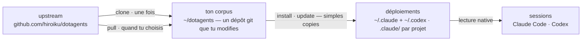

# dotagents

**Un harnais d'agents IA que tu possèdes.** Règles, skills et agents de revue pour Claude Code et Codex — versionnés comme un unique corpus, déployé vers chaque projet depuis celui-ci.

[English](../README.md) | [日本語](README.ja.md) | [简体中文](README.zh-CN.md) | [繁體中文](README.zh-TW.md) | [한국어](README.ko.md) | [Deutsch](README.de.md) | [Español](README.es.md) | Français

[](https://www.npmjs.com/package/@hiroiku/dotagents)
[](../LICENSE)

- **Un corpus, de nombreux déploiements.** Prompts, skills et rôles d'agents vivent dans un unique dépôt git. L'installeur les copie directement dans les répertoires que lisent Claude Code et Codex (`.claude/`, `.codex/`) — des fichiers ordinaires, sans liens symboliques, sans arbre intermédiaire.
- **Un livre de règles, pas une bibliothèque.** Tu modifies les règles, les commit, et tu suis l'upstream seulement quand tu le choisis — rien ne change dans ton dos.
- **Écrit pour des modèles qui jugent.** Le corpus n'enregistre que ce qu'un modèle capable ne peut pas dériver — tes conventions, tes ancres d'exigences, tes frontières de rôles. Tout le reste est laissé au jugement du modèle. Le raisonnement se trouve dans [Le harnais fourni](../payload/docs/README.fr.md).

## Comment ça marche

Un corpus alimente chaque environnement. Les déploiements sont de simples copies — les sessions ne dépendent jamais de l'accessibilité du corpus, et rien ne se déploie dans ton dos :



## Démarrage rapide

**1 · Obtiens ton corpus** (requiert git et Node.js ≥ 18)

```sh
npx @hiroiku/dotagents clone ~/dotagents
```

Un simple `git clone`, et il est à toi : modifie les règles, commit-les, personnalise-le.

**2 · Déploie-le**

```sh
cd ~/dotagents
bin/agents-setup install project /path/to/project   # un projet     → <dir>/.claude + <dir>/.codex
bin/agents-setup install user                       # cette machine → ~/.claude + ~/.codex
```

Omets la cible pour la choisir de façon interactive. Dans un shell non interactif, une cible omise arrête le processus sans rien écrire — aucun défaut ne décide jamais où atterrissent les règles.

**3 · Opère**

```sh
bin/agents-setup pull                 # suivre l'upstream : journal des modifications → rebase → tests
bin/agents-setup update  project ...  # resynchroniser un déploiement
bin/agents-setup status  project ...  # vérifier fichiers et blocs de règles — exit 1 en cas de dérive
bin/agents-setup --help               # toutes les commandes, cibles, options, exemples
```

## Les trois verbes

| Verbe | Cadence | Ce qu'il fait |
|---|---|---|
| **clone** | une fois | matérialise le corpus comme un dépôt git que tu possèdes |
| **pull** | quand tu choisis | récupère l'upstream, affiche les titres des commits entrants, rebase tes commits par-dessus, exécute les tests du corpus |
| **install · update** | par machine, par projet | copie le payload dans les répertoires que lisent les outils |

Trois règles les relient :

- **Pas de déploiement depuis un jetable.** En dehors d'un corpus (un cache npx, une archive tarball décompressée), les commandes de déploiement délèguent au corpus que ta machine connaît déjà — ou s'arrêtent en pointant vers `clone`.
- **Le suivi est délibéré.** Ce que tu récupères par pull, ce sont les textes qui gouvernent tes agents, donc `pull` montre d'abord les titres des commits entrants — écrits en langage du domaine, ils se lisent comme un journal des modifications — puis rebase et exécute les tests. Rien ne se met à jour automatiquement.
- **La dérive est visible.** `status` compare chaque fichier et chaque lien déployés au corpus et sort avec exit 1 en cas de dérive ; `update` resynchronise exactement ce que possède l'installeur.

## Ce qui atterrit où

| Élément | Destination | Livraison |
|---|---|---|
| Règle omniprésente (`AGENTS.md`) | `.claude/CLAUDE.md` · `~/.codex/AGENTS.md` · `AGENTS.md` à la racine d'un projet | un bloc géré entre des marqueurs — ce que tu as écrit autour n'est jamais touché, et `uninstall` restaure le fichier |
| Skills | `.claude/skills/` et `.codex/skills/` | de simples copies, un répertoire par skill, qui coexistent avec les skills que tu as écrits toi-même |
| Agents de revue | `.claude/agents/` | de simples copies, un fichier par agent |
| Relevé local à la machine (manifest) | `~/.dotagents/` | n'atterrit jamais dans un projet — le registre d'empreintes de ce que l'installeur a placé vit avec la machine |

Tout est idempotent et **possédé par empreinte** : l'installeur ne touche que ce qu'il a lui-même placé et reconnaît encore. Tes propres skills ne sont jamais touchés, les fichiers que tu as modifiés sur place sont conservés et signalés (`--force` pour écraser), et `uninstall` retire exactement ce que le manifest enregistre — rien d'autre. Une disposition `.agents` héritée d'anciennes versions (liens symboliques, ligne zshenv, fragments de settings) est détectée et migrée automatiquement lors d'un `install` / `update`.

## Structure

```
bin/agents-setup      CLI de l'installeur (clone / pull / install / update / uninstall / status)
test/                 tests de contrat pour l'installeur (npm test)
payload/              la définition unique de ce qui est distribué
├── AGENTS.md         la règle omniprésente unique — livrée comme un bloc géré
├── skills/           règles momentanées (lues seulement quand leur moment arrive)
├── agents/           rôles de revue (contradictoire · sécurité · accessibilité)
├── README.md         le harnais fourni — ce qui est livré, et pourquoi il en dit si peu
└── docs/             traductions de ce guide (documentation ; non déployée)
```

[payload/](../payload/) est la définition canonique de la distribution : ses catégories de premier niveau décident où atterrissent les choses, et l'installeur ne tient aucune liste des fichiers — les listes répliquées pourrissent en silence, donc `files` dans [package.json](../package.json) ne nomme que `bin` et `payload`. Ce que livre le payload est décrit dans [Le harnais fourni](../payload/docs/README.fr.md).

## Mettre à jour les prompts

Le corpus porte sa propre discipline d'édition : le skill [dotagents-prompting](../payload/skills/dotagents-prompting/SKILL.md) nomme les guides d'ingénierie de contexte à lire avant de toucher au moindre prompt ou à la moindre définition d'agent. Modifie uniquement dans ce dépôt et livre avec `agents-setup update` — modifier directement un arbre installé fait que `update` protège le fichier et avertit, ce qui est la détection de dérive à l'œuvre.
