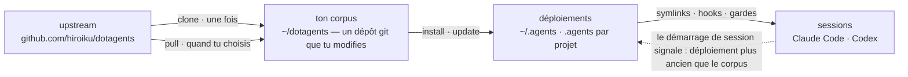

# dotagents

**Un harnais d'agents IA que tu possèdes.** Règles, skills et gardes mécaniques pour Claude Code et Codex — versionnés comme un unique corpus, déployé vers chaque projet depuis celui-ci.

[English](../README.md) | [日本語](README.ja.md) | [简体中文](README.zh-CN.md) | [繁體中文](README.zh-TW.md) | [한국어](README.ko.md) | [Deutsch](README.de.md) | [Español](README.es.md) | Français

[](https://www.npmjs.com/package/@hiroiku/dotagents)
[](../LICENSE)

- **Un corpus, de nombreux déploiements.** Prompts, skills, rôles d'agents, gardes shell et instruments de session vivent dans un unique dépôt git. L'installeur les copie dans `~/.agents` ou `<project>/.agents` et câble les liens symboliques et les hooks que lisent Claude Code et Codex.
- **Un livre de règles, pas une bibliothèque.** Tu modifies les règles, les commit, et tu suis l'upstream seulement quand tu le choisis — rien ne change dans ton dos.
- **Les règles deviennent mécanisme.** Tout ce qu'un hook ou un wrapper peut imposer est imposé ; tout ce qui a un moment clair devient un skill ; seul le reste a le droit d'occuper l'attention de chaque session. Le raisonnement se trouve dans [Le harnais fourni](HARNESS.fr.md).

## Comment ça marche

Un corpus alimente chaque environnement. Les déploiements sont de simples copies — les sessions ne dépendent jamais de l'accessibilité du corpus, et rien ne se déploie dans ton dos :



## Démarrage rapide

**1 · Vérifie les prérequis**

| Outil | | Pourquoi |
|---|---|---|
| git, Node.js ≥ 18 | requis | fait tourner la CLI |
| [bd (beads)](https://github.com/gastownhall/beads) | requis | le registre de tickets sur lequel repose le harnais fourni : dépôt, réclamation, portes d'achèvement, exclusion de fusion |
| [codegraph](https://github.com/colbymchenry/codegraph) | recommandé | requêtes de structure — à câbler une fois avec `codegraph install`, à indexer par projet avec `codegraph init` |

Le harnais ne les installe jamais à ta place — l'installeur et chaque démarrage de session détectent ce qui manque et le signalent.

**2 · Obtiens ton corpus**

```sh
npx @hiroiku/dotagents clone ~/dotagents
```

Un simple `git clone`, et il est à toi : modifie les règles, commit-les, personnalise-le.

**3 · Déploie-le**

```sh
cd ~/dotagents
bin/agents-setup install project /path/to/project   # un projet     → <dir>/.agents
bin/agents-setup install user                       # cette machine → ~/.agents
bin/agents-setup install shell                      # gardes seules → hooks/bin + une ligne dans ~/.zshenv
```

Omets la cible pour la choisir de façon interactive. Dans un shell non interactif, une cible omise arrête le processus sans rien écrire — aucun défaut ne décide jamais où atterrissent les règles.

**4 · Opère**

```sh
bin/agents-setup pull                 # suivre l'upstream : journal des modifications → rebase → tests
bin/agents-setup update  project ...  # resynchroniser un déploiement (les sessions te le disent)
bin/agents-setup status  project ...  # vérifier fichiers, liens, fragments — exit 1 en cas de dérive
bin/agents-setup --help               # toutes les commandes, cibles, options, exemples
```

## Les trois verbes

| Verbe | Cadence | Ce qu'il fait |
|---|---|---|
| **clone** | une fois | matérialise le corpus comme un dépôt git que tu possèdes |
| **pull** | quand tu choisis | récupère l'upstream, affiche les titres des commits entrants, rebase tes commits par-dessus, exécute les tests du corpus |
| **install · update** | par machine, par projet | copie le corpus dans `.agents/` et câble liens, hooks, gardes |

Trois règles les relient :

- **Pas de déploiement depuis un jetable.** En dehors d'un corpus (un cache npx, une archive tarball décompressée), les commandes de déploiement délèguent au corpus que ta machine connaît déjà — ou s'arrêtent en pointant vers `clone`.
- **La resynchronisation se pull, elle ne se push pas.** Quand le corpus avance, l'instrument à chaque entrée de session signale *déploiement plus ancien que le corpus*, et tu exécutes `update` dans ce projet.
- **Le suivi est délibéré.** Ce que tu récupères par pull, ce sont les textes qui gouvernent tes agents, donc `pull` montre d'abord les titres des commits entrants — écrits en langage du domaine, ils se lisent comme un journal des modifications — puis rebase et exécute les tests. Rien ne se met à jour automatiquement.

## Ce qui atterrit où

| Élément | Destination | Livraison |
|---|---|---|
| Règles omniprésentes (`AGENTS.md`) | `.agents/AGENTS.md` | symlink `.claude/CLAUDE.md → .agents/AGENTS.md` ; Codex reçoit la même forme sous `.codex/` |
| Skills · rôles d'agents | `.agents/skills/` · `.agents/agents/` | un lien par entrée, pour qu'ils coexistent avec les skills que tu as écrits toi-même |
| Gardes (wrapper `bd` · `git-guard`) | `.agents/bin/` · `.agents/hooks/` | une ligne gérée dans `~/.zshenv` — niveau utilisateur, une fois par machine |
| Injection de session | `settings.json` · `.codex/hooks.json` | fragments : `hooks.SessionStart`, `env.BASH_ENV`, `permissions.ask` |
| Produits spécifiques à la machine (manifest · métriques) | `.agents/` | tenus hors du contrôle de version par un `.gitignore` livré avec le payload |

Tout est idempotent et **possédé par empreinte** : l'installeur ne touche que ce qu'il a lui-même placé et reconnaît encore. Tes propres skills ne sont jamais touchés, les fichiers que tu as modifiés sur place sont conservés et signalés (`--force` pour écraser), et `uninstall` retire exactement ce que le manifest enregistre — rien d'autre.

<details>
<summary><b>La couche shell — une par machine, entretenue des deux côtés</b></summary>

Les gardes n'atteignent les sessions que par `hooks/shellenv.sh`, et zsh n'a pas de fichier de démarrage par projet — donc cette couche existe **une fois par machine**, quel que soit le nombre de projets qui utilisent le harnais. L'installeur garde son entretien hors de ta connaissance opérationnelle : `install project` ajoute la portée shell minimale quand elle manque ; `uninstall user` demande confirmation avant de retirer ce que d'autres projets partagent (`--keep-shell` la conserve sans interaction) ; `uninstall project` n'y touche jamais.

</details>

<details>
<summary><b>Adoption tardive et déploiement en équipe</b></summary>

- **Indépendant de l'ordre** : ajouter bd ou codegraph plus tard ne nécessite aucune réinstallation — les organes, les registres et les index sont détectés dynamiquement à chaque démarrage de session. Un AGENTS.md racine existant créé par `bd init` n'est pas repris ; seul un bloc de référence géré est ajouté.
- **Deux couches de livraison** : la couche de prompts (le payload de `.agents/`, les liens, le bloc de référence) voyage avec le contrôle de version et fonctionne dès le simple `git clone` ; la couche d'injection et d'application des règles (manifest, fragments de settings, la ligne zshenv, les gardes shell) est spécifique à la machine et est posée par l'installeur sur chaque machine.
- **À partir de la deuxième personne** : cloner le projet, cloner dotagents, exécuter `bin/agents-setup install project <project>` — une seule commande ; la couche shell est complétée au passage si elle manque. L'installeur est idempotent et vérifié par empreinte, si bien qu'il ne combat jamais ce que le contrôle de version a livré.

</details>

<details>
<summary><b>Notes de conception de la CLI</b></summary>

La cible est **un unique argument positionnel** (`user` / `project [dir]` / `shell`), jamais par défaut. Comme il n'y a qu'une seule position, « utilisateur et projet à la fois » ne peut même pas être saisi — l'exclusivité est garantie par la syntaxe, pas par une validation à l'exécution. L'invite interactive est un sélecteur à flèches (`↑/↓` déplacer, `enter` confirmer, `ctrl-c` annuler) qui se réduit à une seule ligne montrant ce que tu as choisi. La sortie perd automatiquement la couleur sous `NO_COLOR` ou sans TTY.

</details>

## Structure

```
bin/agents-setup      CLI de l'installeur (clone / pull / install / update / uninstall / status)
test/                 tests de contrat pour l'installeur et la couche d'application (npm test)
payload/              la définition unique de ce qui est distribué ; cet arbre devient .agents/
├── AGENTS.md         règles omniprésentes (lues par chaque session, toujours)
├── skills/           règles momentanées (lues seulement quand leur moment arrive)
├── agents/           définitions de rôles (reviewer / verifier, aux outils restreints)
├── hooks/            shellenv.sh (livraison des gardes) / beads-session.sh (injection SessionStart)
├── bin/              application des règles (bd, git-guard, agents-gate, agents-reap) et autovérification (agents-doctor)
└── docs/             directives pour la mise à jour des prompts
```

[payload/](../payload/) est la définition canonique de la distribution ; l'installeur ne tient aucune liste de son contenu (les listes répliquées pourrissent en silence — `files` dans [package.json](../package.json) ne nomme que `bin` et `payload`). Ce que livre le payload — le harnais fourni et le raisonnement derrière ses règles — est décrit dans [Le harnais fourni](HARNESS.fr.md).

## Mettre à jour les prompts

Suis [payload/docs/prompt-guidelines.md](../payload/docs/prompt-guidelines.md). Modifie uniquement dans ce dépôt et livre avec `agents-setup update` — modifier directement un arbre installé fait que `update` protège le fichier et avertit, ce qui est la détection de dérive à l'œuvre.
