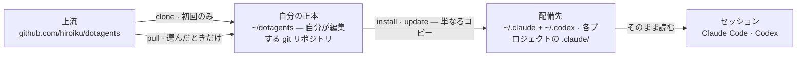

# dotagents

**AI エージェントが従う規則のパッケージマネージャ。** Claude Code と Codex 向けのプロンプト・スキル・レビューエージェントを module にまとめ、単一の正本として版管理し、選んだプロジェクトへ install する。

[English](../README.md) | 日本語 | [简体中文](README.zh-CN.md) | [繁體中文](README.zh-TW.md) | [한국어](README.ko.md) | [Deutsch](README.de.md) | [Español](README.es.md) | [Français](README.fr.md)

[](https://www.npmjs.com/package/@hiroiku/dotagents)
[](../LICENSE)

- **正本は 1 つ、配備先は複数。** すべての規則は 1 つの git リポジトリに住み、プロジェクト単位・マシン単位で install する module へ切り分けられている。installer は Claude Code と Codex が読むディレクトリへ直接書き込む — 素のファイルであり、symlink も中間ツリーも無い。
- **ライブラリではなく、規則集。** 規則は自分で編集してコミットし、上流に追従するのも選んだときだけ — 背後で勝手に変わることはない。
- **判断するモデルのために書かれている。** 正本に記録するのは、有能なモデルが導出できない物だけ — 自分の慣習、自分の要件アンカー、自分の役割の境界。それ以外はすべてモデルの判断に委ねる。理由は [同梱ハーネス](../modules/harness/docs/README.ja.md) にある。

## 仕組み

正本 1 つが全環境に供給される。配備は単なるコピーであり — セッションは正本に到達できることに依存せず、背後で勝手に配備されることもない:



## クイックスタート

**1 · 正本を取得する**(git と Node.js ≥ 18 が必要)

```sh
npx @hiroiku/dotagents clone ~/dotagents
```

ただの git clone であり、それは自分の物になる: 規則を編集し、コミットし、個人化してよい。

**2 · 欲しい物を、欲しい場所へ入れる**

```sh
cd ~/dotagents
bin/agents-setup list                     # この正本が提供する物
bin/agents-setup install harness          # 現在のプロジェクトへ
bin/agents-setup install harness -g       # このマシンの全プロジェクトへ
bin/agents-setup install harness -C ~/x   # 指定したプロジェクトへ
```

対象の既定はこのプロジェクトである — 影響範囲が最小だからだ。より広い範囲には必ず flag が要る。何を入れるかに既定値は無い: module を名指しするか、対話で選ぶ。非対話シェルでは、代わりに選ぶのではなく停止する。

**3 · 運用する**

```sh
bin/agents-setup pull                 # 上流に追従: changelog → rebase → テスト
bin/agents-setup update               # このプロジェクトを再同期する(記憶している module を使う)
bin/agents-setup status               # ファイルと規則ブロックを検査 — 乖離があれば exit 1
bin/agents-setup uninstall <module>   # module を 1 つ外し、残りは保つ
bin/agents-setup --help               # 全コマンド・オプション・例
```

## 二つの対象、二つの語彙

コマンドが作用する対象は 2 つのどちらかであり、それぞれが既に知っている語彙を借りている:

| 対象 | 語彙 | コマンド |
|---|---|---|
| **正本** — 自分が所有する規則の git リポジトリ | git | `clone` · `pull` · `list` |
| **配備先** — ツールが実際に読む物 | パッケージマネージャ | `install` · `update` · `uninstall` · `status` |

3 つの規則がこれらをつなぐ:

- **使い捨てからは配備しない。** 正本の外(npx のキャッシュ、展開した tarball)では、配備系コマンドはマシンが既に知っている正本へ委譲するか — `clone` への案内を出して止まる。
- **追従は意図してするものである。** pull で取り込むのはエージェントを支配する文書なので、`pull` はまず入ってくるコミットタイトルを見せ(ドメイン言語で書かれ、changelog として読める)、それから rebase してテストを走らせる。自動更新は無い。
- **選択は記憶され、打ち直さない。** その配備先がどの module を保持しているかは manifest が記録するので、`update` に引数は要らない。`install` は加算、`uninstall` は減算である。

## 何がどこに届くか

| 物 | 届く先 | 届け方 |
|---|---|---|
| スキル · レビューエージェント · hook | `.claude/skills/dotagents/` | **1 つの plugin directory**。Claude Code はそこに見つけた plugin を、marketplace も install 手順も無しに読み込み、その中身を `/dotagents:*` という名前空間に収める — hook が `settings.json` に一切触れずに届くのは、これによる |
| スキル(Codex) | `.codex/skills/dotagents-*` | 単なるコピー。Codex に plugin は無いので、名前空間はディレクトリ名に畳み込まれる |
| 遍在則(`AGENTS.md`) | `.claude/CLAUDE.md` · `~/.codex/AGENTS.md` · プロジェクト直下の `AGENTS.md` | マーカーに挟まれた管理ブロック — その周囲に自分が書いた物には決して触れず、`uninstall` はファイルを復元する |
| マシン固有の記録(manifest) | `~/.dotagents/` | プロジェクトには決して届かない — installer が置いた物のハッシュ台帳と、自分が選んだ module は、マシンと共にある |

すべて冪等で**ハッシュ所有**である: installer が触れるのは、自分が置いて今も認識できる物だけ。自分で書いたスキルには一切触れず、配備先で改変したファイルは残して報告し(`--force` で上書き)、`uninstall` が除去するのは manifest に記録された物ちょうどそれだけである — それ以外には触れない。旧バージョンが残した配置(`.agents` ツリー、symlink、zshenv の行、settings の断片、名前空間の外にある単なるコピー)は、`install` / `update` の際に検出され、移行される。

プロジェクト範囲の plugin が読み込まれるのは、Claude Code をリポジトリのルートで起動したときだけであり、workspace の信頼ダイアログを承認した後だけである。エージェントと hook への変更は次のセッション、または `/reload-plugins` の後に効く。`SKILL.md` への編集は即座に取り込まれる。

## 構成

```
bin/agents-setup      installer CLI(clone / pull / list / install / update / uninstall / status)
test/                 installer の契約テスト(npm test)
modules/              配布できる物の唯一の定義
└── harness/          同梱 module — 外部依存は無い
    ├── MODULE.md     名前、説明、PATH に期待する物
    ├── AGENTS.md     唯一の遍在則 — 管理ブロックとして届く
    ├── skills/       瞬間則(その瞬間が来たときだけ読む)
    ├── agents/       レビューの役割(敵対的 · セキュリティ · アクセシビリティ)
    ├── README.md     同梱ハーネス — 何を積んでいるか、なぜこれだけしか書いていないか
    └── docs/         そのガイドの翻訳(ドキュメントであり、配備されない)
```

[modules/](../modules/) が配布物の正本の定義である: `MODULE.md` を持つディレクトリが module であり、その最上位の種別が物の届く先を決め、installer 側にファイルの列挙は存在しない — 列挙の複製は黙って古びるため、[package.json](../package.json) の `files` が挙げるのは `bin` と `modules` の 2 項のみ。同梱 module の隣に自分の module を書けば、同じように install される。

module は `PATH` に期待する物を宣言してよい。要件は**検出されるだけで、決して install されない**: `list` と `install` は欠けている物を報告するが、何も妨げない。だから後からツールを足しても、再 install は要らない。

## プロンプトの更新

正本は自らの編集規律を携えている: [prompting](../modules/harness/skills/prompting/SKILL.md) スキルが、プロンプトやエージェント定義に触れる前に読むべきコンテキストエンジニアリングのガイドを挙げている。編集は必ずこのリポジトリで行い、`agents-setup update` で配る — 配備先のツリーを直接編集すると、`update` がそのファイルを保護して警告するようになる。それが乖離の検出が働いている証拠である。
