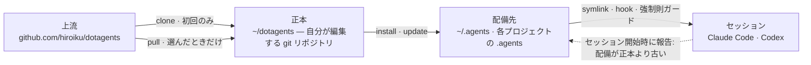

# dotagents

**自分で所有する AI エージェントハーネス。** Claude Code と Codex 向けの規則・スキル・機械的ガードを、単一の正本として版管理し、そこから全プロジェクトへ配備する。

[English](../README.md) | 日本語 | [简体中文](README.zh-CN.md) | [繁體中文](README.zh-TW.md) | [한국어](README.ko.md) | [Deutsch](README.de.md) | [Español](README.es.md) | [Français](README.fr.md)

[](https://www.npmjs.com/package/@hiroiku/dotagents)
[](../LICENSE)

- **正本は 1 つ、配備先は複数。** プロンプト・スキル・エージェント定義・シェルガード・セッションの計器は、1 つの git リポジトリに同居する。installer がそれを `~/.agents` や `<project>/.agents` にコピーし、Claude Code と Codex が読む symlink と hook を配線する。
- **消費するライブラリではなく、運転する規則集。** 規則は自分で編集してコミットし、上流に追従するのも選んだときだけ — 背後で勝手に変わることはない。
- **規則は仕組みに落ちる。** hook やラッパーで強制できることは強制則として強制し、観測の瞬間が明確な物は瞬間則(スキル)になり、残りだけが遍在則としてセッションの注意を占有することを許される。理由は [同梱ハーネス](HARNESS.ja.md) にある。

## 仕組み

正本 1 つが全環境に供給される。配備は単なるコピーであり — セッションは正本に到達できることに依存せず、背後で勝手に配備されることもない:



## クイックスタート

**1 · 前提を確認する**

| ツール | | 理由 |
|---|---|---|
| git、Node.js ≥ 18 | 必須 | CLI を動かす |
| [bd (beads)](https://github.com/gastownhall/beads) | 必須 | 同梱ハーネスがその上で動く issue の台帳: 起票・claim・完了ゲート・merge 排他 |
| [codegraph](https://github.com/colbymchenry/codegraph) | 推奨 | 構造への問い合わせ — 配線は `codegraph install` で 1 度だけ、index はプロジェクトごとに `codegraph init` |

ハーネスはこれらを代わりに導入しない — installer と毎回の SessionStart が不在を検出して伝える。

**2 · 正本を取得する**

```sh
npx @hiroiku/dotagents clone ~/dotagents
```

ただの git clone であり、それは自分の物になる: 規則を編集し、コミットし、好きに個人化してよい。

**3 · 配備する**

```sh
cd ~/dotagents
bin/agents-setup install project /path/to/project   # プロジェクト単体   → <dir>/.agents
bin/agents-setup install user                       # このマシン        → ~/.agents
bin/agents-setup install shell                       # ガードのみ        → hooks/bin + ~/.zshenv の 1 行
```

対象を省略すると対話で選ぶ。非対話シェルでは、対象を省略すると何も書き込まずに停止する — 既定値が規則の行き先を決めることは無い。

**4 · 運用する**

```sh
bin/agents-setup pull                 # 上流に追従: changelog → rebase → テスト
bin/agents-setup update  project ...  # 配備を再同期する(タイミングはセッションが教える)
bin/agents-setup status  project ...  # ファイル・リンク・断片を検査 — 乖離があれば exit 1
bin/agents-setup --help               # 全コマンド・対象・オプション・例
```

## 三つの動詞

| 動詞 | 頻度 | 何をするか |
|---|---|---|
| **clone(取得)** | 初回のみ | 正本を、自分が所有する git リポジトリとして実体化する |
| **pull(追従)** | 選んだときだけ | 上流を取得し、入ってくるコミットタイトルを見せ、自分のコミットを rebase で乗せ、正本のテストを走らせる |
| **install・update(配備)** | マシンごと・プロジェクトごと | 正本を `.agents/` にコピーし、link・hook・強制則ガードを配線する |

3 つの規則がこれらをつなぐ:

- **使い捨てからは配備しない。** 正本の外(npx のキャッシュ、展開した tarball)では、配備系コマンドはマシンが既に知っている正本へ委譲するか — `clone` への案内を出して止まる。
- **再同期は pull されるのであって push されない。** 正本が先に進むと、各セッション入口の計器が *配備が正本より古い* と報告し、そのプロジェクトで `update` を実行する。
- **追従はわざと自動化しない。** pull で取り込むのはエージェントを支配する文書なので、`pull` はまず入ってくるコミットタイトルを見せ(ドメイン言語で書かれ、changelog として読める)、それから rebase してテストを走らせる。自動更新は無い。

## 何がどこに届くか

| 物 | 届く先 | 届け方 |
|---|---|---|
| 遍在則(`AGENTS.md`) | `.agents/AGENTS.md` | symlink `.claude/CLAUDE.md → .agents/AGENTS.md`。Codex にも `.codex/` の下に同じ形で届く |
| スキル・エージェント定義 | `.agents/skills/` ・ `.agents/agents/` | 1 件ずつリンクし、自分で書いたスキルと同居させる |
| 強制則ガード(`bd` ラッパー・`git-guard`) | `.agents/bin/` ・ `.agents/hooks/` | `~/.zshenv` の管理下の 1 行 — ユーザーレベル、マシンあたり 1 回 |
| セッション注入 | `settings.json` ・ `.codex/hooks.json` | 断片: `hooks.SessionStart`、`env.BASH_ENV`、`permissions.ask` |
| マシン固有の生成物(manifest・計器のメトリクス) | `.agents/` | payload に同梱される `.gitignore` が版管理から外す |

すべて冪等で**ハッシュ所有**である: installer が触れるのは、自分が置いて今も認識できる物だけ。自分で書いたスキルには一切触れず、配備先で改変したファイルは残して報告し(`--force` で上書き)、`uninstall` が除去するのは manifest に記録された物だけ — それ以外には触れない。

<details>
<summary><b>シェル層 — マシンに 1 つだけ、両側から世話をする</b></summary>

ガードがセッションに届く経路は `hooks/shellenv.sh` だけであり、zsh にはプロジェクトごとの起動ファイルが無いため、この層はハーネスを使うプロジェクトの数によらず**マシンあたり 1 つ**しか存在しない。installer は両側から面倒を見るので、運用知識として覚えておく必要は無い: `install project` はシェル層が無ければ最小の shell スコープを補い、`uninstall user` は他のプロジェクトが共有している物を取り上げる前に確認し(`--keep-shell` で非対話でも残せる)、`uninstall project` はシェル層に一切触れない。

</details>

<details>
<summary><b>後からの導入とチーム展開</b></summary>

- **導入の順序に依存しない**: bd や codegraph を後から入れても再配備は要らない — 器官・台帳・index の検出は毎セッションの開始時に動的に行われる。`bd init` が作った既存の root AGENTS.md は奪わず、管理下の参照ブロックだけを足す。
- **届き方は二層**: プロンプト層(`.agents/` の payload・リンク・参照ブロック)は版管理に乗り、`git clone` するだけで効く。注入と強制則の層(manifest・settings 断片・zshenv 行・シェルガード)はマシン固有で、各マシンで installer が敷く。
- **2 人目以降**: プロジェクトを clone、dotagents を clone、`bin/agents-setup install project <project>` を叩く — これだけの 1 コマンドで、シェル層も無ければその途中で補われる。installer は冪等でハッシュ照合するので、版管理が届けた物と衝突しない。

</details>

<details>
<summary><b>CLI 設計の要点</b></summary>

対象は**位置引数 1 つ**(`user` / `project [dir]` / `shell`)で、既定値では決まらない。位置が 1 つしか無いので「user と project の同時指定」はそもそも書けない — 排他は実行時の検証ではなく構文が保証する。対話プロンプトは矢印キーのセレクター(`↑/↓` 移動・`enter` 決定・`ctrl-c` 中止)で、決めた後は選んだ結果を示す 1 行だけが残る。出力は `NO_COLOR` か非 TTY では自動的に色を落とす。

</details>

## 構成

```
bin/agents-setup      installer CLI(clone / pull / install / update / uninstall / status)
test/                 installer と強制則の契約テスト(npm test)
payload/              配布物の唯一の定義。この木がそのまま .agents/ になる
├── AGENTS.md         遍在則(全セッションが常時読む)
├── skills/           瞬間則(その瞬間が来たときだけ読む)
├── agents/           役割定義(reviewer / verifier。ツール制限つき)
├── hooks/            shellenv.sh(ガードのシェル配達)/ beads-session.sh(SessionStart 注入)
├── bin/              強制則(bd、git-guard、agents-gate、agents-reap)と自己検査(agents-doctor)
└── docs/             プロンプト更新のガイドライン
```

[payload/](../payload/) が配布物の正本の定義であり、installer 側に配布物の列挙は存在しない(列挙の複製は黙って古くなるため — [package.json](../package.json)の `files` は `bin` と `payload` の 2 項のみ)。payload が何を積んでいるか — 同梱ハーネスと、その規則の背後にある理由 — は [同梱ハーネス](HARNESS.ja.md) で説明する。

## プロンプトの更新

[payload/docs/prompt-guidelines.md](../payload/docs/prompt-guidelines.md) に従う。編集は必ずこのリポジトリで行い、`agents-setup update` で配る — 配備先を直接編集すると、`update` がそのファイルを保護して警告するようになる。それが乖離の検出が働いている証拠である。
