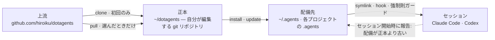
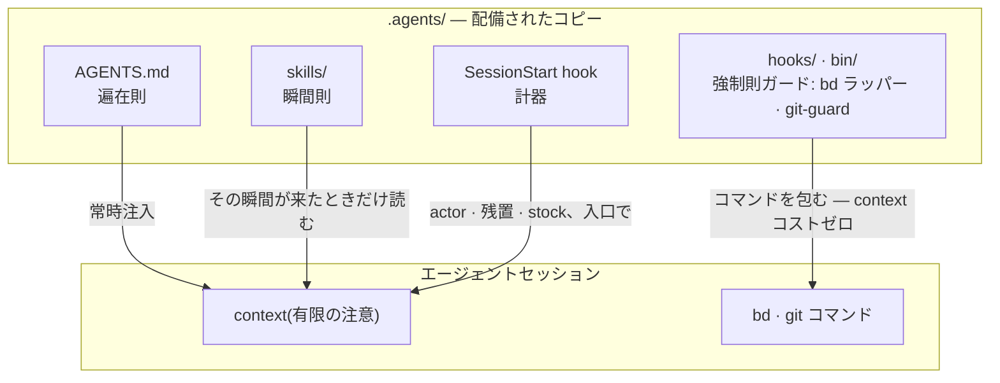

# dotagents

**自分で所有する AI エージェントハーネス。** Claude Code と Codex 向けの規則・
スキル・機械的ガードを、単一の正本として版管理し、そこから全プロジェクトへ
配備する。

[English](../README.md) | 日本語 | [简体中文](README.zh-CN.md) | [繁體中文](README.zh-TW.md) | [한국어](README.ko.md) | [Deutsch](README.de.md) | [Español](README.es.md) | [Français](README.fr.md)

[](https://www.npmjs.com/package/@hiroiku/dotagents)
[](../LICENSE)

- **正本は 1 つ、配備先は複数。** プロンプト・スキル・エージェント定義・
  シェルガード・セッションの計器は、1 つの git リポジトリに同居する。
  installer がそれを `~/.agents` や `<project>/.agents` にコピーし、
  Claude Code と Codex が読む symlink と hook を配線する。
- **消費するライブラリではなく、運転する規則集。** 規則は自分で編集して
  コミットし、上流に追従するのも選んだときだけ — 背後で勝手に変わることは
  ない。
- **規則は仕組みに落ちる。** hook やラッパーで強制できることは強制則として
  強制し、観測の瞬間が明確な物は瞬間則(スキル)になり、残りだけが遍在則
  としてセッションの注意を占有することを許される。理由は
  [コンセプト](#コンセプト) にある。

## 仕組み

正本 1 つが全環境に供給される。配備は単なるコピーであり — セッションは
正本に到達できることに依存せず、背後で勝手に配備されることもない:



セッションの内側では、正本の三層がそれぞれ違う経路でエージェントに届く —
経路が下にあるほど、規則は強く、そして安く届く:



## クイックスタート

**1 · 前提を確認する**

| ツール | | 理由 |
|---|---|---|
| git、Node.js ≥ 18 | 必須 | CLI を動かす |
| [bd (beads)](https://github.com/gastownhall/beads) | 必須 | すべてがその上で動く issue の台帳: 起票・claim・完了ゲート・merge 排他 |
| [codegraph](https://github.com/colbymchenry/codegraph) | 推奨 | 構造への問い合わせ — 配線は `codegraph install` で 1 度だけ、index はプロジェクトごとに `codegraph init` |

ハーネスはこれらを代わりに導入しない — installer と毎回の SessionStart が
不在を検出して伝える。

**2 · 正本を取得する**

```sh
npx @hiroiku/dotagents clone ~/dotagents
```

ただの git clone であり、それは自分の物になる: 規則を編集し、コミットし、
好きに個人化してよい。

**3 · 配備する**

```sh
cd ~/dotagents
bin/agents-setup install project /path/to/project   # プロジェクト単体   → <dir>/.agents
bin/agents-setup install user                       # このマシン        → ~/.agents
bin/agents-setup install shell                       # ガードのみ        → hooks/bin + ~/.zshenv の 1 行
```

対象を省略すると対話で選ぶ。非対話シェルでは、対象を省略すると何も書き込ま
ずに停止する — 既定値が規則の行き先を決めることは無い。

**4 · 運用する**

```sh
bin/agents-setup pull                 # 上流に追従: changelog → rebase → テスト
bin/agents-setup update  project ...  # 配備を再同期する(タイミングはセッションが教える)
bin/agents-setup status  project ...  # ファイル・リンク・断片を検査 — 乖離があれば exit 1
bin/agents-setup --help               # 全コマンド・対象・オプション・例
```

## 三つの動詞

| 動詞 | 頻度 | 何をするか |
|---|---|---|
| **clone(取得)** | 初回のみ | 正本を、自分が所有する git リポジトリとして実体化する |
| **pull(追従)** | 選んだときだけ | 上流を取得し、入ってくるコミットタイトルを見せ、自分のコミットを rebase で乗せ、正本のテストを走らせる |
| **install・update(配備)** | マシンごと・プロジェクトごと | 正本を `.agents/` にコピーし、link・hook・強制則ガードを配線する |

3 つの規則がこれらをつなぐ:

- **使い捨てからは配備しない。** 正本の外(npx のキャッシュ、展開した
  tarball)では、配備系コマンドはマシンが既に知っている正本へ委譲するか
  — `clone` への案内を出して止まる。
- **再同期は pull されるのであって push されない。** 正本が先に進むと、
  各セッション入口の計器が *配備が正本より古い* と報告し、そのプロジェクト
  で `update` を実行する。
- **追従はわざと自動化しない。** pull で取り込むのはエージェントを支配する
  文書なので、`pull` はまず入ってくるコミットタイトルを見せ(ドメイン言語で
  書かれ、changelog として読める)、それから rebase してテストを走らせる。
  自動更新は無い。

## 何がどこに届くか

| 物 | 届く先 | 届け方 |
|---|---|---|
| 遍在則(`AGENTS.md`) | `.agents/AGENTS.md` | symlink `.claude/CLAUDE.md → .agents/AGENTS.md`。Codex にも `.codex/` の下に同じ形で届く |
| スキル・エージェント定義 | `.agents/skills/` ・ `.agents/agents/` | 1 件ずつリンクし、自分で書いたスキルと同居させる |
| 強制則ガード(`bd` ラッパー・`git-guard`) | `.agents/bin/` ・ `.agents/hooks/` | `~/.zshenv` の管理下の 1 行 — ユーザーレベル、マシンあたり 1 回 |
| セッション注入 | `settings.json` ・ `.codex/hooks.json` | 断片: `hooks.SessionStart`、`env.BASH_ENV`、`permissions.ask` |
| マシン固有の生成物(manifest・計器のメトリクス) | `.agents/` | payload に同梱される `.gitignore` が版管理から外す |

すべて冪等で**ハッシュ所有**である: installer が触れるのは、自分が置いて
今も認識できる物だけ。自分で書いたスキルには一切触れず、配備先で改変した
ファイルは残して報告し(`--force` で上書き)、`uninstall` が除去するのは
manifest に記録された物だけ — それ以外には触れない。

<details>
<summary><b>シェル層 — マシンに 1 つだけ、両側から世話をする</b></summary>

ガードがセッションに届く経路は `hooks/shellenv.sh` だけであり、zsh には
プロジェクトごとの起動ファイルが無いため、この層はハーネスを使うプロジェク
トの数によらず**マシンあたり 1 つ**しか存在しない。installer は両側から
面倒を見るので、運用知識として覚えておく必要は無い: `install project` は
シェル層が無ければ最小の shell スコープを補い、`uninstall user` は他の
プロジェクトが共有している物を取り上げる前に確認し(`--keep-shell` で
非対話でも残せる)、`uninstall project` はシェル層に一切触れない。

</details>

<details>
<summary><b>後からの導入とチーム展開</b></summary>

- **導入の順序に依存しない**: bd や codegraph を後から入れても再配備は
  要らない — 器官・台帳・index の検出は毎セッションの開始時に動的に行われる。
  `bd init` が作った既存の root AGENTS.md は奪わず、管理下の参照ブロックだけを
  足す。
- **届き方は二層**: プロンプト層(`.agents/` の payload・リンク・参照
  ブロック)は版管理に乗り、`git clone` するだけで効く。注入と強制則の層
  (manifest・settings 断片・zshenv 行・シェルガード)はマシン固有で、
  各マシンで installer が敷く。
- **2 人目以降**: プロジェクトを clone、dotagents を clone、
  `bin/agents-setup install project <project>` を叩く — これだけの
  1 コマンドで、シェル層も無ければその途中で補われる。installer は冪等で
  ハッシュ照合するので、版管理が届けた物と衝突しない。

</details>

<details>
<summary><b>CLI 設計の要点</b></summary>

対象は**位置引数 1 つ**(`user` / `project [dir]` / `shell`)で、既定値では
決まらない。位置が 1 つしか無いので「user と project の同時指定」はそもそも
書けない — 排他は実行時の検証ではなく構文が保証する。対話プロンプトは
矢印キーのセレクター(`↑/↓` 移動・`enter` 決定・`ctrl-c` 中止)で、決めた後は
選んだ結果を示す 1 行だけが残る。出力は `NO_COLOR` か非 TTY では自動的に
色を落とす。

</details>

## コンセプト

このハーネスが作るのは「1 つの有能なエージェント」ではなく、**限られた注意
(コンテキスト)を役割で分割し、外部記録で接続した組織**である。以下の規則は
すべて 1 つの前提から導かれる — context は有限で、セッションと共に消える。

### 規則の三層 — 遍在則・瞬間則・強制則

規則は内容より先に、**配達のされ方**で性質が決まる。

- **遍在則**(コア = AGENTS.md)— 常時注入。全セッションの注意を常に消費し、
  守られるかは注意の配分に依存する**ベストエフォート**である。だからここに
  置けるのは、観測の瞬間を選べない少数の規則だけ
- **瞬間則**(スキル)— just-in-time 注入。その瞬間が来たときだけ context に
  入るので、詳細に書いても他の瞬間の注意を奪わない
- **強制則**(hooks / bin / permissions)— 注入されない。仕組みが判定するので
  注意を消費せず、破られない(または破れば痕跡が残る)

**落下則**: 規則は可能な限り下の層へ落とす。下へ行くほど保証が強くなり、
同時に注意コストが消える — 強度と費用が同時に改善する一方通行の坂である。
プロンプトとは「まだ仕組みに落とせていない規則の待機場所」に過ぎない。

### 分離 — 重複を作らない境界

サブエージェントは能力ではなく**重複が起きない境界**で切る: 判断材料
(context)・探索範囲・書き込み先(worktree)が交差しない単位。同じ情報を
2 つの context に持たせれば注意を二重に払い、同じ場所を 2 つが書けば合流点が
生まれる。構造で消せない合流点(統合ブランチと台帳)だけを、排他で守る。

分離は隠蔽でもある。実装の事情を知らないことがレビューの検出力であり、
**「渡さない」は「渡す」と同じ強さの設計判断**である。

### 器官 — 宣言と導出を分ける

道具は「答えられる問い」を 1 種類ずつ持つ器官として使い分け、器官のネイティブ
機能を他で再実装しない。分類の軸は**宣言か導出か**:

- **宣言の記録**(決めたことは導出できないから、記録する): bd = 意思と状態の
  台帳(何をやると決めたか・誰が何を・なぜ止まっているか)、ADR = 判断の経緯、
  用語の正本 = ユビキタス言語
- **導出**(実物から機械が導けるものは、手で記録しない): codegraph = コードの
  現在の構造(シンボル・呼び出し経路・影響範囲)、git = 変更の履歴

導出できるものを手で書いた瞬間から乖離が始まる。記憶も同じ軸の上にある:
状態は導出(bd prime のクエリ注入)、不変事項だけが宣言(bd remember)。
セッション間で文脈を運ぶのは会話の転写ではなく、住所を持つ外部記録である
(**コンテキストブリッジ**)。

codegraph は普段の探索で常用する器官であり、その遍在則(まず explore で
導出する)は**ツール説明(MCP サーバー指示)が配達する** — プロンプトに
書き写さない(codegraph 側の更新に置いていかれる写しになる)。ツール選択は
機械判定できないので強制則にも落とせない — 注入コストゼロのツール層が、この
規則の最下層である。ハーネスのプロンプトが明文化するのは、使わないことが
契約違反になる義務の瞬間(凍結前の土地勘・横展開スイープの導出・reviewer の
走査)だけ。配線(`codegraph install`)と index(`codegraph init`)は codegraph
自身の責務で、ハーネスは検査も再実装もしない — SessionStart が `.codegraph/`
の存在を検出して想起の 1 行を注入するのみ。

### 敵対的レビュー — 欠落は探さないと存在しない

AI エージェント特有の失敗は「終わっていないのに完了しました」であり、その
正体は嘘ではなく**欠落**である — 書いた物しか context に無い者には、書かなか
った物が見えない。

だからレビューは検品(できた物を眺めて良し悪しを言う)ではなく **存在証明**
にする: 要件を起点に「それを満たす実装と検証が実物に存在するか」を探させる、
逆方向の走査。レビュアーに差分を先に見せないのは、注意が「書かれた物」の
検証に占有されると「書かれなかった物」の探索が消えるからである。

### 沈降 — 知識を沈めるからループが終わる

レビューを繰り返すだけでは発散する(指摘は無限に湧く)。ループが収束するのは、
ラウンドごとに知識が層を**沈降**するからである: 個別の指摘 → 欠陥クラス
(壊れた契約)としての言語化 → 強制則(構造・型・ガード 1 本)へ。沈んだ仮説は
憲章から取り除かれ、レビューの燃料は回を追って減る。同じ欠陥クラスが二度
浮上したら、直し方ではなく**沈め方**が間違っている合図である。

issue の台帳も同じ原理で収束させる: 観測を open に積み上げるのではなく、
決めた事だけを open にし、同型は畳み、起票時に消化の経路を与える。

### テスト — 件数は守りの量ではない

テストが固定してよいのは**契約**(業務にとっての約束)だけであり、症状の写しは
退行から何も守らない。第一の防御は壊せない構造(発生条件を持てない設計・型)
であり、テストは構造で封じられない契約のための最後の手段である。

### 見張りと列挙 — メタな品質チェックを作らない

監視の監視・テストのテスト・ガードのガードのような、業務の契約を守らない
メタな検査は増殖しやすく、何も守らないまま維持費だけを食う。3 つの原則で
排除する:

- **見張りは足さず、沈める** — ガードを見張りたくなるのは層が高すぎる徴候で
  ある。応答は監視の追加ではなく落下則の適用: 下げれば見張る対象そのものが
  消える
- **検出は一段まで** — 構造で閉じられない契約だけが検出型を持てる。検出の
  検出は作らない。検出器が壊れたら気づけないことはこの設計の対価であり、
  だから検出器は最小・単純に保つ
- **列挙で守らない** — 守備範囲・修正対象・監視対象が人の列挙で決まる仕組みは、
  足し忘れが静かな空白になる漏れの温床。構造そのものが定義になる形(payload
  方式)か、列挙を機械が副産物として導出する形(manifest 方式)に寄せる

規則の本文はここに書かない(payload と二重管理になり、複製は黙って古くなる)。
正本の索引: 役割・品質の不変条件・Git 権限・beads の遍在則は
[AGENTS.md](../payload/AGENTS.md)、着手前と組成は
[agents-kickoff](../payload/skills/agents-kickoff/SKILL.md)、品質ループの
運転は [agents-quality-loop](../payload/skills/agents-quality-loop/SKILL.md)、
bd 運用と記憶の線引きは
[agents-beads-ops](../payload/skills/agents-beads-ops/SKILL.md)、テスト設計は
[agents-test-design](../payload/skills/agents-test-design/SKILL.md)、三層配置と
アブレーションの規律は
[prompt-guidelines.md](../payload/docs/prompt-guidelines.md)。

## 構成

```
bin/agents-setup      installer CLI(clone / pull / install / update / uninstall / status)
test/                 installer と強制則の契約テスト(npm test)
payload/              配布物の唯一の定義。この木がそのまま .agents/ になる
├── AGENTS.md         遍在則(全セッションが常時読む)
├── skills/           瞬間則(その瞬間が来たときだけ読む)
├── agents/           役割定義(reviewer / verifier。ツール制限つき)
├── hooks/            shellenv.sh(ガードのシェル配達)/ beads-session.sh(SessionStart 注入)
├── bin/              強制則(bd、git-guard、agents-gate、agents-reap)と自己検査(agents-doctor)
└── docs/             プロンプト更新のガイドライン
```

[payload/](../payload/) が配布物の正本の定義であり、installer 側に配布物の
列挙は存在しない(列挙の複製は黙って古くなるため — [package.json](../package.json)
の `files` は `bin` と `payload` の 2 項のみ)。

## プロンプトの更新

[payload/docs/prompt-guidelines.md](../payload/docs/prompt-guidelines.md) に
従う。編集は必ずこのリポジトリで行い、`agents-setup update` で配る — 配備先を
直接編集すると、`update` がそのファイルを保護して警告するようになる。それが
乖離の検出が働いている証拠である。

## 検討中

- 既存の台帳を持つプロジェクトへハーネスを導入する際の、既存 open issue の
  一括トリアージ(`AGENTS_BD_OPEN_OK=1` の包括承認つき)
- 造語の見直しと、AGENTS.md の `<beads>` 断片のさらなるスリム化 — 計器が
  観測を蓄積してから
