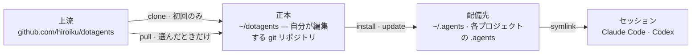

# dotagents

**自分で所有する AI エージェントハーネス。** Claude Code と Codex 向けの規則・スキル・レビューエージェントを、単一の正本として版管理し、そこから全プロジェクトへ配備する。

[English](../README.md) | 日本語 | [简体中文](README.zh-CN.md) | [繁體中文](README.zh-TW.md) | [한국어](README.ko.md) | [Deutsch](README.de.md) | [Español](README.es.md) | [Français](README.fr.md)

[](https://www.npmjs.com/package/@hiroiku/dotagents)
[](../LICENSE)

- **正本は 1 つ、配備先は複数。** プロンプト・スキル・エージェントの役割は、1 つの git リポジトリに同居する。installer がそれを `~/.agents` や `<project>/.agents` にコピーし、Claude Code と Codex が読む symlink を配線する。
- **ライブラリではなく、規則集。** 規則は自分で編集してコミットし、上流に追従するのも選んだときだけ — 背後で勝手に変わることはない。
- **判断するモデルのために書かれている。** 正本に記録するのは、有能なモデルが導出できない物だけ — 自分の慣習、要件のアンカー、役割の境界。それ以外はすべてモデルの判断に委ねる。理由は [同梱ハーネス](../payload/docs/README.ja.md) にある。

## 仕組み

正本 1 つが全環境に供給される。配備は単なるコピーであり — セッションは正本に到達できることに依存せず、背後で勝手に配備されることもない:



## クイックスタート

**1 · 正本を取得する**(git と Node.js ≥ 18 が必要)

```sh
npx @hiroiku/dotagents clone ~/dotagents
```

ただの git clone であり、それは自分の物になる: 規則を編集し、コミットし、好きに個人化してよい。

**2 · 配備する**

```sh
cd ~/dotagents
bin/agents-setup install project /path/to/project   # プロジェクト単体   → <dir>/.agents
bin/agents-setup install user                       # このマシン        → ~/.agents
```

対象を省略すると対話で選ぶ。非対話シェルでは、対象を省略すると何も書き込まずに停止する — 既定値が規則の行き先を決めることは無い。

**3 · 運用する**

```sh
bin/agents-setup pull                 # 上流に追従: changelog → rebase → テスト
bin/agents-setup update  project ...  # 配備を再同期する
bin/agents-setup status  project ...  # ファイルとリンクを検査 — 乖離があれば exit 1
bin/agents-setup --help               # 全コマンド・対象・オプション・例
```

## 三つの動詞

| 動詞                      | 頻度                         | 何をするか                                                                                             |
| ------------------------- | ---------------------------- | ------------------------------------------------------------------------------------------------------ |
| **clone(取得)**           | 初回のみ                     | 正本を、自分が所有する git リポジトリとして実体化する                                                  |
| **pull(追従)**            | 選んだときだけ               | 上流を取得し、入ってくるコミットタイトルを見せ、自分のコミットを rebase で乗せ、正本のテストを走らせる |
| **install・update(配備)** | マシンごと・プロジェクトごと | 正本を `.agents/` にコピーし、リンクを配線する                                                         |

3 つの規則がこれらをつなぐ:

- **使い捨てからは配備しない。** 正本の外(npx のキャッシュ、展開した tarball)では、配備系コマンドはマシンが既に知っている正本へ委譲するか — `clone` への案内を出して止まる。
- **追従はわざと自動化しない。** pull で取り込むのはエージェントを支配する文書なので、`pull` はまず入ってくるコミットタイトルを見せ(ドメイン言語で書かれ、changelog として読める)、それから rebase してテストを走らせる。自動更新は無い。
- **乖離は可視である。** `status` は配備された全ファイルと全リンクを正本と照合し、乖離があれば exit 1 で終了する。`update` が再同期するのは、installer が所有する物ちょうどそれだけである。

## 何がどこに届くか

| 物                           | 届く先              | 届け方                                                                                             |
| ---------------------------- | ------------------- | -------------------------------------------------------------------------------------------------- |
| 遍在則(`AGENTS.md`)          | `.agents/AGENTS.md` | symlink `.claude/CLAUDE.md → .agents/AGENTS.md`。Codex にも `.codex/` の下に同じ形で届く           |
| スキル                       | `.agents/skills/`   | スキル 1 件ごとに `.claude/skills/` と `.codex/skills/` へリンクし、自分で書いたスキルと同居させる |
| レビューエージェント         | `.agents/agents/`   | エージェント 1 件ごとに `.claude/agents/` へリンクする                                             |
| マシン固有の生成物(manifest) | `.agents/`          | payload に同梱される `.gitignore` が版管理から外す                                                 |

すべて冪等で**ハッシュ所有**である: installer が触れるのは、自分が置いて今も認識できる物だけ。自分で書いたスキルには一切触れず、配備先で改変したファイルは残して報告し(`--force` で上書き)、`uninstall` が除去するのは manifest に記録された物だけ — それ以外には触れない。

## 構成

```
bin/agents-setup      installer CLI(clone / pull / install / update / uninstall / status)
test/                 installer の契約テスト(npm test)
payload/              配布物の唯一の定義。この木がそのまま .agents/ になる
├── README.md         同梱ハーネス — 何を積んでいるか、なぜこれだけしか書いていないか
├── AGENTS.md         唯一の遍在則(全セッションが常時読む)
├── skills/           瞬間則(その瞬間が来たときだけ読む)
└── agents/           レビューの役割(敵対的 · セキュリティ · アクセシビリティ)
```

[payload/](../payload/) が配布物の正本の定義であり、installer 側に配布物の列挙は存在しない — 列挙の複製は黙って古くなるため、[package.json](../package.json) の `files` が挙げるのは `bin` と `payload` の 2 項のみ。payload が何を積んでいるかは [同梱ハーネス](../payload/docs/README.ja.md) が説明し、その説明はすべての配備と共に運ばれる。

## プロンプトの更新

正本は自らの編集規律を携えている: [dotagents-prompting](../payload/skills/dotagents-prompting/SKILL.md) スキルが、プロンプトやエージェント定義に触れる前に読むべきコンテキストエンジニアリングのガイドを挙げている。編集は必ずこのリポジトリで行い、`agents-setup update` で配る — 配備先を直接編集すると、`update` がそのファイルを保護して警告するようになる。それが乖離の検出が働いている証拠である。
