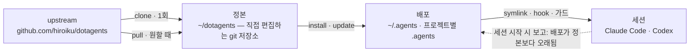
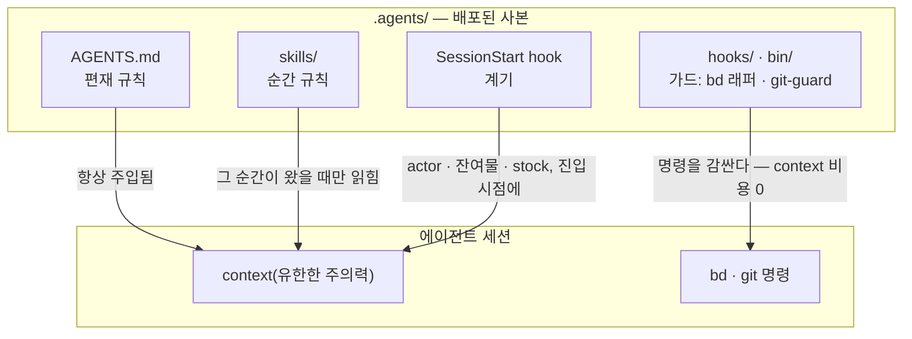

# dotagents

**직접 소유하는 AI 에이전트 하네스.** Claude Code와 Codex를 위한 규칙,
스킬, 기계적 가드를 하나의 정본으로 버전 관리하고, 거기서 모든 프로젝트로
배포한다.

[English](../README.md) | [日本語](README.ja.md) | [简体中文](README.zh-CN.md) | [繁體中文](README.zh-TW.md) | 한국어 | [Deutsch](README.de.md) | [Español](README.es.md) | [Français](README.fr.md)

[](https://www.npmjs.com/package/@hiroiku/dotagents)
[](../LICENSE)

- **정본은 하나, 배포는 여럿.** 프롬프트, 스킬, 에이전트 정의, 셸 가드,
  세션 계기가 하나의 git 저장소에 함께 산다. installer가 이를
  `~/.agents`나 `<project>/.agents`로 복사하고, Claude Code와 Codex가
  읽는 symlink와 hook을 연결한다.
- **가져다 쓰는 라이브러리가 아니라, 직접 운용하는 규칙집.** 규칙은 직접
  편집하고 커밋하며, upstream을 따르는 것도 선택했을 때만이다 — 뒤에서
  몰래 바뀌는 일은 없다.
- **규칙은 메커니즘이 된다.** hook이나 래퍼로 강제할 수 있는 것은 강제
  규칙이 되고, 관측 시점이 분명한 것은 순간 규칙(스킬)이 되며, 나머지만이
  편재 규칙으로서 매 세션의 주의력을 차지하는 것이 허용된다. 그 이유는
  [개념](#개념)에 있다.

## 작동 방식

정본 하나가 모든 환경에 공급된다. 배포는 단순한 복사다 — 세션은 정본에
접근 가능한지에 의존하지 않으며, 뒤에서 몰래 배포되는 일도 없다:



세션 내부에서는 정본의 세 층이 서로 다른 경로로 에이전트에 도달한다 —
경로가 낮을수록 규칙은 강해지고 동시에 비용은 낮아진다:



## 빠른 시작

**1 · 전제 조건을 확인한다**

| 도구 | | 이유 |
|---|---|---|
| git, Node.js ≥ 18 | 필수 | CLI를 구동한다 |
| [bd (beads)](https://github.com/gastownhall/beads) | 필수 | 모든 것이 그 위에서 돌아가는 이슈 원장: 등록, claim, 완료 게이트, merge 배제 |
| [codegraph](https://github.com/colbymchenry/codegraph) | 권장 | 구조 조회 — 연결은 `codegraph install`로 한 번, 인덱싱은 프로젝트마다 `codegraph init` |

하네스는 이들을 절대 대신 설치하지 않는다 — installer와 매 세션 시작
시점이 빠진 것을 감지해서 알려준다.

**2 · 정본을 취득한다**

```sh
npx @hiroiku/dotagents clone ~/dotagents
```

그냥 git clone이며, 그것은 직접 소유하게 된다: 규칙을 편집하고, 커밋하고,
자유롭게 개인화한다.

**3 · 배포한다**

```sh
cd ~/dotagents
bin/agents-setup install project /path/to/project   # 프로젝트 하나     → <dir>/.agents
bin/agents-setup install user                       # 이 머신           → ~/.agents
bin/agents-setup install shell                       # 가드만            → hooks/bin + ~/.zshenv 한 줄
```

대상을 생략하면 대화형으로 고른다. 비대화형 셸에서 대상을 생략하면
아무것도 쓰지 않고 멈춘다 — 기본값이 규칙이 놓일 곳을 결정하는 일은 없다.

**4 · 운용한다**

```sh
bin/agents-setup pull                 # upstream 추종: changelog → rebase → 테스트
bin/agents-setup update  project ...  # 배포를 재동기화한다(세션이 시점을 알려준다)
bin/agents-setup status  project ...  # 파일, 링크, 조각을 검증 — 어긋나면 exit 1
bin/agents-setup --help               # 모든 명령, 대상, 옵션, 예시
```

## 세 개의 동사

| 동사 | 빈도 | 하는 일 |
|---|---|---|
| **clone(취득)** | 1회 | 정본을 직접 소유하는 git 저장소로 실체화한다 |
| **pull(추종)** | 원할 때 | upstream을 가져와 들어오는 커밋 제목을 보여주고, 자신의 커밋을 그 위에 rebase하고, 정본의 테스트를 실행한다 |
| **install·update(배포)** | 머신마다, 프로젝트마다 | 정본을 `.agents/`로 복사하고 link, hook, 가드를 연결한다 |

세 가지 규칙이 이들을 연결한다:

- **일회용에서는 배포하지 않는다.** 정본 바깥(npx 캐시, 풀어놓은
  tarball)에서는 배포 명령이 이 머신이 이미 알고 있는 정본에 위임하거나
  — `clone`으로 안내하고 멈춘다.
- **재동기화는 pull되는 것이지 push되지 않는다.** 정본이 앞서 나가면
  매 세션 진입 지점의 계기가 *배포가 정본보다 오래됨*을 보고하고, 해당
  프로젝트에서 `update`를 실행한다.
- **추종은 의도적으로 자동화하지 않는다.** pull로 받아오는 것은
  에이전트를 지배하는 문서이므로, `pull`은 먼저 들어오는 커밋 제목을
  보여주고(도메인 언어로 쓰여 changelog처럼 읽힌다), 그다음 rebase하고
  테스트를 실행한다. 자동 업데이트는 없다.

## 무엇이 어디로 가는가

| 항목 | 도착지 | 전달 방식 |
|---|---|---|
| 편재 규칙(`AGENTS.md`) | `.agents/AGENTS.md` | symlink `.claude/CLAUDE.md → .agents/AGENTS.md`; Codex에도 `.codex/` 아래 같은 형태로 도착 |
| 스킬 · 에이전트 정의 | `.agents/skills/` · `.agents/agents/` | 항목마다 하나씩 링크되어, 직접 작성한 스킬과 공존한다 |
| 가드(`bd` 래퍼 · `git-guard`) | `.agents/bin/` · `.agents/hooks/` | `~/.zshenv`의 관리되는 한 줄 — 사용자 레벨, 머신당 1회 |
| 세션 주입 | `settings.json` · `.codex/hooks.json` | 조각: `hooks.SessionStart`, `env.BASH_ENV`, `permissions.ask` |
| 머신별 산출물(manifest · 메트릭) | `.agents/` | payload에 함께 실려 오는 `.gitignore`가 버전 관리에서 제외 |

모든 것은 멱등이며 **해시로 소유**된다: installer는 자신이 배치했고 지금도
인식할 수 있는 것만 건드린다. 직접 작성한 스킬은 절대 건드리지 않고,
배포 위치에서 수정한 파일은 그대로 두고 보고하며(`--force`로 덮어쓰기),
`uninstall`이 제거하는 것도 manifest에 기록된 것뿐이다 — 그 외에는
건드리지 않는다.

<details>
<summary><b>셸 계층 — 머신당 하나, 양쪽에서 함께 돌본다</b></summary>

가드가 세션에 도달하는 경로는 `hooks/shellenv.sh` 하나뿐이고, zsh에는
프로젝트별 시작 파일이 없기 때문에, 이 계층은 하네스를 쓰는 프로젝트
수와 무관하게 **머신당 하나만** 존재한다. installer가 양쪽을 모두
돌보므로 순서가 운영 지식이 될 일은 없다: `install project`는 셸
계층이 없으면 최소한의 shell scope를 보충하고, `uninstall user`는
다른 프로젝트가 공유하는 것을 제거하기 전에 먼저 확인하며
(`--keep-shell`로 비대화형에서도 남길 수 있다), `uninstall project`는
셸 계층을 절대 건드리지 않는다.

</details>

<details>
<summary><b>뒤늦은 도입과 팀 전개</b></summary>

- **도입 순서에 의존하지 않는다**: bd나 codegraph를 나중에 들여도
  재설치가 필요 없다 — 기관, 원장, 인덱스는 매 세션 시작 시점마다
  동적으로 감지된다. `bd init`이 만든 기존 루트 AGENTS.md를 빼앗지
  않고, 관리되는 참조 블록만 추가한다.
- **전달 계층은 둘**: 프롬프트 계층(`.agents/`의 payload, 링크, 참조
  블록)은 버전 관리를 타고 `git clone`만으로 작동한다. 주입과 강제
  계층(manifest, settings 조각, zshenv 라인, 셸 가드)은 머신별이며
  각 머신에서 installer가 깐다.
- **두 번째 사람부터**: 프로젝트를 clone하고, dotagents를 clone하고,
  `bin/agents-setup install project <project>`를 실행한다 — 명령
  하나면 끝이며, 셸 계층이 없다면 그 과정에서 함께 채워진다.
  installer는 멱등이며 해시를 검증하므로 버전 관리가 이미 배달해 둔
  것과 충돌하지 않는다.

</details>

<details>
<summary><b>CLI 설계 노트</b></summary>

대상은 **위치 인자 하나**(`user` / `project [dir]` / `shell`)이며 절대
기본값으로 정해지지 않는다. 위치가 하나뿐이므로 "user와 project를
동시에" 지정하는 것 자체가 애초에 쓸 수 없다 — 배타성은 런타임 검증이
아니라 문법이 보장한다. 대화형 프롬프트는 화살표 키 선택기(`↑/↓`
이동, `enter` 확정, `ctrl-c` 취소)로, 선택이 끝나면 고른 결과를
보여주는 한 줄로 접힌다. 출력은 `NO_COLOR` 환경이거나 TTY가 아니면
자동으로 색을 뺀다.

</details>

## 개념

이 하네스가 만드는 것은 "유능한 에이전트 하나"가 아니라 **유한한 주의력
(컨텍스트)을 역할별로 나누고 외부 기록으로 연결한 조직**이다. 아래의 모든
규칙은 단 하나의 전제에서 나온다: 컨텍스트는 유한하고 세션과 함께 사라진다.

### 규칙의 세 층 — 편재 규칙, 순간 규칙, 강제 규칙

규칙의 내용보다 먼저, **어떻게 전달되는가**가 그 성격을 결정한다.

- **편재 규칙**(코어 = AGENTS.md) — 항상 주입된다. 모든 세션의 주의력을
  세금처럼 소모하며, 지켜지는지는 어디까지나 **최선의 노력**에 달려
  있다. 그래서 이 층에는 관측 시점을 특정할 수 없는 소수의 규칙만
  올려야 한다
- **순간 규칙**(스킬) — 적시(just-in-time)에 주입된다. 그 순간이 왔을
  때만 컨텍스트에 들어오므로, 여기에 자세히 써도 다른 순간의 주의력은
  잃지 않는다
- **강제 규칙**(hooks / bin / permissions) — 절대 주입되지 않는다.
  메커니즘이 판정하므로 주의력을 소모하지 않고, 어길 수도 없다(어기면
  흔적이 남는다)

**하강 법칙**: 규칙은 갈 수 있는 한 아래 층까지 밀어 내린다. 아래로
내려갈수록 보장은 강해지고, 동시에 주의력 비용은 사라진다 — 강도와
비용이 동시에 좋아지는 일방통행 경사다. 프롬프트란 아직 메커니즘으로
바뀌지 못한 규칙의 대기실일 뿐이다.

### 분리 — 중복이 일어나지 않는 경계

서브에이전트는 능력이 아니라 **중복이 일어나지 않는 경계**로 잘라낸다:
입력(컨텍스트), 탐색 범위, 쓰기 대상(worktree)이 서로 겹치지 않는 단위다.
같은 정보를 두 컨텍스트에 주면 주의력을 두 번 지불하는 것이고, 두
주체가 같은 곳을 쓰게 하면 병합점이 생긴다. 구조로도 없앨 수 없는
병합점(통합 브랜치와 원장)만 배타 처리로 지킨다.

분리는 은폐이기도 하다. 구현의 사정을 모른다는 것 자체가 리뷰의 탐지력을
만든다 — **"넘기지 않는다"는 "넘긴다"와 똑같은 무게를 지닌 설계
결정이다**.

### 기관 — 선언과 도출을 가른다

각 도구는 한 가지 종류의 질문에 답하는 기관으로 구분해서 쓰고, 한
기관의 고유 기능을 다른 곳에서 재구현하지 않는다. 분류 축은 **선언
대 도출**이다:

- **선언의 기록**(결정된 것은 도출할 수 없으므로 기록한다): bd = 의도와
  상태의 원장(무엇을 하기로 했는지, 누가 무엇을 맡고 있는지, 왜
  멈췄는지), ADR = 결정의 경위, 용어집 = 유비쿼터스 언어
- **도출**(기계가 산출물에서 도출할 수 있는 것은 절대 손으로 쓰지
  않는다): codegraph = 코드의 현재 구조(심볼, 호출 경로, 영향 범위),
  git = 변경 이력

도출 가능한 것을 손으로 쓰는 순간부터 표류가 시작된다. 기억도 같은
축 위에 있다: 상태는 도출되고(bd prime의 쿼리 주입), 불변 사항만
선언된다(bd remember). 세션을 넘어 컨텍스트를 나르는 것은 대화
기록이 아니라 주소를 가진 외부 기록이다(**컨텍스트 브리지**).

codegraph는 일상적인 탐색에 상시 쓰는 기관이며, 그 편재 규칙("먼저
explore로 도출하라")은 **도구 설명(MCP 서버 instructions)이 전달한다**
— 프롬프트로 옮겨 적지 않는다(codegraph 쪽 갱신에서 뒤처진 낡은
사본이 되어버린다). 도구 선택은 기계로 검증할 수 없으므로 강제
규칙으로도 내려보낼 수 없다 — 주입 비용이 0인 도구 계층이 이 규칙이
머물 수 있는 가장 낮은 층이다. 하네스 프롬프트가 명문화하는 것은
codegraph를 쓰지 않으면 계약 위반이 되는 의무적인 순간(동결 전
현장 확인, 수평 전개 스윕의 도출, 리뷰어의 스캔)뿐이다. 연결
(`codegraph install`)과 인덱싱(`codegraph init`)은 codegraph 자신의
책임이며, 하네스는 검사도 재구현도 하지 않는다 — SessionStart는
`.codegraph/`의 존재만 감지해서 상기시키는 한 줄을 주입할 뿐이다.

### 적대적 리뷰 — 누락은 찾지 않으면 존재하지 않는다

AI 에이전트 특유의 실패 양식은 "다 안 됐는데 다 됐다고 하는 것"이며,
그 정체는 거짓말이 아니라 **누락**이다 — 자기가 쓴 것만 컨텍스트에
남는 사람에게는, 쓰지 않은 것이 보이지 않는다.

그래서 리뷰는 검품(만들어진 것을 살펴보고 좋고 나쁨을 판단하는 일)이
아니라 **존재 증명**이 되어야 한다: 요구 사항에서 출발해, 그것을
충족하는 구현과 검증이 실제 산출물에 존재하는지를 찾아내는, 역방향
스캔이다. 리뷰어에게 diff를 먼저 보여주지 않는 이유는, "쓰인 것"을
검증하는 데 주의력이 붙잡히면 "쓰이지 않은 것"을 찾는 일이 멈추기
때문이다.

### 침강 — 지식이 가라앉기 때문에 루프가 끝난다

리뷰만 반복하면 발산한다(지적 사항이 끝없이 솟아난다). 루프가 수렴하는
것은 라운드마다 지식이 한 층씩 **침강**하기 때문이다: 개별 지적 →
언어화된 결함 클래스(깨진 계약) → 강제 규칙(구조, 타입, 가드 하나)으로.
가라앉은 가설은 헌장에서 제거되므로, 리뷰의 연료는 라운드를 거듭할수록
줄어든다. 같은 결함 클래스가 두 번 떠오른다면, 잘못된 것은 고친 방식이
아니라 **가라앉힌 방식**이라는 신호다.

이슈 원장도 같은 원리로 수렴시킨다: 관측을 open에 쌓아두지 않고,
결정된 것만 open으로 두며, 같은 모양의 이슈는 접어 합치고, 등록되는
순간 소화 경로를 함께 부여한다.

### 테스트 — 개수는 보호의 양이 아니다

테스트가 고정해도 되는 것은 **계약**(업무가 의지하는 약속)뿐이며,
증상을 그대로 베낀 테스트는 회귀로부터 아무것도 지키지 못한다. 첫
번째 방어선은 깨질 수 없는 구조(실패 조건 자체가 존재할 수 없는
설계와 타입)이며, 테스트는 구조로 봉인할 수 없는 계약을 위한 최후의
수단이다.

### 감시자와 열거 — 메타 품질 검사는 만들지 않는다

감시자를 감시하고, 테스트를 테스트하고, 가드를 가드하는 식의, 어떤
업무 계약도 지키지 않는 메타 검사는 쉽게 증식하며 유지 비용만 먹고
아무것도 지키지 못한다. 세 가지 원칙으로 이를 배제한다:

- **감시자를 더하지 말고, 가라앉혀라** — 가드를 감시하고 싶어진다는
  것 자체가 그 계층이 너무 높다는 증상이다. 해답은 감시 추가가 아니라
  하강 법칙의 적용이다: 아래로 내리면 감시할 대상 자체가 사라진다
- **탐지는 한 홉까지만** — 구조로 봉인할 수 없는 계약만 탐지기를 가질
  수 있고, 탐지기에는 탐지기를 두지 않는다. 탐지기가 고장 나도
  눈치채지 못하는 것은 이 설계가 치르는 대가이며, 그래서 탐지기는
  최소한으로 단순하게 유지한다
- **열거로 지키지 않는다** — 보호 범위, 수정 대상, 감시 대상이 사람이
  손으로 작성한 목록으로 정해지는 방식은 추가를 깜빡하는 순간 조용한
  구멍이 된다. 구조 자체가 정의가 되는 형태(payload 방식)나, 기계가
  목록을 부산물로 도출하는 형태(manifest 방식)를 택한다

규칙 본문은 여기에 다시 적지 않는다(payload와 이중 관리가 되고, 사본은
조용히 낡아간다). 정본 색인: 역할, 품질 불변조건, Git 권한, beads의
편재 규칙은 [AGENTS.md](../payload/AGENTS.md)에, 착수 전 준비와 구성은
[agents-kickoff](../payload/skills/agents-kickoff/SKILL.md)에, 품질
루프 운용은
[agents-quality-loop](../payload/skills/agents-quality-loop/SKILL.md)에,
bd 운용과 기억의 경계는
[agents-beads-ops](../payload/skills/agents-beads-ops/SKILL.md)에,
테스트 설계는
[agents-test-design](../payload/skills/agents-test-design/SKILL.md)에,
세 층 배치와 ablation 규율은
[prompt-guidelines.md](../payload/docs/prompt-guidelines.md)에 있다.

## 레이아웃

```
bin/agents-setup      installer CLI (clone / pull / install / update / uninstall / status)
test/                 installer와 강제 규칙 계층의 contract 테스트 (npm test)
payload/              배포되는 것의 단일 정의; 이 트리가 그대로 .agents/가 된다
├── AGENTS.md         편재 규칙 (모든 세션이 항상 읽는다)
├── skills/           순간 규칙 (그 순간이 왔을 때만 읽는다)
├── agents/           역할 정의 (reviewer / verifier, 도구 제한)
├── hooks/            shellenv.sh (가드 전달) / beads-session.sh (SessionStart 주입)
├── bin/              강제 규칙 (bd, git-guard, agents-gate, agents-reap)과 자가 점검 (agents-doctor)
└── docs/             프롬프트 업데이트 가이드라인
```

[payload/](../payload/)가 배포물의 정본 정의이며, installer 쪽에는 배포물
목록이 따로 존재하지 않는다(목록을 복제하면 조용히 낡아가기 때문 —
[package.json](../package.json)의 `files`는 `bin`과 `payload` 두 항목뿐이다).

## 프롬프트 업데이트

[payload/docs/prompt-guidelines.md](../payload/docs/prompt-guidelines.md)를
따른다. 편집은 반드시 이 저장소에서만 하고 `agents-setup update`로 전달한다
— 배포된 트리를 직접 편집하면 `update`가 그 파일을 보호하며 경고하게
되는데, 이것이 바로 표류 감지가 작동하는 모습이다.

## 검토 중인 사항

- 이미 원장이 자리 잡은 프로젝트에 하네스를 도입할 때, 기존에 열려 있던
  이슈를 일괄 트리아지하는 방법(포괄 승인 `AGENTS_BD_OPEN_OK=1`과 함께)
- 만든 용어들에 대한 재검토, 그리고 AGENTS.md의 `<beads>` 블록을 더
  슬림하게 줄이는 작업 — 계기가 관측치를 충분히 모은 뒤에
