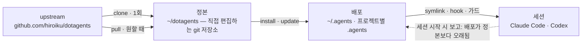

# dotagents

**직접 소유하는 AI 에이전트 하네스.** Claude Code와 Codex를 위한 규칙, 스킬, 기계적 가드를 하나의 정본으로 버전 관리하고, 거기서 모든 프로젝트로 배포한다.

[English](../README.md) | [日本語](README.ja.md) | [简体中文](README.zh-CN.md) | [繁體中文](README.zh-TW.md) | 한국어 | [Deutsch](README.de.md) | [Español](README.es.md) | [Français](README.fr.md)

[](https://www.npmjs.com/package/@hiroiku/dotagents)
[](../LICENSE)

- **정본은 하나, 배포는 여럿.** 프롬프트, 스킬, 에이전트 정의, 셸 가드, 세션 계기가 하나의 git 저장소에 함께 산다. installer가 이를 `~/.agents`나 `<project>/.agents`로 복사하고, Claude Code와 Codex가 읽는 symlink와 hook을 연결한다.
- **가져다 쓰는 라이브러리가 아니라, 직접 운용하는 규칙집.** 규칙은 직접 편집하고 커밋하며, upstream을 따르는 것도 선택했을 때만이다 — 뒤에서 몰래 바뀌는 일은 없다.
- **규칙은 메커니즘이 된다.** hook이나 래퍼로 강제할 수 있는 것은 강제 규칙이 되고, 관측 시점이 분명한 것은 순간 규칙(스킬)이 되며, 나머지만이 편재 규칙으로서 매 세션의 주의력을 차지하는 것이 허용된다. 그 이유는 [동봉된 하네스](HARNESS.ko.md)에 있다.

## 작동 방식

정본 하나가 모든 환경에 공급된다. 배포는 단순한 복사다 — 세션은 정본에 접근 가능한지에 의존하지 않으며, 뒤에서 몰래 배포되는 일도 없다:



## 빠른 시작

**1 · 전제 조건을 확인한다**

| 도구 | | 이유 |
|---|---|---|
| git, Node.js ≥ 18 | 필수 | CLI를 구동한다 |
| [bd (beads)](https://github.com/gastownhall/beads) | 필수 | 동봉된 하네스가 그 위에서 돌아가는 이슈 원장: 등록, claim, 완료 게이트, merge 배제 |
| [codegraph](https://github.com/colbymchenry/codegraph) | 권장 | 구조 조회 — 연결은 `codegraph install`로 한 번, 인덱싱은 프로젝트마다 `codegraph init` |

하네스는 이들을 절대 대신 설치하지 않는다 — installer와 매 세션 시작 시점이 빠진 것을 감지해서 알려준다.

**2 · 정본을 취득한다**

```sh
npx @hiroiku/dotagents clone ~/dotagents
```

그냥 git clone이며, 그것은 직접 소유하게 된다: 규칙을 편집하고, 커밋하고, 자유롭게 개인화한다.

**3 · 배포한다**

```sh
cd ~/dotagents
bin/agents-setup install project /path/to/project   # 프로젝트 하나     → <dir>/.agents
bin/agents-setup install user                       # 이 머신           → ~/.agents
bin/agents-setup install shell                       # 가드만            → hooks/bin + ~/.zshenv 한 줄
```

대상을 생략하면 대화형으로 고른다. 비대화형 셸에서 대상을 생략하면 아무것도 쓰지 않고 멈춘다 — 기본값이 규칙이 놓일 곳을 결정하는 일은 없다.

**4 · 운용한다**

```sh
bin/agents-setup pull                 # upstream 추종: changelog → rebase → 테스트
bin/agents-setup update  project ...  # 배포를 재동기화한다(세션이 시점을 알려준다)
bin/agents-setup status  project ...  # 파일, 링크, 조각을 검증 — 어긋나면 exit 1
bin/agents-setup --help               # 모든 명령, 대상, 옵션, 예시
```

## 세 개의 동사

| 동사 | 빈도 | 하는 일 |
|---|---|---|
| **clone(취득)** | 1회 | 정본을 직접 소유하는 git 저장소로 실체화한다 |
| **pull(추종)** | 원할 때 | upstream을 가져와 들어오는 커밋 제목을 보여주고, 자신의 커밋을 그 위에 rebase하고, 정본의 테스트를 실행한다 |
| **install·update(배포)** | 머신마다, 프로젝트마다 | 정본을 `.agents/`로 복사하고 link, hook, 가드를 연결한다 |

세 가지 규칙이 이들을 연결한다:

- **일회용에서는 배포하지 않는다.** 정본 바깥(npx 캐시, 풀어놓은 tarball)에서는 배포 명령이 이 머신이 이미 알고 있는 정본에 위임하거나 — `clone`으로 안내하고 멈춘다.
- **재동기화는 pull되는 것이지 push되지 않는다.** 정본이 앞서 나가면 매 세션 진입 지점의 계기가 *배포가 정본보다 오래됨*을 보고하고, 해당 프로젝트에서 `update`를 실행한다.
- **추종은 의도적으로 자동화하지 않는다.** pull로 받아오는 것은 에이전트를 지배하는 문서이므로, `pull`은 먼저 들어오는 커밋 제목을 보여주고(도메인 언어로 쓰여 changelog처럼 읽힌다), 그다음 rebase하고 테스트를 실행한다. 자동 업데이트는 없다.

## 무엇이 어디로 가는가

| 항목 | 도착지 | 전달 방식 |
|---|---|---|
| 편재 규칙(`AGENTS.md`) | `.agents/AGENTS.md` | symlink `.claude/CLAUDE.md → .agents/AGENTS.md`; Codex에도 `.codex/` 아래 같은 형태로 도착 |
| 스킬 · 에이전트 정의 | `.agents/skills/` · `.agents/agents/` | 항목마다 하나씩 링크되어, 직접 작성한 스킬과 공존한다 |
| 가드(`bd` 래퍼 · `git-guard`) | `.agents/bin/` · `.agents/hooks/` | `~/.zshenv`의 관리되는 한 줄 — 사용자 레벨, 머신당 1회 |
| 세션 주입 | `settings.json` · `.codex/hooks.json` | 조각: `hooks.SessionStart`, `env.BASH_ENV`, `permissions.ask` |
| 머신별 산출물(manifest · 메트릭) | `.agents/` | payload에 함께 실려 오는 `.gitignore`가 버전 관리에서 제외 |

모든 것은 멱등이며 **해시로 소유**된다: installer는 자신이 배치했고 지금도 인식할 수 있는 것만 건드린다. 직접 작성한 스킬은 절대 건드리지 않고, 배포 위치에서 수정한 파일은 그대로 두고 보고하며(`--force`로 덮어쓰기), `uninstall`이 제거하는 것도 manifest에 기록된 것뿐이다 — 그 외에는 건드리지 않는다.

<details>
<summary><b>셸 계층 — 머신당 하나, 양쪽에서 함께 돌본다</b></summary>

가드가 세션에 도달하는 경로는 `hooks/shellenv.sh` 하나뿐이고, zsh에는 프로젝트별 시작 파일이 없기 때문에, 이 계층은 하네스를 쓰는 프로젝트 수와 무관하게 **머신당 하나만** 존재한다. installer가 양쪽을 모두 돌보므로 순서가 운영 지식이 될 일은 없다: `install project`는 셸 계층이 없으면 최소한의 shell scope를 보충하고, `uninstall user`는 다른 프로젝트가 공유하는 것을 제거하기 전에 먼저 확인하며 (`--keep-shell`로 비대화형에서도 남길 수 있다), `uninstall project`는 셸 계층을 절대 건드리지 않는다.

</details>

<details>
<summary><b>뒤늦은 도입과 팀 전개</b></summary>

- **도입 순서에 의존하지 않는다**: bd나 codegraph를 나중에 들여도 재설치가 필요 없다 — 기관, 원장, 인덱스는 매 세션 시작 시점마다 동적으로 감지된다. `bd init`이 만든 기존 루트 AGENTS.md를 빼앗지 않고, 관리되는 참조 블록만 추가한다.
- **전달 계층은 둘**: 프롬프트 계층(`.agents/`의 payload, 링크, 참조 블록)은 버전 관리를 타고 `git clone`만으로 작동한다. 주입과 강제 계층(manifest, settings 조각, zshenv 라인, 셸 가드)은 머신별이며 각 머신에서 installer가 깐다.
- **두 번째 사람부터**: 프로젝트를 clone하고, dotagents를 clone하고, `bin/agents-setup install project <project>`를 실행한다 — 명령 하나면 끝이며, 셸 계층이 없다면 그 과정에서 함께 채워진다. installer는 멱등이며 해시를 검증하므로 버전 관리가 이미 배달해 둔 것과 충돌하지 않는다.

</details>

<details>
<summary><b>CLI 설계 노트</b></summary>

대상은 **위치 인자 하나**(`user` / `project [dir]` / `shell`)이며 절대 기본값으로 정해지지 않는다. 위치가 하나뿐이므로 "user와 project를 동시에" 지정하는 것 자체가 애초에 쓸 수 없다 — 배타성은 런타임 검증이 아니라 문법이 보장한다. 대화형 프롬프트는 화살표 키 선택기(`↑/↓` 이동, `enter` 확정, `ctrl-c` 취소)로, 선택이 끝나면 고른 결과를 보여주는 한 줄로 접힌다. 출력은 `NO_COLOR` 환경이거나 TTY가 아니면 자동으로 색을 뺀다.

</details>

## 레이아웃

```
bin/agents-setup      installer CLI (clone / pull / install / update / uninstall / status)
test/                 installer와 강제 규칙 계층의 contract 테스트 (npm test)
payload/              배포되는 것의 단일 정의; 이 트리가 그대로 .agents/가 된다
├── AGENTS.md         편재 규칙 (모든 세션이 항상 읽는다)
├── skills/           순간 규칙 (그 순간이 왔을 때만 읽는다)
├── agents/           역할 정의 (reviewer / verifier, 도구 제한)
├── hooks/            shellenv.sh (가드 전달) / beads-session.sh (SessionStart 주입)
├── bin/              강제 규칙 (bd, git-guard, agents-gate, agents-reap)과 자가 점검 (agents-doctor)
└── docs/             프롬프트 업데이트 가이드라인
```

[payload/](../payload/)가 배포물의 정본 정의이며, installer 쪽에는 배포물 목록이 따로 존재하지 않는다(목록을 복제하면 조용히 낡아가기 때문 — [package.json](../package.json)의 `files`는 `bin`과 `payload` 두 항목뿐이다). payload가 싣고 오는 것 — 동봉된 하네스와 그 규칙의 근거 — 에 대해서는 [동봉된 하네스](HARNESS.ko.md)에서 설명한다.

## 프롬프트 업데이트

[payload/docs/prompt-guidelines.md](../payload/docs/prompt-guidelines.md)를 따른다. 편집은 반드시 이 저장소에서만 하고 `agents-setup update`로 전달한다 — 배포된 트리를 직접 편집하면 `update`가 그 파일을 보호하며 경고하게 되는데, 이것이 바로 표류 감지가 작동하는 모습이다.
