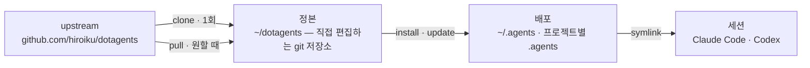

# dotagents

**직접 소유하는 AI 에이전트 하네스.** Claude Code와 Codex를 위한 규칙, 스킬, 리뷰 에이전트를 하나의 정본으로 버전 관리하고, 거기서 모든 프로젝트로 배포한다.

[English](../README.md) | [日本語](README.ja.md) | [简体中文](README.zh-CN.md) | [繁體中文](README.zh-TW.md) | 한국어 | [Deutsch](README.de.md) | [Español](README.es.md) | [Français](README.fr.md)

[](https://www.npmjs.com/package/@hiroiku/dotagents)
[](../LICENSE)

- **정본은 하나, 배포는 여럿.** 프롬프트, 스킬, 에이전트 역할이 하나의 git 저장소에 함께 산다. installer가 이를 `~/.agents`나 `<project>/.agents`로 복사하고, Claude Code와 Codex가 읽는 symlink를 연결한다.
- **가져다 쓰는 라이브러리가 아니라, 직접 운용하는 규칙집.** 규칙은 직접 편집하고 커밋하며, upstream을 따르는 것도 선택했을 때만이다 — 뒤에서 몰래 바뀌는 일은 없다.
- **판단하는 모델을 위해 쓰였다.** 정본에는 유능한 모델이 도출할 수 없는 것만 기록한다 — 자신의 관례, 자신의 요구 사항 앵커, 자신의 역할 경계. 나머지는 모두 모델의 판단에 맡긴다. 그 근거는 [동봉된 하네스](../payload/docs/README.ko.md)에 있다.

## 작동 방식

정본 하나가 모든 환경에 공급된다. 배포는 단순한 복사다 — 세션은 정본에 접근 가능한지에 의존하지 않으며, 뒤에서 몰래 배포되는 일도 없다:



## 빠른 시작

**1 · 정본을 취득한다** (git과 Node.js ≥ 18 필요)

```sh
npx @hiroiku/dotagents clone ~/dotagents
```

그냥 git clone이며, 그것은 직접 소유하게 된다: 규칙을 편집하고, 커밋하고, 개인화한다.

**2 · 배포한다**

```sh
cd ~/dotagents
bin/agents-setup install project /path/to/project   # 프로젝트 하나   → <dir>/.agents
bin/agents-setup install user                       # 이 머신        → ~/.agents
```

대상을 생략하면 대화형으로 고른다. 비대화형 셸에서 대상을 생략하면 아무것도 쓰지 않고 멈춘다 — 기본값이 규칙이 놓일 곳을 결정하는 일은 없다.

**3 · 운용한다**

```sh
bin/agents-setup pull                 # upstream 추종: changelog → rebase → 테스트
bin/agents-setup update  project ...  # 배포를 재동기화한다
bin/agents-setup status  project ...  # 파일과 링크를 검증 — 어긋나면 exit 1
bin/agents-setup --help               # 모든 명령, 대상, 옵션, 예시
```

## 세 개의 동사

| 동사 | 빈도 | 하는 일 |
|---|---|---|
| **clone(취득)** | 1회 | 정본을 직접 소유하는 git 저장소로 실체화한다 |
| **pull(추종)** | 원할 때 | upstream을 가져와 들어오는 커밋 제목을 보여주고, 자신의 커밋을 그 위에 rebase하고, 정본의 테스트를 실행한다 |
| **install·update(배포)** | 머신마다, 프로젝트마다 | 정본을 `.agents/`로 복사하고 링크를 연결한다 |

세 가지 규칙이 이들을 연결한다:

- **일회용에서는 배포하지 않는다.** 정본 바깥(npx 캐시, 풀어놓은 tarball)에서는 배포 명령이 이 머신이 이미 알고 있는 정본에 위임하거나 — `clone`으로 안내하고 멈춘다.
- **추종은 의도적으로 이루어진다.** pull로 받아오는 것은 에이전트를 지배하는 문서이므로, `pull`은 먼저 들어오는 커밋 제목을 보여주고(도메인 언어로 쓰여 changelog처럼 읽힌다), 그다음 rebase하고 테스트를 실행한다. 자동 업데이트는 없다.
- **표류는 눈에 보인다.** `status`는 배포된 모든 파일과 링크를 정본과 대조해 어긋나면 exit 1을 반환하고, `update`는 installer가 소유한 것만 정확히 재동기화한다.

## 무엇이 어디로 가는가

| 항목 | 도착지 | 전달 방식 |
|---|---|---|
| 편재 규칙(`AGENTS.md`) | `.agents/AGENTS.md` | symlink `.claude/CLAUDE.md → .agents/AGENTS.md`; Codex에도 `.codex/` 아래 같은 형태로 도착 |
| 스킬 | `.agents/skills/` | 스킬마다 하나씩 `.claude/skills/`와 `.codex/skills/`로 링크되어, 직접 작성한 스킬과 공존한다 |
| 리뷰 에이전트 | `.agents/agents/` | 에이전트마다 하나씩 `.claude/agents/`로 링크 |
| 머신별 산출물(manifest) | `.agents/` | payload에 함께 실려 오는 `.gitignore`가 버전 관리에서 제외 |

모든 것은 멱등이며 **해시로 소유**된다: installer는 자신이 배치했고 지금도 인식할 수 있는 것만 건드린다. 직접 작성한 스킬은 절대 건드리지 않고, 배포 위치에서 수정한 파일은 그대로 두고 보고하며(`--force`로 덮어쓰기), `uninstall`이 제거하는 것도 manifest에 기록된 것뿐이다 — 그 외에는 건드리지 않는다.

## 레이아웃

```
bin/agents-setup      installer CLI (clone / pull / install / update / uninstall / status)
test/                 installer의 contract 테스트 (npm test)
payload/              배포되는 것의 단일 정의; 이 트리가 그대로 .agents/가 된다
├── README.md         동봉된 하네스 — 무엇이 실려 오고, 왜 이토록 말을 아끼는가
├── AGENTS.md         단 하나의 편재 규칙 (모든 세션이 항상 읽는다)
├── skills/           순간 규칙 (그 순간이 왔을 때만 읽는다)
└── agents/           리뷰 역할 (적대적 · 보안 · 접근성)
```

[payload/](../payload/)가 배포물의 정본 정의이며, installer 쪽에는 배포물 목록이 따로 존재하지 않는다 — 목록을 복제하면 조용히 낡아가기 때문에, [package.json](../package.json)의 `files`는 `bin`과 `payload`만을 지정한다. payload가 싣고 오는 것은 [동봉된 하네스](../payload/docs/README.ko.md)에서 설명하며, 그 설명은 모든 배포와 함께 이동한다.

## 프롬프트 업데이트

정본은 자신의 편집 규율을 함께 싣고 다닌다: [dotagents-prompting](../payload/skills/dotagents-prompting/SKILL.md) 스킬이, 프롬프트나 에이전트 정의를 건드리기 전에 읽어야 할 컨텍스트 엔지니어링 가이드를 지명한다. 편집은 반드시 이 저장소에서만 하고 `agents-setup update`로 전달한다 — 배포된 트리를 직접 편집하면 `update`가 그 파일을 보호하며 경고하게 되는데, 이것이 바로 표류 감지가 작동하는 모습이다.
