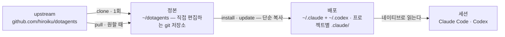

# dotagents

**AI 에이전트가 따르는 규칙을 위한 패키지 매니저.** Claude Code와 Codex를 위한 프롬프트, 스킬, 리뷰 에이전트를 module로 묶어 하나의 정본으로 버전 관리하고, 직접 고른 프로젝트에 설치한다.

[English](../README.md) | [日本語](README.ja.md) | [简体中文](README.zh-CN.md) | [繁體中文](README.zh-TW.md) | 한국어 | [Deutsch](README.de.md) | [Español](README.es.md) | [Français](README.fr.md)

[](https://www.npmjs.com/package/@hiroiku/dotagents)
[](../LICENSE)

- **정본은 하나, 배포는 여럿.** 모든 규칙이 하나의 git 저장소에 살며, 프로젝트마다 또는 머신마다 설치하는 module로 나뉜다. installer는 Claude Code와 Codex가 읽는 디렉터리에 곧바로 쓴다 — 평범한 파일이며, symlink도 중간 트리도 없다.
- **가져다 쓰는 라이브러리가 아니라, 직접 운용하는 규칙집.** 규칙은 직접 편집하고 커밋하며, upstream을 따르는 것도 선택했을 때만이다 — 뒤에서 몰래 바뀌는 일은 없다.
- **판단하는 모델을 위해 쓰였다.** 정본에는 유능한 모델이 도출할 수 없는 것만 기록한다 — 자신의 관례, 자신의 요구 사항 앵커, 자신의 역할 경계. 나머지는 모두 모델의 판단에 맡긴다. 그 근거는 [동봉된 하네스](../modules/harness/docs/README.ko.md)에 있다.

## 작동 방식

정본 하나가 모든 환경에 공급된다. 배포는 단순한 복사다 — 세션은 정본에 접근 가능한지에 의존하지 않으며, 뒤에서 몰래 배포되는 일도 없다:



## 빠른 시작

**1 · 정본을 취득한다** (git과 Node.js ≥ 18 필요)

```sh
npx @hiroiku/dotagents clone ~/dotagents
```

그냥 git clone이며, 그것은 직접 소유하게 된다: 규칙을 편집하고, 커밋하고, 개인화한다.

**2 · 원하는 것을, 원하는 곳에 설치한다**

```sh
cd ~/dotagents
bin/agents-setup list                     # 이 정본이 제공하는 것
bin/agents-setup install harness          # 현재 프로젝트에
bin/agents-setup install harness -g       # 이 머신의 모든 프로젝트에
bin/agents-setup install harness -C ~/x   # 특정 프로젝트에
```

대상의 기본값은 현재 프로젝트다 — 영향 범위가 가장 작은 곳. 더 넓은 범위에는 언제나 플래그가 필요하다. 무엇을 넣을지에는 기본값이 없다: module을 지명하거나 대화형으로 고른다; 비대화형 셸은 대신 골라 주지 않고 멈춘다.

**3 · 운용한다**

```sh
bin/agents-setup pull                 # upstream 추종: changelog → rebase → 테스트
bin/agents-setup update               # 이 프로젝트를 재동기화한다 (기억해 둔 module을 쓴다)
bin/agents-setup status               # 파일과 규칙 블록을 검증 — 표류가 있으면 exit 1
bin/agents-setup uninstall <module>   # module 하나만 빼고 나머지는 남긴다
bin/agents-setup --help               # 모든 명령, 옵션, 예시
```

## 두 개의 대상, 두 개의 어휘

명령은 두 가지 중 하나에 작용하며, 각각은 이미 알고 있는 어휘를 빌려 쓴다:

| 대상 | 어휘 | 명령 |
|---|---|---|
| **정본** — 직접 소유하는 규칙의 git 저장소 | git | `clone` · `pull` · `list` |
| **배포** — 도구가 실제로 읽는 것 | 패키지 매니저 | `install` · `update` · `uninstall` · `status` |

세 가지 규칙이 이들을 연결한다:

- **일회용에서는 배포하지 않는다.** 정본 바깥(npx 캐시, 풀어놓은 tarball)에서는 배포 명령이 이 머신이 이미 알고 있는 정본에 위임하거나 — `clone`으로 안내하고 멈춘다.
- **추종은 의도적으로 이루어진다.** pull로 받아오는 것은 에이전트를 지배하는 문서이므로, `pull`은 먼저 들어오는 커밋 제목을 보여주고(도메인 언어로 쓰여 changelog처럼 읽힌다), 그다음 rebase하고 테스트를 실행한다. 자동 업데이트는 없다.
- **선택은 기억되며, 다시 입력하지 않는다.** manifest가 어떤 배포에 어떤 module이 담겨 있는지 기록하므로 `update`에는 인자가 필요 없다. `install`은 더하는(additive) 명령이고, `uninstall`은 빼는(subtractive) 명령이다.

## 무엇이 어디로 가는가

| 항목 | 도착지 | 전달 방식 |
|---|---|---|
| 스킬 · 리뷰 에이전트 · 훅 | `.claude/skills/dotagents/` | **하나의 plugin 디렉터리**. Claude Code는 거기에 놓인 plugin을 marketplace도 설치 단계도 없이 읽어 들이고, 그것이 담은 것을 `/dotagents:*`라는 네임스페이스에 넣는다 — 훅이 `settings.json`을 한 번도 건드리지 않고 도착하는 것은 이 덕분이다 |
| 스킬(Codex) | `.codex/skills/dotagents-*` | 단순 복사. Codex에는 plugin이 없으므로, 네임스페이스가 디렉터리 이름 안으로 접혀 들어간다 |
| 편재 규칙(`AGENTS.md`) | `.claude/CLAUDE.md` · `~/.codex/AGENTS.md` · 프로젝트 루트의 `AGENTS.md` | 마커 사이의 관리 블록 — 그 주위에 직접 쓴 내용은 절대 건드리지 않으며, `uninstall`이 파일을 원래대로 되돌린다 |
| 머신 로컬 기록(manifest) | `~/.dotagents/` | 프로젝트에는 절대 놓이지 않는다 — installer가 배치한 것의 해시 장부도, 어떤 module을 골랐는지도 머신과 함께 산다 |

모든 것은 멱등이며 **해시로 소유**된다: installer는 자신이 배치했고 지금도 인식할 수 있는 것만 건드린다. 직접 작성한 스킬은 절대 건드리지 않고, 그 자리에서 수정한 파일은 그대로 두고 보고하며(`--force`로 덮어쓰기), `uninstall`이 제거하는 것도 manifest에 기록된 것뿐이다 — 그 외에는 건드리지 않는다. 이전 버전이 남긴 레이아웃(`.agents` 트리, symlink, zshenv 줄, settings 조각, 네임스페이스 바깥의 단순 복사본)은 `install` / `update` 시 감지되어 마이그레이션된다.

프로젝트 범위의 plugin은 Claude Code가 저장소 루트에서 시작했을 때, 그리고 workspace 신뢰 대화상자를 수락한 뒤에만 읽힌다. 에이전트와 훅의 변경은 다음 세션부터, 또는 `/reload-plugins` 이후에 반영된다; `SKILL.md`의 편집은 즉시 반영된다.

## 레이아웃

```
bin/agents-setup      installer CLI (clone / pull / list / install / update / uninstall / status)
test/                 installer의 contract 테스트 (npm test)
modules/              배포할 수 있는 것의 단일 정의
├── harness/          동봉된 module — 외부 의존이 없다
│   ├── MODULE.md     이름, 설명, PATH에 무엇을 기대하는지
│   ├── AGENTS.md     단 하나의 편재 규칙 — 관리 블록으로 전달된다
│   ├── skills/       순간 규칙 (그 순간이 왔을 때만 읽는다)
│   ├── agents/       리뷰 역할 (적대적 · 보안 · 접근성)
│   ├── README.md     동봉된 하네스 — 무엇이 실려 오고, 왜 이토록 말을 아끼는가
│   └── docs/         그 안내서의 번역 (문서일 뿐, 배포되지 않는다)
└── beads/            선택적 module — PATH 에 bd 를 요구한다
```

[modules/](../modules/)가 배포물의 정본 정의다: `MODULE.md`를 가진 디렉터리가 곧 module이고, 그 최상위 항목의 종류가 각각이 어디에 놓일지를 결정하며, installer 쪽에는 파일 목록이 따로 존재하지 않는다 — 목록을 복제하면 조용히 낡아가기 때문에, [package.json](../package.json)의 `files`는 `bin`과 `modules`만을 지정한다. 동봉된 module 옆에 자신의 module을 써 두면 같은 방식으로 설치된다.

module은 `PATH`에 무엇을 기대하는지 선언할 수 있다. 요구 사항은 **감지될 뿐, 절대 설치되지 않는다**: `list`와 `install`은 빠진 것을 보고할 뿐 아무것도 막지 않으므로, 나중에 도구를 추가하더라도 재설치는 필요 없다.

## 프롬프트 업데이트

정본은 자신의 편집 규율을 함께 싣고 다닌다: [prompting](../modules/harness/skills/prompting/SKILL.md) 스킬이, 프롬프트나 에이전트 정의를 건드리기 전에 읽어야 할 컨텍스트 엔지니어링 가이드를 지명한다. 편집은 반드시 이 저장소에서만 하고 `agents-setup update`로 전달한다 — 설치된 트리를 직접 편집하면 `update`가 그 파일을 보호하며 경고하게 되는데, 이것이 바로 표류 감지가 작동하는 모습이다.
