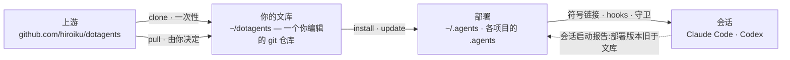

# dotagents

**一个你自己拥有的 AI 代理框架。** 面向 Claude Code 与 Codex 的规则、技能与机制化守卫——作为单一文库接受版本控制,并从中部署到每一个项目。

[English](../README.md) | [日本語](README.ja.md) | 简体中文 | [繁體中文](README.zh-TW.md) | [한국어](README.ko.md) | [Deutsch](README.de.md) | [Español](README.es.md) | [Français](README.fr.md)

[](https://www.npmjs.com/package/@hiroiku/dotagents)
[](../LICENSE)

- **一份文库,多处部署。** 提示词、技能、代理角色、shell 守卫与会话仪器都存放在同一个 git 仓库中。安装程序会将它们复制到 `~/.agents` 或 `<project>/.agents`,并接通 Claude Code 与 Codex 所读取的符号链接与 hooks。
- **是一部规则手册,不是一个库。** 你编辑规则、提交规则,只在自己选择时才跟随上游——不存在任何背着你发生的改动。
- **规则化为机制。** 凡是 hook 或包装器能够强制的,就予以强制;凡是拥有明确时机的,就化为技能;只有剩下的部分,才被允许占据每一次会话的注意力。相关推理见[随附的框架](HARNESS.zh-CN.md)。

## 工作原理

一份文库供给所有环境。部署只是纯粹的复制——会话从不依赖文库本身是否可达,也不存在任何背着你发生的部署:



## 快速开始

**1 · 检查前置需求**

| 工具 | | 用途 |
|---|---|---|
| git、Node.js ≥ 18 | 必需 | 运行 CLI |
| [bd (beads)](https://github.com/gastownhall/beads) | 必需 | 随附的框架所依赖的议题账本:登记、认领、完成关卡、合并互斥 |
| [codegraph](https://github.com/colbymchenry/codegraph) | 推荐 | 结构查询——用 `codegraph install` 接入一次,按项目用 `codegraph init` 建立索引 |

本框架从不替你安装这些器官——安装程序与每次会话启动时都会检测缺失项并予以报告。

**2 · 获取你的文库**

```sh
npx @hiroiku/dotagents clone ~/dotagents
```

一次纯粹的 git clone,而它属于你:编辑规则、提交规则、按自己的需要个性化。

**3 · 部署它**

```sh
cd ~/dotagents
bin/agents-setup install project /path/to/project   # 单个项目   → <dir>/.agents
bin/agents-setup install user                       # 本机       → ~/.agents
bin/agents-setup install shell                       # 仅守卫     → hooks/bin + 一行 ~/.zshenv
```

省略目标以进入交互式选择。在非交互式 shell 中,省略目标会直接停止且不写入任何内容——不存在由默认值决定规则落地位置这回事。

**4 · 日常操作**

```sh
bin/agents-setup pull                 # 跟随上游:变更日志 → 变基 → 测试
bin/agents-setup update  project ...  # 重新同步一次部署(会话会告诉你何时需要)
bin/agents-setup status  project ...  # 校验文件、链接、片段——存在漂移时以退出码 1 报告
bin/agents-setup --help               # 全部命令、目标、选项、示例
```

## 三个动词

| 动词 | 频率 | 作用 |
|---|---|---|
| **clone** | 一次性 | 把文库具象化为一个你拥有的 git 仓库 |
| **pull** | 由你决定 | 拉取上游、展示传入的提交标题、把你的提交变基到其上、运行文库测试 |
| **install · update** | 每台机器、每个项目 | 把文库复制进 `.agents/`,并接通链接、hooks、守卫 |

三条规则将它们连接在一起:

- **不从一次性环境部署。** 在文库之外(npx 缓存、解包的 tarball 中),部署命令要么委托给你机器上已知的文库,要么停止执行并指向 `clone`。
- **重新同步是拉取而来,不是推送而来。** 当文库领先于本地时,位于每次会话入口处的仪器会报告*部署版本旧于文库*,而你需要在该项目中运行 `update`。
- **跟随是刻意为之的。** 你所拉取的是治理你的代理行为的文本,因此 `pull` 会先展示传入的提交标题——它们以领域语言书写,读起来就像一份变更日志——再进行变基并运行测试。不存在任何自动更新。

## 落地位置一览

| 内容 | 落地位置 | 交付方式 |
|---|---|---|
| 普遍规则(`AGENTS.md`) | `.agents/AGENTS.md` | 符号链接 `.claude/CLAUDE.md → .agents/AGENTS.md`;Codex 在 `.codex/` 下获得相同结构 |
| 技能 · 代理角色 | `.agents/skills/` · `.agents/agents/` | 每个条目各建一条链接,以便与你自己撰写的技能共存 |
| 守卫(`bd` 包装器 · `git-guard`) | `.agents/bin/` · `.agents/hooks/` | `~/.zshenv` 中受管理的一行——用户级,每台机器一次 |
| 会话注入 | `settings.json` · `.codex/hooks.json` | 片段:`hooks.SessionStart`、`env.BASH_ENV`、`permissions.ask` |
| 机器本地产物(manifest · 指标) | `.agents/` | 由随 payload 一同分发的 `.gitignore` 排除在版本控制之外 |

一切都是幂等且**由哈希所有**的:安装程序只会触及自己放置且仍然识别的内容。你自己的技能永远不会被触碰,你就地编辑过的文件会被保留并报告(可用 `--force` 覆盖),而 `uninstall` 只会移除 manifest 所记录的内容——不多不少。

<details>
<summary><b>shell 层——每台机器一份,由两侧共同维护</b></summary>

守卫只通过 `hooks/shellenv.sh` 到达各个会话,而 zsh 没有按项目区分的启动文件——因此不论有多少个项目在使用本框架,这一层在**每台机器上只存在一份**。安装程序把对它的照料留在你的操作知识之外:`install project` 会在缺失时补上最小限度的 shell 作用域;`uninstall user` 在移除其他项目共享的内容前会先询问(`--keep-shell` 可非交互式地保留它);`uninstall project` 则从不触碰这一层。

</details>

<details>
<summary><b>后期采用与团队推广</b></summary>

- **与顺序无关**:之后再添加 bd 或 codegraph 不需要重新安装——器官、账本与索引在每次会话启动时都会被动态检测。若根目录的 AGENTS.md 已由 `bd init` 创建,它不会被接管,只会被追加一段受管理的引用区块
- **两层交付**:提示词层(`.agents/` payload、链接、引用区块)搭乘版本控制,**仅凭 clone 即可生效**;注入与强制层(manifest、settings 片段、zshenv 行、shell 守卫)是机器相关的,**由安装程序在每台机器上分别铺设**
- **从第二人起**:克隆项目、克隆 dotagents、运行 `bin/agents-setup install project <project>`——一条命令;若 shell 层缺失,会在过程中一并补全。安装程序是幂等且基于哈希校验的,因此它从不会与版本控制交付的内容相冲突

</details>

<details>
<summary><b>CLI 设计要点</b></summary>

目标是**唯一的位置参数**(`user` / `project [dir]` / `shell`),从不设默认值。正因为只有一个位置,"同时指定 user 和 project"这种写法根本无法输入——互斥性由语法本身保证,而非运行时校验。交互式提示是一个方向键选择器(`↑/↓` 移动、`enter` 确认、`ctrl-c` 取消),选定后会折叠为单行,记录你所做的选择。输出在 `NO_COLOR` 环境变量存在或没有 TTY 时会自动关闭颜色。

</details>

## 目录结构

```
bin/agents-setup      安装程序 CLI(clone / pull / install / update / uninstall / status)
test/                 面向安装程序与强制层的契约测试(npm test)
payload/              分发内容的唯一定义;这棵树会成为 .agents/
├── AGENTS.md         普遍规则(每次会话都会读取)
├── skills/           瞬时规则(只在其时机到来时才被读取)
├── agents/           角色定义(reviewer / verifier,受工具限制)
├── hooks/            shellenv.sh(守卫传递)/ beads-session.sh(SessionStart 注入)
├── bin/              强制机制(bd、git-guard、agents-gate、agents-reap)与自检(agents-doctor)
└── docs/             更新提示词的指南
```

[payload/](../payload/) 是分发内容的权威定义;安装程序自身并不持有其内容的清单(重复维护的清单会无声腐坏——[package.json](../package.json) 的 `files` 字段只列出了 `bin` 与 `payload`)。payload 所分发的内容——随附的框架及其规则背后的推理——记述在[随附的框架](HARNESS.zh-CN.md)中。

## 更新提示词

请遵循 [payload/docs/prompt-guidelines.md](../payload/docs/prompt-guidelines.md)。只在本仓库中编辑,并通过 `agents-setup update` 交付——直接编辑已安装的目录树,会让 `update` 保护该文件并发出警告,这正是漂移检测在起作用。
