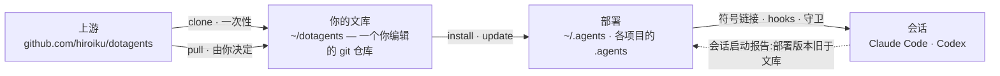
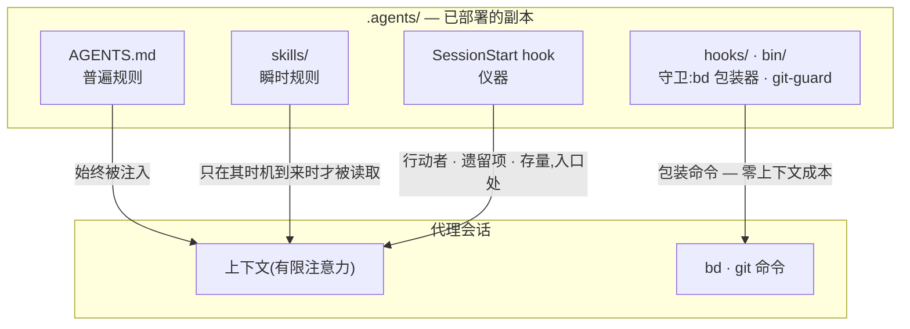

# dotagents

**一个你自己拥有的 AI 代理框架。** 面向 Claude Code 与 Codex 的规则、技能与
机制化守卫——作为单一文库接受版本控制,并从中部署到每一个项目。

[English](../README.md) | [日本語](README.ja.md) | 简体中文 | [繁體中文](README.zh-TW.md) | [한국어](README.ko.md) | [Deutsch](README.de.md) | [Español](README.es.md) | [Français](README.fr.md)

[](https://www.npmjs.com/package/@hiroiku/dotagents)
[](../LICENSE)

- **一份文库,多处部署。** 提示词、技能、代理角色、shell 守卫与会话仪器都
  存放在同一个 git 仓库中。安装程序会将它们复制到 `~/.agents` 或
  `<project>/.agents`,并接通 Claude Code 与 Codex 所读取的符号链接与 hooks。
- **是一部规则手册,不是一个库。** 你编辑规则、提交规则,只在自己选择时
  才跟随上游——不存在任何背着你发生的改动。
- **规则化为机制。** 凡是 hook 或包装器能够强制的,就予以强制;凡是拥有
  明确时机的,就化为技能;只有剩下的部分,才被允许占据每一次会话的注意力。
  相关推理见[理念](#理念)。

## 工作原理

一份文库供给所有环境。部署只是纯粹的复制——会话从不依赖文库本身是否可达,
也不存在任何背着你发生的部署:



在一次会话内部,文库的三层规则通过不同的路径抵达代理——路径越低,规则就
越强、也越廉价:



## 快速开始

**1 · 检查前置需求**

| 工具 | | 用途 |
|---|---|---|
| git、Node.js ≥ 18 | 必需 | 运行 CLI |
| [bd (beads)](https://github.com/gastownhall/beads) | 必需 | 一切运行所依赖的议题账本:登记、认领、完成关卡、合并互斥 |
| [codegraph](https://github.com/colbymchenry/codegraph) | 推荐 | 结构查询——用 `codegraph install` 接入一次,按项目用 `codegraph init` 建立索引 |

本框架从不替你安装这些器官——安装程序与每次会话启动时都会检测缺失项并
予以报告。

**2 · 获取你的文库**

```sh
npx @hiroiku/dotagents clone ~/dotagents
```

一次纯粹的 git clone,而它属于你:编辑规则、提交规则、按自己的需要个性化。

**3 · 部署它**

```sh
cd ~/dotagents
bin/agents-setup install project /path/to/project   # 单个项目   → <dir>/.agents
bin/agents-setup install user                       # 本机       → ~/.agents
bin/agents-setup install shell                       # 仅守卫     → hooks/bin + 一行 ~/.zshenv
```

省略目标以进入交互式选择。在非交互式 shell 中,省略目标会直接停止且不写入
任何内容——不存在由默认值决定规则落地位置这回事。

**4 · 日常操作**

```sh
bin/agents-setup pull                 # 跟随上游:变更日志 → 变基 → 测试
bin/agents-setup update  project ...  # 重新同步一次部署(会话会告诉你何时需要)
bin/agents-setup status  project ...  # 校验文件、链接、片段——存在漂移时以退出码 1 报告
bin/agents-setup --help               # 全部命令、目标、选项、示例
```

## 三个动词

| 动词 | 频率 | 作用 |
|---|---|---|
| **clone** | 一次性 | 把文库具象化为一个你拥有的 git 仓库 |
| **pull** | 由你决定 | 拉取上游、展示传入的提交标题、把你的提交变基到其上、运行文库测试 |
| **install · update** | 每台机器、每个项目 | 把文库复制进 `.agents/`,并接通链接、hooks、守卫 |

三条规则将它们连接在一起:

- **不从一次性环境部署。** 在文库之外(npx 缓存、解包的 tarball 中),部署
  命令要么委托给你机器上已知的文库,要么停止执行并指向 `clone`。
- **重新同步是拉取而来,不是推送而来。** 当文库领先于本地时,位于每次会话
  入口处的仪器会报告*部署版本旧于文库*,而你需要在该项目中运行 `update`。
- **跟随是刻意为之的。** 你所拉取的是治理你的代理行为的文本,因此 `pull`
  会先展示传入的提交标题——它们以领域语言书写,读起来就像一份变更日志——
  再进行变基并运行测试。不存在任何自动更新。

## 落地位置一览

| 内容 | 落地位置 | 交付方式 |
|---|---|---|
| 普遍规则(`AGENTS.md`) | `.agents/AGENTS.md` | 符号链接 `.claude/CLAUDE.md → .agents/AGENTS.md`;Codex 在 `.codex/` 下获得相同结构 |
| 技能 · 代理角色 | `.agents/skills/` · `.agents/agents/` | 每个条目各建一条链接,以便与你自己撰写的技能共存 |
| 守卫(`bd` 包装器 · `git-guard`) | `.agents/bin/` · `.agents/hooks/` | `~/.zshenv` 中受管理的一行——用户级,每台机器一次 |
| 会话注入 | `settings.json` · `.codex/hooks.json` | 片段:`hooks.SessionStart`、`env.BASH_ENV`、`permissions.ask` |
| 机器本地产物(manifest · 指标) | `.agents/` | 由随 payload 一同分发的 `.gitignore` 排除在版本控制之外 |

一切都是幂等且**由哈希所有**的:安装程序只会触及自己放置且仍然识别的内容。
你自己的技能永远不会被触碰,你就地编辑过的文件会被保留并报告(可用
`--force` 覆盖),而 `uninstall` 只会移除 manifest 所记录的内容——不多不少。

<details>
<summary><b>shell 层——每台机器一份,由两侧共同维护</b></summary>

守卫只通过 `hooks/shellenv.sh` 到达各个会话,而 zsh 没有按项目区分的启动
文件——因此不论有多少个项目在使用本框架,这一层在**每台机器上只存在
一份**。安装程序把对它的照料留在你的操作知识之外:`install project` 会在
缺失时补上最小限度的 shell 作用域;`uninstall user` 在移除其他项目共享的
内容前会先询问(`--keep-shell` 可非交互式地保留它);`uninstall project`
则从不触碰这一层。

</details>

<details>
<summary><b>后期采用与团队推广</b></summary>

- **与顺序无关**:之后再添加 bd 或 codegraph 不需要重新安装——器官、账本
  与索引在每次会话启动时都会被动态检测。若根目录的 AGENTS.md 已由
  `bd init` 创建,它不会被接管,只会被追加一段受管理的引用区块
- **两层交付**:提示词层(`.agents/` payload、链接、引用区块)搭乘版本
  控制,**仅凭 clone 即可生效**;注入与强制层(manifest、settings 片段、
  zshenv 行、shell 守卫)是机器相关的,**由安装程序在每台机器上分别铺设**
- **从第二人起**:克隆项目、克隆 dotagents、运行
  `bin/agents-setup install project <project>`——一条命令;若 shell 层
  缺失,会在过程中一并补全。安装程序是幂等且基于哈希校验的,因此它从不会
  与版本控制交付的内容相冲突

</details>

<details>
<summary><b>CLI 设计要点</b></summary>

目标是**唯一的位置参数**(`user` / `project [dir]` / `shell`),从不设
默认值。正因为只有一个位置,"同时指定 user 和 project"这种写法根本无法
输入——互斥性由语法本身保证,而非运行时校验。交互式提示是一个方向键
选择器(`↑/↓` 移动、`enter` 确认、`ctrl-c` 取消),选定后会折叠为单行,
记录你所做的选择。输出在 `NO_COLOR` 环境变量存在或没有 TTY 时会自动
关闭颜色。

</details>

## 理念

本框架所构建的并非"一个能力全面的代理",而是**一个把有限注意力(上下文)
拆分到各个角色、并通过外部记录将它们连接起来的组织**。以下每一条规则都
源自同一个前提:上下文是有限的,并且会随会话一同消亡。

### 三层规则——普遍、瞬时、强制

在讨论内容之前,一条规则的性质首先由**它是如何被传递的**来决定。

- **普遍规则**(核心即 AGENTS.md)——始终被注入。它们会消耗每一次会话的
  注意力,并且只能作为**尽力而为**来遵守,因此这一层只应容纳那些少数
  无法为其指明具体观察时机的规则
- **瞬时规则**(技能)——即时注入。它们只在自己的时机到来时才进入上下文,
  因此写在这里的细节不会耗费任何其他时刻的成本
- **强制规则**(hooks / bin / permissions)——从不被注入。由机制来做
  判断,因此它们不消耗任何注意力,也无法被违反(即便被违反也会留下痕迹)

**下降律**:把每一条规则尽可能推到它能到达的最低层。更低的层次同时兼具
更强与更廉价两种性质——这是一道单向的斜坡,注意力成本消失的同时强度随之
上升。提示词不过是那些尚未被转化为机制的规则的等候室。

### 分割——不容许重复的边界

子代理的切分依据不是能力,而是**不会产生重复的边界**:各单元的输入
(上下文)、搜索范围与写入目标(worktree)彼此互不相交。把同一份信息交给
两个上下文,你就要为注意力多付一次账;让两者写同一个地方,你就制造出了
一个合并点。结构无法消除的那些合并点(集成分支与账本)才是唯一受互斥
保护的对象。

分割同时也是遮蔽。不了解实现的具体情形,恰恰是审查具备检测力的原因——
**"不传递它"与"传递它"是同样有力的设计决策**。

### 器官——声明与派生

每一个工具都作为一个器官,回答一类问题,而且任何器官的原生能力都不会
在别处被重新实现。这条轴线是**声明与派生**:

- **声明的记录**(被决定的事情无法被派生出来,所以要记录下来):bd = 意图
  与状态的账本(我们决定做什么、谁在负责什么、为何某事被搁置);ADR = 决策
  的轨迹;词汇表 = 通用语言
- **派生**(凡是机器能从产物中派生出来的东西,就绝不手写):codegraph =
  代码当前的结构(符号、调用路径、影响范围);git = 变更的历史

一旦你手写了某个本可被派生的东西,漂移便随之开始。记忆也处在同一条轴线
上:状态是被派生出来的(bd prime 的查询注入);只有不变量才被声明
(bd remember)。跨会话携带上下文的不是聊天记录,而是一份带有地址的外部
记录(**上下文桥**)。

codegraph 是日常探索所用的器官,它的普遍规则("先用 explore 派生")
**通过工具描述(MCP server instructions)来传递**——绝不会被复制进提示词,
否则就会变成一份陈旧的复制品。工具的选择无法被机器校验,因此它也无法落入
强制层:零注入成本的工具层,是这条规则能够安身的最低层。本框架的提示词
只在*不*使用它就会破坏某个契约的那些时刻才把话说清楚(冻结前的事实核验、
派生横向扫描、审查者的扫描)。接入(`codegraph install`)与建立索引
(`codegraph init`)是 codegraph 自身的职责——本框架既不校验也不重新实现
它们;SessionStart 只是检测 `.codegraph/` 是否存在,并注入一行提醒。

### 对抗式审查——遗漏在被寻找之前并不存在

AI 代理特有的失败模式,是明明没做完却说"做完了!",而其本质不是说谎,
而是**遗漏**——一个上下文里只装着自己写下之物的人,是看不见自己没写下
之物的。

因此审查不是检验(查看已存在之物并对其作出判断),而是**存在性证明**:
审查者必须从需求出发,在产物中找到满足每一条需求的实现与验证——这是一次
反方向的扫描。审查者不会先被给出 diff,因为被"核实已写之物"占据的注意力,
会停止寻找那些未被写下之物。

### 下沉——循环之所以收敛,是因为知识在下沉

单纯重复审查会发散(发现会源源不断地冒出来,永无止境)。循环之所以收敛,
是因为每一轮都让知识**下沉**一层:个别发现 → 被清楚表述的缺陷类别
(被打破的契约) → 强制机制(一个结构、一个类型、一道守卫)。已经下沉的
假设会从任务清单中移除,因此审查的燃料一轮比一轮减少。当同一类缺陷第二次
出现时,这传递的信号不是修复本身错了,而是**下沉这件事错了**。

议题账本收敛于同一条原则:不要把观察堆进 open 状态;只有已经决定要做的
事才能被开立;把形态相同的议题合并起来;每一笔登记在诞生之时就要指定它
的消化路径。

### 测试——数量不等于保护的份量

一个测试只应钉住一个**契约**(业务所依赖的一项承诺);单纯复制一个症状,
不能防止任何回归。第一道防线是不会破坏的结构(在其中失败条件根本无法
存在的设计与类型);测试是留给那些结构无法封住的契约的最后手段。

### 监视者与枚举——不做元质量检查

监视者的监视者、测试的测试、守卫的守卫——这些不守护任何业务契约的元
检查很容易不断增殖,吞噬维护成本却什么也保护不了。三条原则将它们排除
在外:

- **不要增加监视者,而要下沉**——想要监视一道守卫,本身就是它所处位置
  太高的症状。答案是下降律,而不是更多的监控:把它往下推,需要被监视的
  对象就会随之消失
- **检测只走一跳**——只有结构无法封住的契约才可以拥有检测器,而检测器
  本身不再拥有检测器。检测器坏掉却无人察觉,是被接受的代价,这正是检测器
  必须保持极简的原因
- **绝不通过枚举来守护**——任何覆盖范围依赖手工维护清单的方案,都会把
  被遗忘的新增项变成无声的漏洞。应优先选择结构本身即定义的形式(payload
  原则),或机器把清单作为副产品派生出来的形式(manifest 原则)

规则文本本身不会在此重复(payload 的副本会无声腐坏)。权威索引如下:
角色、质量不变量、git 权限与 beads 的普遍规则在 [AGENTS.md](../payload/AGENTS.md)
中;前置工作与组合方式在
[agents-kickoff](../payload/skills/agents-kickoff/SKILL.md) 中;质量循环
的运作方式在
[agents-quality-loop](../payload/skills/agents-quality-loop/SKILL.md) 中;
bd 操作与记忆边界在
[agents-beads-ops](../payload/skills/agents-beads-ops/SKILL.md) 中;测试
设计在 [agents-test-design](../payload/skills/agents-test-design/SKILL.md)
中;三层结构与消融纪律在
[prompt-guidelines.md](../payload/docs/prompt-guidelines.md) 中。

## 目录结构

```
bin/agents-setup      安装程序 CLI(clone / pull / install / update / uninstall / status)
test/                 面向安装程序与强制层的契约测试(npm test)
payload/              分发内容的唯一定义;这棵树会成为 .agents/
├── AGENTS.md         普遍规则(每次会话都会读取)
├── skills/           瞬时规则(只在其时机到来时才被读取)
├── agents/           角色定义(reviewer / verifier,受工具限制)
├── hooks/            shellenv.sh(守卫传递)/ beads-session.sh(SessionStart 注入)
├── bin/              强制机制(bd、git-guard、agents-gate、agents-reap)与自检(agents-doctor)
└── docs/             更新提示词的指南
```

[payload/](../payload/) 是分发内容的权威定义;安装程序自身并不持有其内容
的清单(重复维护的清单会无声腐坏——[package.json](../package.json) 的
`files` 字段只列出了 `bin` 与 `payload`)。

## 更新提示词

请遵循 [payload/docs/prompt-guidelines.md](../payload/docs/prompt-guidelines.md)。
只在本仓库中编辑,并通过 `agents-setup update` 交付——直接编辑已安装的
目录树,会让 `update` 保护该文件并发出警告,这正是漂移检测在起作用。

## 未决问题

- 在已有账本的项目中引入本框架时,如何批量分诊既有的 open 议题(需配合
  整体性的 `AGENTS_BD_OPEN_OK=1` 授权)
- 待仪器积累足够观察结果后,复审自造术语,并进一步精简 AGENTS.md 中的
  `<beads>` 区块
