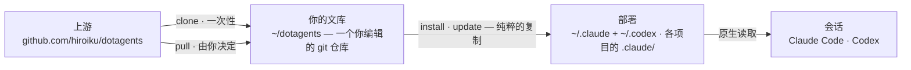

# dotagents

**一个面向 AI 代理所遵循规则的包管理器。** 由面向 Claude Code 与 Codex 的提示词、技能与审查代理所构成的一个个 module——作为单一文库接受版本控制,并安装进你所选择的项目。

[English](../README.md) | [日本語](README.ja.md) | 简体中文 | [繁體中文](README.zh-TW.md) | [한국어](README.ko.md) | [Deutsch](README.de.md) | [Español](README.es.md) | [Français](README.fr.md)

[](https://www.npmjs.com/package/@hiroiku/dotagents)
[](../LICENSE)

- **一份文库,多处部署。** 每一条规则都存放在同一个 git 仓库中,并被切分成一个个 module,由你按项目或按机器安装。安装程序会直接写入 Claude Code 与 Codex 所读取的目录——纯粹的文件,没有符号链接,也没有中间目录树。
- **是一部规则手册,不是一个库。** 你编辑规则、提交规则,只在自己选择时才跟随上游——不存在任何背着你发生的改动。
- **为会做判断的模型而写。** 文库只记录一个有能力的模型无法自行派生的内容——你的约定、你的需求锚点、你的角色边界。其余一切都交给模型自己的判断。相关推理见[随附的框架](../modules/harness/docs/README.zh-CN.md)。

## 工作原理

一份文库供给所有环境。部署只是纯粹的复制——会话从不依赖文库本身是否可达,也不存在任何背着你发生的部署:



## 快速开始

**1 · 获取你的文库**(需要 git 与 Node.js ≥ 18)

```sh
npx @hiroiku/dotagents clone ~/dotagents
```

一次纯粹的 git clone,而它属于你:编辑规则、提交规则、按自己的需要个性化。

**2 · 把你想要的内容,安装到你想要的位置**

```sh
cd ~/dotagents
bin/agents-setup list                     # 这份文库提供了什么
bin/agents-setup install harness          # 安装进当前项目
bin/agents-setup install harness -g       # 面向本机上的每一个项目
bin/agents-setup install harness -C ~/x   # 安装进指定的项目
```

目标默认是当前项目——影响范围最小的那一个。更广的作用域始终需要显式加上标志。而装入什么则从不取默认值:要么指名一个 module,要么交互式挑选;非交互式 shell 会直接停止,而不会替你做出选择。

**3 · 日常操作**

```sh
bin/agents-setup pull                 # 跟随上游:变更日志 → 变基 → 测试
bin/agents-setup update               # 重新同步本项目(使用它所记住的 module)
bin/agents-setup status               # 校验文件与规则块——存在漂移时以退出码 1 结束
bin/agents-setup uninstall <module>   # 移除一个 module,其余保持不变
bin/agents-setup --help               # 全部命令、选项、示例
```

## 两类对象,两套词汇

命令作用于两类事物之一,而每一类都借用了你已经熟悉的词汇:

| 对象 | 词汇 | 命令 |
|---|---|---|
| **文库**——你所拥有的、装着规则的 git 仓库 | git | `clone` · `pull` · `list` |
| **部署**——各工具实际读取的内容 | 包管理器 | `install` · `update` · `uninstall` · `status` |

三条规则将它们连接在一起:

- **不从一次性环境部署。** 在文库之外(npx 缓存、解包的 tarball 中),部署命令要么委托给你机器上已知的文库,要么停止执行并指向 `clone`。
- **跟随是刻意为之的。** 你所拉取的是治理你的代理行为的文本,因此 `pull` 会先展示传入的提交标题——它们以领域语言书写,读起来就像一份变更日志——再进行变基并运行测试。不存在任何自动更新。
- **选择会被记住,而不必重新输入。** manifest 记录着一次部署持有哪些 module,因此 `update` 不需要任何参数。`install` 是增量式的,`uninstall` 是削减式的。

## 落地位置一览

| 内容 | 落地位置 | 交付方式 |
|---|---|---|
| 技能 · 审查代理 · hooks | `.claude/skills/dotagents/` | **一个 plugin 目录**。Claude Code 会加载在那里发现的 plugin,既不需要 marketplace,也不需要任何安装步骤,并把它所容纳的内容置于 `/dotagents:*` 命名空间之下——hooks 正是借此在完全不触碰 `settings.json` 的情况下送达 |
| 技能(Codex) | `.codex/skills/dotagents-*` | 纯粹的复制。Codex 没有 plugin,因此命名空间被折叠进目录名之中 |
| 普遍规则(`AGENTS.md`) | `.claude/CLAUDE.md` · `~/.codex/AGENTS.md` · 项目根目录的 `AGENTS.md` | 位于标记之间的受管块——你写在其周围的任何内容绝不会被触碰,`uninstall` 会将文件复原 |
| 机器本地记录(manifest) | `~/.dotagents/` | 从不落入项目——记录安装程序放置了什么、以及你选择了哪些 module 的哈希台账,随机器一同保存 |

一切都是幂等且**由哈希所有**的:安装程序只会触及自己放置且仍然识别的内容。你自己的技能永远不会被触碰,你就地编辑过的文件会被保留并报告(可用 `--force` 覆盖),而 `uninstall` 只会移除 manifest 所记录的内容——不多不少。旧版本遗留的布局(`.agents` 目录树、符号链接、zshenv 行、settings 片段,或命名空间之外的纯粹复制)会在 `install` / `update` 时被检测到并完成迁移。

项目作用域的 plugin 只在 Claude Code 于仓库根目录启动时才会加载,并且要在你接受工作区信任对话框之后。对代理与 hooks 的改动会在下一次会话或执行 `/reload-plugins` 之后生效;对 `SKILL.md` 的编辑则会立即被采纳。

## 目录结构

```
bin/agents-setup      安装程序 CLI(clone / pull / list / install / update / uninstall / status)
test/                 面向安装程序的契约测试(npm test)
modules/              可分发内容的唯一定义
├── harness/          随附的 module——没有任何外部依赖
│   ├── MODULE.md     名称、描述、以及它期望 PATH 上存在什么
│   ├── AGENTS.md     唯一的普遍规则——以受管块的形式交付
│   ├── skills/       瞬时规则(只在其时机到来时才被读取)
│   ├── agents/       审查角色(对抗式 · 安全 · 无障碍)
│   ├── README.md     随附的框架——分发了什么,以及它为何言之甚少
│   └── docs/         该指南的各语言翻译(属于文档;不参与部署)
└── beads/            可选 module — 需要 PATH 上有 bd
```

[modules/](../modules/) 是分发内容的权威定义:带有 `MODULE.md` 的目录就是一个 module,其顶层的各个种类决定了内容落地的位置,而安装程序自身并不持有文件清单——重复维护的清单会无声腐坏,因此 [package.json](../package.json) 的 `files` 字段只列出了 `bin` 与 `modules`。在随附的那个 module 旁边写下你自己的 module,它会以完全相同的方式被安装。

一个 module 可以声明它期望 `PATH` 上存在什么。这些依赖**只被检测,绝不被安装**:`list` 与 `install` 会报告缺少了什么,但不会阻断任何事情,因此日后再补上该工具也无需重新安装。

## 更新提示词

文库自带其编辑纪律:[prompting](../modules/harness/skills/prompting/SKILL.md) 技能指明了在触碰任何提示词或代理定义之前应当阅读的上下文工程指南。只在本仓库中编辑,并通过 `agents-setup update` 交付——直接编辑已安装的目录树,会让 `update` 保护该文件并发出警告,这正是漂移检测在起作用。
