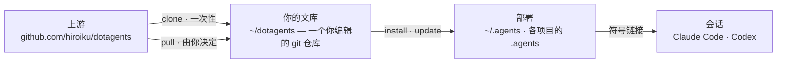

# dotagents

**一个你自己拥有的 AI 代理框架。** 面向 Claude Code 与 Codex 的规则、技能与审查代理——作为单一文库接受版本控制,并从中部署到每一个项目。

[English](../README.md) | [日本語](README.ja.md) | 简体中文 | [繁體中文](README.zh-TW.md) | [한국어](README.ko.md) | [Deutsch](README.de.md) | [Español](README.es.md) | [Français](README.fr.md)

[](https://www.npmjs.com/package/@hiroiku/dotagents)
[](../LICENSE)

- **一份文库,多处部署。** 提示词、技能与代理角色存放在同一个 git 仓库中。安装程序会将它们复制到 `~/.agents` 或 `<project>/.agents`,并接通 Claude Code 与 Codex 所读取的符号链接。
- **是一部规则手册,不是一个库。** 你编辑规则、提交规则,只在自己选择时才跟随上游——不存在任何背着你发生的改动。
- **为会做判断的模型而写。** 文库只记录一个有能力的模型无法自行派生的内容——你的约定、你的需求锚点、你的角色边界。其余一切都交给模型自己的判断。相关推理见[随附的框架](../payload/docs/README.zh-CN.md)。

## 工作原理

一份文库供给所有环境。部署只是纯粹的复制——会话从不依赖文库本身是否可达,也不存在任何背着你发生的部署:



## 快速开始

**1 · 获取你的文库**(需要 git 与 Node.js ≥ 18)

```sh
npx @hiroiku/dotagents clone ~/dotagents
```

一次纯粹的 git clone,而它属于你:编辑规则、提交规则、按自己的需要个性化。

**2 · 部署它**

```sh
cd ~/dotagents
bin/agents-setup install project /path/to/project   # 单个项目   → <dir>/.agents
bin/agents-setup install user                       # 本机       → ~/.agents
```

省略目标以进入交互式选择。在非交互式 shell 中,省略目标会直接停止且不写入任何内容——不存在由默认值决定规则落地位置这回事。

**3 · 日常操作**

```sh
bin/agents-setup pull                 # 跟随上游:变更日志 → 变基 → 测试
bin/agents-setup update  project ...  # 重新同步一次部署
bin/agents-setup status  project ...  # 校验文件与链接——存在漂移时以退出码 1 报告
bin/agents-setup --help               # 全部命令、目标、选项、示例
```

## 三个动词

| 动词 | 频率 | 作用 |
|---|---|---|
| **clone** | 一次性 | 把文库具象化为一个你拥有的 git 仓库 |
| **pull** | 由你决定 | 拉取上游、展示传入的提交标题、把你的提交变基到其上、运行文库测试 |
| **install · update** | 每台机器、每个项目 | 把文库复制进 `.agents/`,并接通链接 |

三条规则将它们连接在一起:

- **不从一次性环境部署。** 在文库之外(npx 缓存、解包的 tarball 中),部署命令要么委托给你机器上已知的文库,要么停止执行并指向 `clone`。
- **跟随是刻意为之的。** 你所拉取的是治理你的代理行为的文本,因此 `pull` 会先展示传入的提交标题——它们以领域语言书写,读起来就像一份变更日志——再进行变基并运行测试。不存在任何自动更新。
- **漂移是可见的。** `status` 会把每一个已部署的文件与链接同文库进行比对,存在漂移时以退出码 1 结束;`update` 只重新同步安装程序所拥有的内容,不多不少。

## 落地位置一览

| 内容 | 落地位置 | 交付方式 |
|---|---|---|
| 普遍规则(`AGENTS.md`) | `.agents/AGENTS.md` | 符号链接 `.claude/CLAUDE.md → .agents/AGENTS.md`;Codex 在 `.codex/` 下获得相同结构 |
| 技能 | `.agents/skills/` | 每个技能各建一条链接,接入 `.claude/skills/` 与 `.codex/skills/`,以便与你自己撰写的技能共存 |
| 审查代理 | `.agents/agents/` | 每个代理各建一条链接,接入 `.claude/agents/` |
| 机器本地产物(manifest) | `.agents/` | 由随 payload 一同分发的 `.gitignore` 排除在版本控制之外 |

一切都是幂等且**由哈希所有**的:安装程序只会触及自己放置且仍然识别的内容。你自己的技能永远不会被触碰,你就地编辑过的文件会被保留并报告(可用 `--force` 覆盖),而 `uninstall` 只会移除 manifest 所记录的内容——不多不少。

## 目录结构

```
bin/agents-setup      安装程序 CLI(clone / pull / install / update / uninstall / status)
test/                 面向安装程序的契约测试(npm test)
payload/              分发内容的唯一定义;这棵树会成为 .agents/
├── README.md         随附的框架——分发了什么,以及它为何言之甚少
├── AGENTS.md         唯一的普遍规则(每次会话始终都会读取)
├── skills/           瞬时规则(只在其时机到来时才被读取)
└── agents/           审查角色(对抗式 · 安全 · 无障碍)
```

[payload/](../payload/) 是分发内容的权威定义;安装程序自身并不持有其内容的清单——重复维护的清单会无声腐坏,因此 [package.json](../package.json) 的 `files` 字段只列出了 `bin` 与 `payload`。payload 所分发的内容记述于[随附的框架](../payload/docs/README.zh-CN.md),而这份记述会随每一次部署一同抵达。

## 更新提示词

文库自带其编辑纪律:[dotagents-prompting](../payload/skills/dotagents-prompting/SKILL.md) 技能指明了在触碰任何提示词或代理定义之前应当阅读的上下文工程指南。只在本仓库中编辑,并通过 `agents-setup update` 交付——直接编辑已安装的目录树,会让 `update` 保护该文件并发出警告,这正是漂移检测在起作用。
