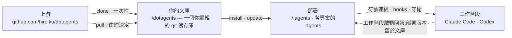
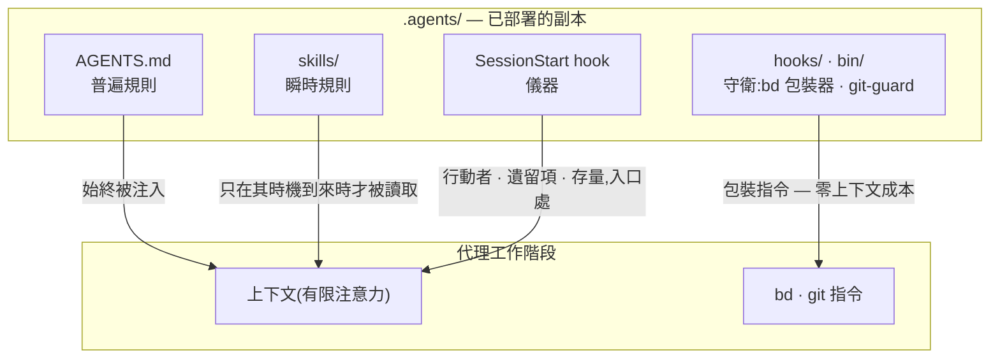

# dotagents

**一個你自己擁有的 AI 代理框架。** 面向 Claude Code 與 Codex 的規則、技能與
機制化守衛——作為單一文庫接受版本控制,並從中部署到每一個專案。

[English](../README.md) | [日本語](README.ja.md) | [简体中文](README.zh-CN.md) | 繁體中文 | [한국어](README.ko.md) | [Deutsch](README.de.md) | [Español](README.es.md) | [Français](README.fr.md)

[](https://www.npmjs.com/package/@hiroiku/dotagents)
[](../LICENSE)

- **一份文庫,多處部署。** 提示詞、技能、代理角色、shell 守衛與工作階段
  儀器都存放在同一個 git 儲存庫中。安裝程式會將它們複製到 `~/.agents` 或
  `<project>/.agents`,並接通 Claude Code 與 Codex 所讀取的符號連結與 hooks。
- **是一部規則手冊,不是一個函式庫。** 你編輯規則、提交規則,只在自己
  選擇時才跟隨上游——不存在任何背著你發生的變動。
- **規則化為機制。** 凡是 hook 或包裝器能夠強制的,就予以強制;凡是擁有
  明確時機的,就化為技能;只有剩下的部分,才被允許佔據每一次工作階段的
  注意力。相關推理見[理念](#理念)。

## 運作原理

一份文庫供給所有環境。部署只是純粹的複製——工作階段從不依賴文庫本身是否
可達,也不存在任何背著你發生的部署:



在一次工作階段內部,文庫的三層規則透過不同的路徑抵達代理——路徑越低,
規則就越強、也越廉價:



## 快速開始

**1 · 檢查前置需求**

| 工具 | | 用途 |
|---|---|---|
| git、Node.js ≥ 18 | 必要 | 執行 CLI |
| [bd (beads)](https://github.com/gastownhall/beads) | 必要 | 一切運行所依賴的議題帳本:登記、認領、完成關卡、合併互斥 |
| [codegraph](https://github.com/colbymchenry/codegraph) | 建議 | 結構查詢——用 `codegraph install` 接入一次,依專案用 `codegraph init` 建立索引 |

本框架從不替你安裝這些器官——安裝程式與每次工作階段啟動時都會偵測缺失項
並予以回報。

**2 · 取得你的文庫**

```sh
npx @hiroiku/dotagents clone ~/dotagents
```

一次純粹的 git clone,而它屬於你:編輯規則、提交規則、依自己的需要個人化。

**3 · 部署它**

```sh
cd ~/dotagents
bin/agents-setup install project /path/to/project   # 單一專案   → <dir>/.agents
bin/agents-setup install user                       # 本機       → ~/.agents
bin/agents-setup install shell                       # 僅守衛     → hooks/bin + 一行 ~/.zshenv
```

省略目標以進入互動式選擇。在非互動式 shell 中,省略目標會直接停止且不寫入
任何內容——不存在由預設值決定規則落腳處這回事。

**4 · 日常操作**

```sh
bin/agents-setup pull                 # 跟隨上游:變更日誌 → 重訂基底 → 測試
bin/agents-setup update  project ...  # 重新同步一次部署(工作階段會告訴你何時需要)
bin/agents-setup status  project ...  # 驗證檔案、連結、片段——出現漂移時以結束碼 1 回報
bin/agents-setup --help               # 全部指令、目標、選項、範例
```

## 三個動詞

| 動詞 | 頻率 | 作用 |
|---|---|---|
| **clone** | 一次性 | 把文庫具象化為一個你擁有的 git 儲存庫 |
| **pull** | 由你決定 | 拉取上游、顯示傳入的提交標題、把你的提交重訂基底到其上、執行文庫測試 |
| **install · update** | 每台機器、每個專案 | 把文庫複製進 `.agents/`,並接通連結、hooks、守衛 |

三條規則將它們連接在一起:

- **不從一次性環境部署。** 在文庫之外(npx 快取、解開的 tarball 中),部署
  指令要麼委派給你機器上已知的文庫,要麼停止執行並指向 `clone`。
- **重新同步是拉取而來,不是推送而來。** 當文庫領先於本機時,位於每次
  工作階段入口處的儀器會回報*部署版本舊於文庫*,而你需要在該專案中執行
  `update`。
- **跟隨是刻意為之的。** 你所拉取的是治理你的代理行為的文本,因此 `pull`
  會先顯示傳入的提交標題——它們以領域語言撰寫,讀起來就像一份變更日誌——
  再進行重訂基底並執行測試。不存在任何自動更新。

## 落腳位置一覽

| 內容 | 落腳位置 | 交付方式 |
|---|---|---|
| 普遍規則(`AGENTS.md`) | `.agents/AGENTS.md` | 符號連結 `.claude/CLAUDE.md → .agents/AGENTS.md`;Codex 在 `.codex/` 下取得相同結構 |
| 技能 · 代理角色 | `.agents/skills/` · `.agents/agents/` | 每個條目各建一條連結,以便與你自己撰寫的技能共存 |
| 守衛(`bd` 包裝器 · `git-guard`) | `.agents/bin/` · `.agents/hooks/` | `~/.zshenv` 中受管理的一行——使用者層級,每台機器一次 |
| 工作階段注入 | `settings.json` · `.codex/hooks.json` | 片段:`hooks.SessionStart`、`env.BASH_ENV`、`permissions.ask` |
| 機器本機產物(manifest · 指標) | `.agents/` | 由隨 payload 一同分發的 `.gitignore` 排除在版本控制之外 |

一切都是冪等且**由雜湊擁有**的:安裝程式只會觸及自己放置且仍然識別的內容。
你自己的技能永遠不會被觸碰,你就地編輯過的檔案會被保留並回報(可用
`--force` 覆寫),而 `uninstall` 只會移除 manifest 所記錄的內容——不多不少。

<details>
<summary><b>shell 層——每台機器一份,由兩側共同維護</b></summary>

守衛只透過 `hooks/shellenv.sh` 抵達各個工作階段,而 zsh 沒有依專案區分的
啟動檔案——因此不論有多少個專案在使用本框架,這一層在**每台機器上只
存在一份**。安裝程式把對它的照料留在你的操作知識之外:`install project`
會在缺失時補上最小限度的 shell 作用範圍;`uninstall user` 在移除其他專案
共用的內容前會先詢問(`--keep-shell` 可非互動式地保留它);`uninstall
project` 則從不觸碰這一層。

</details>

<details>
<summary><b>後期採用與團隊推廣</b></summary>

- **與順序無關**:之後再加入 bd 或 codegraph 不需要重新安裝——器官、
  帳本與索引在每次工作階段啟動時都會被動態偵測。若根目錄的 AGENTS.md
  已由 `bd init` 建立,它不會被接管,只會被附加一段受管理的參照區塊
- **兩層交付**:提示詞層(`.agents/` payload、連結、參照區塊)搭乘版本
  控制,**僅憑 clone 即可生效**;注入與強制層(manifest、settings 片段、
  zshenv 行、shell 守衛)是機器專屬的,**由安裝程式在每台機器上分別
  鋪設**
- **自第二人起**:複製專案、複製 dotagents、執行
  `bin/agents-setup install project <project>`——一道指令;若 shell 層
  缺失,會在過程中一併補全。安裝程式是冪等且以雜湊驗證的,因此它從不會
  與版本控制所交付的內容衝突

</details>

<details>
<summary><b>CLI 設計要點</b></summary>

目標是**唯一的位置引數**(`user` / `project [dir]` / `shell`),從不設
預設值。正因為只有一個位置,「同時指定 user 和 project」這種寫法根本
無法輸入——互斥性由語法本身保證,而非執行期驗證。互動式提示是一個
方向鍵選擇器(`↑/↓` 移動、`enter` 確認、`ctrl-c` 取消),選定後會摺疊
為單行,記錄你所做的選擇。輸出在 `NO_COLOR` 環境變數存在或沒有 TTY 時
會自動關閉顏色。

</details>

## 理念

本框架所建構的並非「一個能力全面的代理」,而是**一個把有限注意力(上下文)
拆分到各個角色、並透過外部記錄將它們連接起來的組織**。以下每一條規則
都源自同一個前提:上下文是有限的,並且會隨工作階段一同消亡。

### 三層規則——普遍、瞬時、強制

在討論內容之前,一條規則的性質首先由**它是如何被傳遞的**來決定。

- **普遍規則**(核心即 AGENTS.md)——始終被注入。它們會消耗每一次工作
  階段的注意力,並且只能作為**盡力而為**來遵守,因此這一層只應容納那些
  少數無法為其指明具體觀察時機的規則
- **瞬時規則**(技能)——即時注入。它們只在自己的時機到來時才進入上下文,
  因此寫在這裡的細節不會耗費任何其他時刻的成本
- **強制規則**(hooks / bin / permissions)——從不被注入。由機制來做
  判斷,因此它們不消耗任何注意力,也無法被違反(即便被違反也會留下痕跡)

**下降律**:把每一條規則盡可能推到它能到達的最低層。更低的層次同時
兼具更強與更廉價兩種性質——這是一道單向的斜坡,注意力成本消失的同時
強度隨之上升。提示詞不過是那些尚未被轉化為機制的規則的等候室。

### 分割——不容許重複的邊界

子代理的切分依據不是能力,而是**不會產生重複的邊界**:各單元的輸入
(上下文)、搜尋範圍與寫入目標(worktree)彼此互不相交。把同一份資訊
交給兩個上下文,你就要為注意力多付一次帳;讓兩者寫同一個地方,你就
製造出了一個合併點。結構無法消除的那些合併點(整合分支與帳本)才是
唯一受互斥保護的對象。

分割同時也是遮蔽。不了解實作的具體情形,恰恰是審查具備偵測力的原因——
**「不傳遞它」與「傳遞它」是同樣有力的設計決策**。

### 器官——宣告與衍生

每一個工具都作為一個器官,回答一類問題,而且任何器官的原生能力都不會
在別處被重新實作。這條軸線是**宣告與衍生**:

- **宣告的記錄**(被決定的事情無法被衍生出來,所以要記錄下來):bd = 意圖
  與狀態的帳本(我們決定做什麼、誰在負責什麼、為何某事被擱置);ADR = 決策
  的軌跡;詞彙表 = 通用語言
- **衍生**(凡是機器能從產物中衍生出來的東西,就絕不手寫):codegraph =
  程式碼目前的結構(符號、呼叫路徑、影響範圍);git = 變更的歷史

一旦你手寫了某個本可被衍生的東西,漂移便隨之開始。記憶也處在同一條
軸線上:狀態是被衍生出來的(bd prime 的查詢注入);只有不變量才被宣告
(bd remember)。跨工作階段攜帶上下文的不是對話紀錄,而是一份帶有位址
的外部記錄(**上下文橋**)。

codegraph 是日常探索所用的器官,它的普遍規則(「先用 explore 衍生」)
**透過工具描述(MCP server instructions)來傳遞**——絕不會被複製進
提示詞,否則就會變成一份陳舊的複本。工具的選擇無法被機器驗證,因此它
也無法落入強制層:零注入成本的工具層,是這條規則能夠安身的最低層。
本框架的提示詞只在*不*使用它就會破壞某個契約的那些時刻才把話說清楚
(凍結前的事實核驗、衍生橫向掃描、審查者的掃描)。接入(`codegraph install`)
與建立索引(`codegraph init`)是 codegraph 自身的職責——本框架既不驗證
也不重新實作它們;SessionStart 只是偵測 `.codegraph/` 是否存在,並注入
一行提醒。

### 對抗式審查——遺漏在被尋找之前並不存在

AI 代理特有的失敗模式,是明明沒做完卻說「做完了!」,而其本質不是說謊,
而是**遺漏**——一個上下文裡只裝著自己寫下之物的人,是看不見自己沒寫下
之物的。

因此審查不是檢驗(查看已存在之物並對其作出判斷),而是**存在性證明**:
審查者必須從需求出發,在產物中找到滿足每一條需求的實作與驗證——這是
一次反方向的掃描。審查者不會先被給出 diff,因為被「核實已寫之物」佔據
的注意力,會停止尋找那些未被寫下之物。

### 下沉——循環之所以收斂,是因為知識在下沉

單純重複審查會發散(發現會源源不絕地冒出來,永無止境)。循環之所以
收斂,是因為每一輪都讓知識**下沉**一層:個別發現 → 被清楚表述的缺陷
類別(被打破的契約) → 強制機制(一個結構、一個型別、一道守衛)。已經
下沉的假設會從任務清單中移除,因此審查的燃料一輪比一輪減少。當同一類
缺陷第二次出現時,這傳遞的訊號不是修復本身錯了,而是**下沉這件事錯了**。

議題帳本收斂於同一條原則:不要把觀察堆進 open 狀態;只有已經決定要做
的事才能被開立;把形態相同的議題合併起來;每一筆登記在誕生之時就要
指定它的消化路徑。

### 測試——數量不等於保護的份量

一個測試只應釘住一個**契約**(業務所依賴的一項承諾);單純複製一個
症狀,無法防止任何回歸。第一道防線是不會壞掉的結構(在其中失敗條件
根本無法存在的設計與型別);測試是留給那些結構無法封住的契約的最後
手段。

### 監視者與列舉——不做後設品質檢查

監視者的監視者、測試的測試、守衛的守衛——這些不守護任何業務契約的
後設檢查很容易不斷增殖,吞噬維護成本卻什麼也保護不了。三條原則將它們
排除在外:

- **不要增加監視者,而要下沉**——想要監視一道守衛,本身就是它所處位置
  太高的症狀。答案是下降律,而不是更多的監控:把它往下推,需要被監視
  的對象就會隨之消失
- **偵測只走一跳**——只有結構無法封住的契約才可以擁有偵測器,而偵測器
  本身不再擁有偵測器。偵測器壞掉卻無人察覺,是被接受的代價,這正是
  偵測器必須保持極簡的原因
- **絕不透過列舉來守護**——任何涵蓋範圍依賴手動維護清單的方案,都會把
  被遺忘的新增項變成無聲的漏洞。應優先選擇結構本身即定義的形式(payload
  原則),或機器把清單作為副產品衍生出來的形式(manifest 原則)

規則文本本身不會在此重複(payload 的副本會無聲腐壞)。權威索引如下:
角色、品質不變量、git 權限與 beads 的普遍規則在 [AGENTS.md](../payload/AGENTS.md)
中;前置工作與組成方式在
[agents-kickoff](../payload/skills/agents-kickoff/SKILL.md) 中;品質循環
的運作方式在
[agents-quality-loop](../payload/skills/agents-quality-loop/SKILL.md) 中;
bd 操作與記憶邊界在
[agents-beads-ops](../payload/skills/agents-beads-ops/SKILL.md) 中;測試
設計在 [agents-test-design](../payload/skills/agents-test-design/SKILL.md)
中;三層結構與消融紀律在
[prompt-guidelines.md](../payload/docs/prompt-guidelines.md) 中。

## 目錄結構

```
bin/agents-setup      安裝程式 CLI(clone / pull / install / update / uninstall / status)
test/                 針對安裝程式與強制層的契約測試(npm test)
payload/              分發內容的唯一定義;這棵樹會成為 .agents/
├── AGENTS.md         普遍規則(每次工作階段都會讀取)
├── skills/           瞬時規則(只在其時機到來時才被讀取)
├── agents/           角色定義(reviewer / verifier,受工具限制)
├── hooks/            shellenv.sh(守衛傳遞)/ beads-session.sh(SessionStart 注入)
├── bin/              強制機制(bd、git-guard、agents-gate、agents-reap)與自我檢查(agents-doctor)
└── docs/             更新提示詞的指南
```

[payload/](../payload/) 是分發內容的權威定義;安裝程式自身並不持有其
內容的清單(重複維護的清單會無聲腐壞——[package.json](../package.json)
的 `files` 欄位只列出了 `bin` 與 `payload`)。

## 更新提示詞

請遵循 [payload/docs/prompt-guidelines.md](../payload/docs/prompt-guidelines.md)。
只在本儲存庫中編輯,並透過 `agents-setup update` 交付——直接編輯已安裝的
目錄樹,會讓 `update` 保護該檔案並發出警告,這正是漂移偵測在起作用。

## 未決問題

- 在已有帳本的專案中導入本框架時,如何批次分診既有的 open 議題(需配合
  整體性的 `AGENTS_BD_OPEN_OK=1` 授權)
- 待儀器蒐集足夠觀察結果後,複審自創術語,並進一步精簡 AGENTS.md 中的
  `<beads>` 區塊
