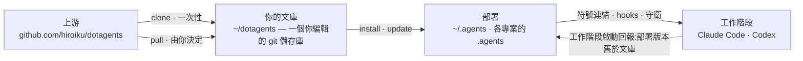

# dotagents

**一個你自己擁有的 AI 代理框架。** 面向 Claude Code 與 Codex 的規則、技能與機制化守衛——作為單一文庫接受版本控制,並從中部署到每一個專案。

[English](../README.md) | [日本語](README.ja.md) | [简体中文](README.zh-CN.md) | 繁體中文 | [한국어](README.ko.md) | [Deutsch](README.de.md) | [Español](README.es.md) | [Français](README.fr.md)

[](https://www.npmjs.com/package/@hiroiku/dotagents)
[](../LICENSE)

- **一份文庫,多處部署。** 提示詞、技能、代理角色、shell 守衛與工作階段儀器都存放在同一個 git 儲存庫中。安裝程式會將它們複製到 `~/.agents` 或 `<project>/.agents`,並接通 Claude Code 與 Codex 所讀取的符號連結與 hooks。
- **是一部規則手冊,不是一個函式庫。** 你編輯規則、提交規則,只在自己選擇時才跟隨上游——不存在任何背著你發生的變動。
- **規則化為機制。** 凡是 hook 或包裝器能夠強制的,就予以強制;凡是擁有明確時機的,就化為技能;只有剩下的部分,才被允許佔據每一次工作階段的注意力。相關推理見[隨附的框架](HARNESS.zh-TW.md)。

## 運作原理

一份文庫供給所有環境。部署只是純粹的複製——工作階段從不依賴文庫本身是否可達,也不存在任何背著你發生的部署:



## 快速開始

**1 · 檢查前置需求**

| 工具 | | 用途 |
|---|---|---|
| git、Node.js ≥ 18 | 必要 | 執行 CLI |
| [bd (beads)](https://github.com/gastownhall/beads) | 必要 | 隨附框架運行所依賴的議題帳本:登記、認領、完成關卡、合併互斥 |
| [codegraph](https://github.com/colbymchenry/codegraph) | 建議 | 結構查詢——用 `codegraph install` 接入一次,依專案用 `codegraph init` 建立索引 |

本框架從不替你安裝這些器官——安裝程式與每次工作階段啟動時都會偵測缺失項並予以回報。

**2 · 取得你的文庫**

```sh
npx @hiroiku/dotagents clone ~/dotagents
```

一次純粹的 git clone,而它屬於你:編輯規則、提交規則、依自己的需要個人化。

**3 · 部署它**

```sh
cd ~/dotagents
bin/agents-setup install project /path/to/project   # 單一專案   → <dir>/.agents
bin/agents-setup install user                       # 本機       → ~/.agents
bin/agents-setup install shell                       # 僅守衛     → hooks/bin + 一行 ~/.zshenv
```

省略目標以進入互動式選擇。在非互動式 shell 中,省略目標會直接停止且不寫入任何內容——不存在由預設值決定規則落腳處這回事。

**4 · 日常操作**

```sh
bin/agents-setup pull                 # 跟隨上游:變更日誌 → 重訂基底 → 測試
bin/agents-setup update  project ...  # 重新同步一次部署(工作階段會告訴你何時需要)
bin/agents-setup status  project ...  # 驗證檔案、連結、片段——出現漂移時以結束碼 1 回報
bin/agents-setup --help               # 全部指令、目標、選項、範例
```

## 三個動詞

| 動詞 | 頻率 | 作用 |
|---|---|---|
| **clone** | 一次性 | 把文庫具象化為一個你擁有的 git 儲存庫 |
| **pull** | 由你決定 | 拉取上游、顯示傳入的提交標題、把你的提交重訂基底到其上、執行文庫測試 |
| **install · update** | 每台機器、每個專案 | 把文庫複製進 `.agents/`,並接通連結、hooks、守衛 |

三條規則將它們連接在一起:

- **不從一次性環境部署。** 在文庫之外(npx 快取、解開的 tarball 中),部署指令要麼委派給你機器上已知的文庫,要麼停止執行並指向 `clone`。
- **重新同步是拉取而來,不是推送而來。** 當文庫領先於本機時,位於每次工作階段入口處的儀器會回報*部署版本舊於文庫*,而你需要在該專案中執行 `update`。
- **跟隨是刻意為之的。** 你所拉取的是治理你的代理行為的文本,因此 `pull` 會先顯示傳入的提交標題——它們以領域語言撰寫,讀起來就像一份變更日誌——再進行重訂基底並執行測試。不存在任何自動更新。

## 落腳位置一覽

| 內容 | 落腳位置 | 交付方式 |
|---|---|---|
| 普遍規則(`AGENTS.md`) | `.agents/AGENTS.md` | 符號連結 `.claude/CLAUDE.md → .agents/AGENTS.md`;Codex 在 `.codex/` 下取得相同結構 |
| 技能 · 代理角色 | `.agents/skills/` · `.agents/agents/` | 每個條目各建一條連結,以便與你自己撰寫的技能共存 |
| 守衛(`bd` 包裝器 · `git-guard`) | `.agents/bin/` · `.agents/hooks/` | `~/.zshenv` 中受管理的一行——使用者層級,每台機器一次 |
| 工作階段注入 | `settings.json` · `.codex/hooks.json` | 片段:`hooks.SessionStart`、`env.BASH_ENV`、`permissions.ask` |
| 機器本機產物(manifest · 指標) | `.agents/` | 由隨 payload 一同分發的 `.gitignore` 排除在版本控制之外 |

一切都是冪等且**由雜湊擁有**的:安裝程式只會觸及自己放置且仍然識別的內容。你自己的技能永遠不會被觸碰,你就地編輯過的檔案會被保留並回報(可用 `--force` 覆寫),而 `uninstall` 只會移除 manifest 所記錄的內容——不多不少。

<details>
<summary><b>shell 層——每台機器一份,由兩側共同維護</b></summary>

守衛只透過 `hooks/shellenv.sh` 抵達各個工作階段,而 zsh 沒有依專案區分的啟動檔案——因此不論有多少個專案在使用本框架,這一層在**每台機器上只存在一份**。安裝程式把對它的照料留在你的操作知識之外:`install project` 會在缺失時補上最小限度的 shell 作用範圍;`uninstall user` 在移除其他專案共用的內容前會先詢問(`--keep-shell` 可非互動式地保留它);`uninstall project` 則從不觸碰這一層。

</details>

<details>
<summary><b>後期採用與團隊推廣</b></summary>

- **與順序無關**:之後再加入 bd 或 codegraph 不需要重新安裝——器官、帳本與索引在每次工作階段啟動時都會被動態偵測。若根目錄的 AGENTS.md 已由 `bd init` 建立,它不會被接管,只會被附加一段受管理的參照區塊
- **兩層交付**:提示詞層(`.agents/` payload、連結、參照區塊)搭乘版本控制,**僅憑 clone 即可生效**;注入與強制層(manifest、settings 片段、zshenv 行、shell 守衛)是機器專屬的,**由安裝程式在每台機器上分別鋪設**
- **自第二人起**:複製專案、複製 dotagents、執行 `bin/agents-setup install project <project>`——一道指令;若 shell 層缺失,會在過程中一併補全。安裝程式是冪等且以雜湊驗證的,因此它從不會與版本控制所交付的內容衝突

</details>

<details>
<summary><b>CLI 設計要點</b></summary>

目標是**唯一的位置引數**(`user` / `project [dir]` / `shell`),從不設預設值。正因為只有一個位置,「同時指定 user 和 project」這種寫法根本無法輸入——互斥性由語法本身保證,而非執行期驗證。互動式提示是一個方向鍵選擇器(`↑/↓` 移動、`enter` 確認、`ctrl-c` 取消),選定後會摺疊為單行,記錄你所做的選擇。輸出在 `NO_COLOR` 環境變數存在或沒有 TTY 時會自動關閉顏色。

</details>

## 目錄結構

```
bin/agents-setup      安裝程式 CLI(clone / pull / install / update / uninstall / status)
test/                 針對安裝程式與強制層的契約測試(npm test)
payload/              分發內容的唯一定義;這棵樹會成為 .agents/
├── AGENTS.md         普遍規則(每次工作階段都會讀取)
├── skills/           瞬時規則(只在其時機到來時才被讀取)
├── agents/           角色定義(reviewer / verifier,受工具限制)
├── hooks/            shellenv.sh(守衛傳遞)/ beads-session.sh(SessionStart 注入)
├── bin/              強制機制(bd、git-guard、agents-gate、agents-reap)與自我檢查(agents-doctor)
└── docs/             更新提示詞的指南
```

[payload/](../payload/) 是分發內容的權威定義;安裝程式自身並不持有其內容的清單(重複維護的清單會無聲腐壞——[package.json](../package.json) 的 `files` 欄位只列出了 `bin` 與 `payload`)。payload 所分發的內容——隨附的框架,以及其規則背後的推理——說明於[隨附的框架](HARNESS.zh-TW.md)一文。

## 更新提示詞

請遵循 [payload/docs/prompt-guidelines.md](../payload/docs/prompt-guidelines.md)。只在本儲存庫中編輯,並透過 `agents-setup update` 交付——直接編輯已安裝的目錄樹,會讓 `update` 保護該檔案並發出警告,這正是漂移偵測在起作用。

