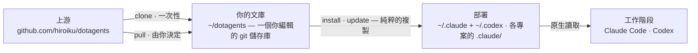

# dotagents

**一個你自己擁有的 AI 代理框架。** 面向 Claude Code 與 Codex 的規則、技能與審查代理——作為單一文庫接受版本控制,並從中部署到每一個專案。

[English](../README.md) | [日本語](README.ja.md) | [简体中文](README.zh-CN.md) | 繁體中文 | [한국어](README.ko.md) | [Deutsch](README.de.md) | [Español](README.es.md) | [Français](README.fr.md)

[](https://www.npmjs.com/package/@hiroiku/dotagents)
[](../LICENSE)

- **一份文庫,多處部署。** 提示詞、技能與代理角色都存放在同一個 git 儲存庫中。安裝程式會將它們直接複製進 Claude Code 與 Codex 所讀取的目錄(`.claude/`、`.codex/`)——純粹的檔案,沒有符號連結,也沒有中介目錄樹。
- **是一部規則手冊,不是一個函式庫。** 你編輯規則、提交規則,只在自己選擇時才跟隨上游——不存在任何背著你發生的變動。
- **為懂得判斷的模型而寫。** 文庫只記錄有能力的模型無法衍生的內容——你的慣例、你的需求錨點、你的角色邊界。其餘一切都交給模型自行判斷。相關推理見[隨附的框架](../payload/docs/README.zh-TW.md)。

## 運作原理

一份文庫供給所有環境。部署只是純粹的複製——工作階段從不依賴文庫本身是否可達,也不存在任何背著你發生的部署:



## 快速開始

**1 · 取得你的文庫**(需要 git 與 Node.js ≥ 18)

```sh
npx @hiroiku/dotagents clone ~/dotagents
```

一次純粹的 git clone,而它屬於你:編輯規則、提交規則、依自己的需要個人化。

**2 · 部署它**

```sh
cd ~/dotagents
bin/agents-setup install project /path/to/project   # 單一專案   → <dir>/.claude + <dir>/.codex
bin/agents-setup install user                       # 本機       → ~/.claude + ~/.codex
```

省略目標以進入互動式選擇。在非互動式 shell 中,省略目標會直接停止且不寫入任何內容——不存在由預設值決定規則落腳處這回事。

**3 · 日常操作**

```sh
bin/agents-setup pull                 # 跟隨上游:變更日誌 → 重訂基底 → 測試
bin/agents-setup update  project ...  # 重新同步一次部署
bin/agents-setup status  project ...  # 驗證檔案與規則區塊——出現漂移時以結束碼 1 回報
bin/agents-setup --help               # 全部指令、目標、選項、範例
```

## 三個動詞

| 動詞 | 頻率 | 作用 |
|---|---|---|
| **clone** | 一次性 | 把文庫具象化為一個你擁有的 git 儲存庫 |
| **pull** | 由你決定 | 拉取上游、顯示傳入的提交標題、把你的提交重訂基底到其上、執行文庫測試 |
| **install · update** | 每台機器、每個專案 | 把 payload 複製進各工具所讀取的目錄 |

三條規則將它們連接在一起:

- **不從一次性環境部署。** 在文庫之外(npx 快取、解開的 tarball 中),部署指令要麼委派給你機器上已知的文庫,要麼停止執行並指向 `clone`。
- **跟隨是刻意為之的。** 你所拉取的是治理你的代理行為的文本,因此 `pull` 會先顯示傳入的提交標題——它們以領域語言撰寫,讀起來就像一份變更日誌——再進行重訂基底並執行測試。不存在任何自動更新。
- **漂移是可見的。** `status` 會把每一個已部署的檔案與連結和文庫逐一比對,出現漂移時以結束碼 1 結束;`update` 只重新同步安裝程式所擁有的內容——不多不少。

## 落腳位置一覽

| 內容 | 落腳位置 | 交付方式 |
|---|---|---|
| 普遍規則(`AGENTS.md`) | `.claude/CLAUDE.md` · `~/.codex/AGENTS.md` · 專案根目錄的 `AGENTS.md` | 一段夾在標記之間的受管理區塊——你寫在其周圍的任何內容永遠不會被觸碰,而 `uninstall` 會還原該檔案 |
| 技能 | `.claude/skills/` 與 `.codex/skills/` | 純粹的複製,每個技能各佔一個目錄,與你自己撰寫的技能共存 |
| 審查代理 | `.claude/agents/` | 純粹的複製,每個代理各佔一個檔案 |
| 機器本機紀錄(manifest) | `~/.dotagents/` | 永遠不落入專案——記錄安裝程式所放置內容的雜湊帳本與機器同在 |

一切都是冪等且**由雜湊擁有**的:安裝程式只會觸及自己放置且仍然識別的內容。你自己的技能永遠不會被觸碰,你就地編輯過的檔案會被保留並回報(可用 `--force` 覆寫),而 `uninstall` 只會移除 manifest 所記錄的內容——不多不少。舊版本遺留的既有 `.agents` 佈局(符號連結、zshenv 行、settings 片段)會在 `install` / `update` 時被自動偵測並遷移。

## 目錄結構

```
bin/agents-setup      安裝程式 CLI(clone / pull / install / update / uninstall / status)
test/                 針對安裝程式的契約測試(npm test)
payload/              分發內容的唯一定義
├── AGENTS.md         唯一的普遍規則——以受管理區塊的形式交付
├── skills/           瞬時規則(只在其時機到來時才被讀取)
├── agents/           審查角色(對抗式 · 安全性 · 無障礙)
├── README.md         隨附的框架——分發了什麼,以及為何它說得如此之少
└── docs/             該說明的各語言翻譯(僅屬文件;不會被部署)
```

[payload/](../payload/) 是分發內容的權威定義:其頂層的種類決定各項內容的落腳位置,而安裝程式自身並不持有檔案的清單——重複維護的清單會無聲腐壞,因此 [package.json](../package.json) 的 `files` 欄位只列出 `bin` 與 `payload`。payload 所分發的內容說明於[隨附的框架](../payload/docs/README.zh-TW.md)。

## 更新提示詞

文庫自身攜帶著編輯紀律:[dotagents-prompting](../payload/skills/dotagents-prompting/SKILL.md) 技能列出了在觸碰任何提示詞或代理定義之前應當閱讀的上下文工程指南。只在本儲存庫中編輯,並透過 `agents-setup update` 交付——直接編輯已安裝的目錄樹,會讓 `update` 保護該檔案並發出警告,這正是漂移偵測在起作用。
