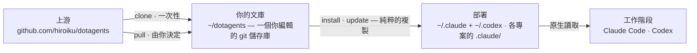

# dotagents

**一個管理你的 AI 代理所遵循之規則的套件管理器。** 面向 Claude Code 與 Codex 的提示詞、技能與審查代理,切分為一個個 module——作為單一文庫接受版本控制,並安裝進你所選擇的專案。

[English](../README.md) | [日本語](README.ja.md) | [简体中文](README.zh-CN.md) | 繁體中文 | [한국어](README.ko.md) | [Deutsch](README.de.md) | [Español](README.es.md) | [Français](README.fr.md)

[](https://www.npmjs.com/package/@hiroiku/dotagents)
[](../LICENSE)

- **一份文庫,多處部署。** 每一條規則都存放在同一個 git 儲存庫中,並被切分為一個個 module,由你決定為每個專案或每台機器安裝哪些。安裝程式會直接寫進 Claude Code 與 Codex 所讀取的目錄——純粹的檔案,沒有符號連結,也沒有中介目錄樹。
- **是一部規則手冊,不是一個函式庫。** 你編輯規則、提交規則,只在自己選擇時才跟隨上游——不存在任何背著你發生的變動。
- **為懂得判斷的模型而寫。** 文庫只記錄有能力的模型無法衍生的內容——你的慣例、你的需求錨點、你的角色邊界。其餘一切都交給模型自行判斷。相關推理見[隨附的框架](../modules/harness/docs/README.zh-TW.md)。

## 運作原理

一份文庫供給所有環境。部署只是純粹的複製——工作階段從不依賴文庫本身是否可達,也不存在任何背著你發生的部署:



## 快速開始

**1 · 取得你的文庫**(需要 git 與 Node.js ≥ 18)

```sh
npx @hiroiku/dotagents clone ~/dotagents
```

一次純粹的 git clone,而它屬於你:編輯規則、提交規則、依自己的需要個人化。

**2 · 安裝你想要的內容,到你想要的位置**

```sh
cd ~/dotagents
bin/agents-setup list                     # 這份文庫提供了什麼
bin/agents-setup install harness          # 安裝進目前的專案
bin/agents-setup install harness -g       # 為本機上的每一個專案安裝
bin/agents-setup install harness -C ~/x   # 安裝進指定的專案
```

目標預設為目前這個專案——影響範圍最小的那一個。更廣的範圍一律需要明確的旗標。至於要放入什麼,則從不預設:指名一個 module,或以互動方式挑選;非互動式 shell 會直接停止,而不替你做選擇。

**3 · 日常操作**

```sh
bin/agents-setup pull                 # 跟隨上游:變更日誌 → 重訂基底 → 測試
bin/agents-setup update               # 重新同步這個專案(使用它所記住的 module)
bin/agents-setup status               # 驗證檔案與規則區塊——出現漂移時以結束碼 1 回報
bin/agents-setup uninstall <module>   # 移除一個 module,其餘保留
bin/agents-setup --help               # 全部指令、選項、範例
```

## 兩種對象,兩套詞彙

指令作用於兩種對象之一,而各自借用了你早已熟悉的詞彙:

| 對象 | 詞彙 | 指令 |
|---|---|---|
| **文庫**——你所擁有的那個規則 git 儲存庫 | git | `clone` · `pull` · `list` |
| **部署**——工具實際讀取的內容 | 套件管理器 | `install` · `update` · `uninstall` · `status` |

三條規則將它們連接在一起:

- **不從一次性環境部署。** 在文庫之外(npx 快取、解開的 tarball 中),部署指令要麼委派給你機器上已知的文庫,要麼停止執行並指向 `clone`。
- **跟隨是刻意為之的。** 你所拉取的是治理你的代理行為的文本,因此 `pull` 會先顯示傳入的提交標題——它們以領域語言撰寫,讀起來就像一份變更日誌——再進行重訂基底並執行測試。不存在任何自動更新。
- **選擇會被記住,不必重打。** manifest 記錄了一次部署持有哪些 module,因此 `update` 不需要任何引數。`install` 是累加的,`uninstall` 是遞減的。

## 落腳位置一覽

| 內容 | 落腳位置 | 交付方式 |
|---|---|---|
| 技能 · 審查代理 · hooks | `.claude/skills/dotagents/` | **單一個 plugin 目錄**。Claude Code 會載入在該處找到的 plugin,不需要 marketplace,也不需要任何安裝步驟,並將它所容納的內容納入 `/dotagents:*` 命名空間——這正是 hooks 得以在完全不觸碰 `settings.json` 的情況下抵達的方式 |
| 技能(Codex) | `.codex/skills/dotagents-*` | 純粹的複製。Codex 沒有 plugin,因此命名空間折進了目錄名稱之中 |
| 普遍規則(`AGENTS.md`) | `.claude/CLAUDE.md` · `~/.codex/AGENTS.md` · 專案根目錄的 `AGENTS.md` | 一段夾在標記之間的受管理區塊——你寫在其周圍的任何內容永遠不會被觸碰,而 `uninstall` 會還原該檔案 |
| 機器本機紀錄(manifest) | `~/.dotagents/` | 永遠不落入專案——記錄安裝程式放置了什麼、以及你選擇了哪些 module 的雜湊帳本,與機器同在 |

一切都是冪等且**由雜湊擁有**的:安裝程式只會觸及自己放置且仍然識別的內容。你自己的技能永遠不會被觸碰,你就地編輯過的檔案會被保留並回報(可用 `--force` 覆寫),而 `uninstall` 只會移除 manifest 所記錄的內容——不多不少。舊版本遺留的佈局(`.agents` 目錄樹、符號連結、zshenv 行、settings 片段,或落在命名空間之外的純粹複製)會在 `install` / `update` 時被偵測並遷移。

專案範圍的 plugin 只在 Claude Code 於儲存庫根目錄啟動時才會載入,而且必須在你接受工作區信任對話框之後。對代理與 hooks 的變更會在下一次工作階段、或執行 `/reload-plugins` 之後生效;對 `SKILL.md` 的編輯則會立即被採用。

## 目錄結構

```
bin/agents-setup      安裝程式 CLI(clone / pull / list / install / update / uninstall / status)
test/                 針對安裝程式的契約測試(npm test)
modules/              可分發內容的唯一定義
├── harness/          隨附的 module——沒有外部依賴
│   ├── MODULE.md     名稱、說明,以及它期望 PATH 上有什麼
│   ├── AGENTS.md     唯一的普遍規則——以受管理區塊的形式交付
│   ├── skills/       瞬時規則(只在其時機到來時才被讀取)
│   ├── agents/       審查角色(對抗式 · 安全性 · 無障礙)
│   ├── README.md     隨附的框架——分發了什麼,以及為何它說得如此之少
│   └── docs/         該說明的各語言翻譯(僅屬文件;不會被部署)
└── beads/            選用 module — 需要 PATH 上有 bd
```

[modules/](../modules/) 是這份分發內容的權威定義:帶有 `MODULE.md` 的目錄就是一個 module,其頂層的種類決定各項內容的落腳位置,而安裝程式自身並不持有檔案的清單——重複維護的清單會無聲腐壞,因此 [package.json](../package.json) 的 `files` 欄位只列出 `bin` 與 `modules`。在隨附的 module 旁邊寫下你自己的 module,它會以完全相同的方式被安裝。

一個 module 可以宣告它期望 `PATH` 上有什麼。這些要求是**被偵測,而非被安裝**的:`list` 與 `install` 會回報缺少了什麼,但不阻擋任何事,因此日後才補上工具也無須重新安裝。

## 更新提示詞

文庫自身攜帶著編輯紀律:[prompting](../modules/harness/skills/prompting/SKILL.md) 技能列出了在觸碰任何提示詞或代理定義之前應當閱讀的上下文工程指南。只在本儲存庫中編輯,並透過 `agents-setup update` 交付——直接編輯已安裝的目錄樹,會讓 `update` 保護該檔案並發出警告,這正是漂移偵測在起作用。
