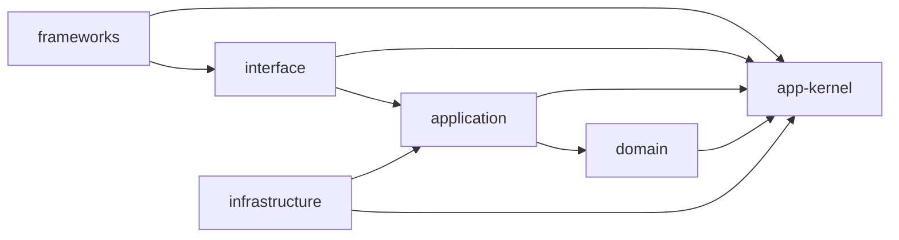

# 設計の指針

[The Clean Architecture](https://blog.cleancoder.com/uncle-bob/2012/08/13/the-clean-architecture.html) の依存のルールを要件として満たす。アダプターを driving と driven に分けるのは [Ports and Adapters](https://alistair.cockburn.us/hexagonal-architecture/) に、`<bounded_context>` の軸と語彙の制約は [DDD](https://www.domainlanguage.com/ddd/reference/) に従う。

以下はそれらを組み合わせたものであり、CA の図の写しではない。出力ポートは使わない。

## 配置

```
src/app-kernel/<name>.ts
src/<layer>/<kind>/<bounded_context>/<name>.<kind>.ts
src/application/ports/<kind>/<bounded_context>/<name>.<kind>.ts
src/frameworks/<framework>/…
```

レイヤーは `app-kernel` `domain` `application` `interface` `infrastructure` `frameworks` の 6 つに固定する。`<kind>` は固定せず、そのレイヤーに必要な種類を持つ(`entities`、`value-objects`、`services`、`errors`、`use-cases`、`controllers`、`presenters`、`repositories`、`integrations` など)。

- ファイルの接尾辞は `<kind>` の単数形にする(`value-objects/` → `.value-object.ts`)。
- `application` が外部に求めるものは `ports/` の下に宣言する。実装は `infrastructure` に置く。
- bounded context は 1 か所で宣言する。どのレイヤーでも、コンテキストの名前を持つディレクトリーはすべてその集合に属する。
- `frameworks/<framework>/` の中では、そのフレームワーク自身の慣習に従う。

## 型とヘルパーを所有者のそばに置く

型とヘルパー関数は、それを所有する操作やポートと同じファイルに置く。分ける必要があるときは、その所有者の隣に置く。所有者は、使う側の数ではなく責務で決める。

| 型 | 所有者 |
|---|---|
| ユースケースの入力と出力 | そのユースケース |
| 外部の機能に対するリクエストとレスポンス | `application` の対応するポート |
| 表示に固有の結果 | プレゼンター |
| データベースの行と SDK の型 | 対応する `infrastructure` の実装の内部 |

- 画面がその出力を使う場合でも、出力の型はユースケースが所有する。所有者がはっきりしないときは、共通のコードを切り出す前に所有を決める。
- DTO という区分、受け渡すだけのクラス、何でも入れる `dtos/`・`types/`・`contracts/` ディレクトリーを作らない。公開された型は、許された依存の方向に沿って定義元から直接 import する。型の写しや re-export で境界を迂回しない。
- 使う側が複数あることは、型を `app-kernel` へ移す理由にならない。業務の概念は `domain` に属する。所有者のそばに置くことは、`domain` に依存できない外側のレイヤーへ `domain` の型を公開してよいという意味ではない。

## `app-kernel`

このアーキテクチャー自体が動くための仕組みである。`Result`、基底のエラー型、すべてのレイヤーを書くための基本部品を持つ。誰もが import してよい唯一の葉なので、共有したいものを置くのに最も手軽な場所になり、だからこそ見張るべきレイヤーになる。

- この製品が何をするかを理由に存在するものは、ここに置かない。エンティティー、業務のルール、bounded context の言葉は、すべてのコンテキストがたまたま共有しているものであっても置かない。
- 判定は再利用で行う。無関係な製品へ持ち込むときに名前を変える必要があるファイルは kernel ではない。2 つのコンテキストが共有するものは `domain` に置き、それらの調整は `application` が担う。
- ここは依存グラフの最も内側のレイヤーであって、業務の最も内側ではない。内側は `domain` であり、`app-kernel` はその下にある。

## 依存



- `interface` は `domain` を参照しない。
- `frameworks` は `application` を参照しない。
- `domain` は bounded context をまたいで import しない。コンテキストをまたぐ調整は `application` が担う。
- `app-kernel` は `src/` のほかの何も import しない(葉である)。
- `domain` と `application` は、`app-kernel` 以外の外部パッケージを import しない。
- 各レイヤーは、参照してよいレイヤーをビルド設定で宣言する。違反は**コンパイルエラー**になる。

## コンポジション

- コンポジションルートは `src/` 直下の `composition` 1 つである。**レイヤーをまたいで import してよいのはここだけ**であり、`frameworks` がこれを使う。
- ディレクトリーは、自分の子を結び付ける `composition` を持ってよい。結び付けるのは自分の階層の子だけで、レイヤーの `composition` はそのレイヤーの外を import しない。
- 依存される側から先に、依存の順に結び付ける。
- 結び付ける一覧は型で守る。登録の漏れは実行時ではなくコンパイル時に失敗する。
- **コンテナーやリゾルバーは境界を越えない。** 内側は依存を引数として受け取る。取り出す手段を渡すと、import のグラフが依存の実態を表さなくなる。
- コンポジションは、内側で宣言されたポートの実装を登録する。

## 言葉

- 内側は業務の言葉で書く。技術やベンダーの名前(GoogleDrive、WorkOS、Prisma、S3、HTTP)が現れてよいのは `infrastructure` と `frameworks` だけである。
- `app-kernel` はこの軸の外にある。業務でもベンダーでもなく、アーキテクチャーの語彙だけを持つ。
- この制約は、識別子、型名、ファイル名、コメント、エラーメッセージに及ぶ。
- ポートは機能を業務の言葉で名付ける(`storage.integration.ts`)。アダプターは、実装が 1 つしかなくても、ポートの名前の前に技術名を付ける(`google-drive-storage.integration.ts`)。
- 1 つのアダプターは、ちょうど 1 つのポートを実装する。

## 失敗

- 契約に含まれる失敗は `Result` の値として返す。`throw` はバグ(壊れた不変条件、到達しないはずの状態)にだけ使う。
- 各レイヤーは自分のエラーを持ち、境界で外側のレイヤーのエラーへ包み直して、連鎖を `cause` に残す。内側のエラーは、そのままの形で外へ出さない。

## 出力

- ユースケースは `Result` を返す。プレゼンターは、出力から表示の形への純粋関数である。成功と失敗で分岐するのはコントローラーである。

## テスト

- `/test` は `/src` の隣に置き、レイヤーを完全に写して、`*.spec.ts` で書く。
- `/test/<layer>/` が import してよいのは `src/<layer>` と `app-kernel` だけである。
- どのレイヤーにも属さないテスト(`/test/e2e`、`/test/browsers`)は、写しの外として `/test` の直下に置く。
- 依存のルールが適用されるのは `/src` の下だけである。
